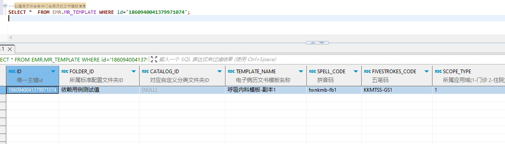

# 领域服务/病历领域 - 查询创建病历符合条件门诊病历的文书模板信息 - 查询创建病历符合条件门诊病历的文书模板信息 正向用例
## 请求参数：
``` json
{
  "hospCode": "NXRY",
  "pageIndex": 1,
  "orgCode": "NXRMYY",
  "pageSize": 1,
  "list": [
    {
      "templateAttr": "1",
      "diagnosisCodes": [
        "K07.205"
      ],
      "birthDay": "1999-12-12 00:00:00",
      "suitSex": "2",
      "regId": "1848171145803902977"
    }
  ]
}
```
## 返回参数：
``` json
{
  "exception": null,
  "apiCode": null,
  "data": {
    "list": [],
    "totalCount": 0,
    "pageSize": 10,
    "pageNo": 1,
    "pageCount": 1
  },
  "Code": 200,
  "Message": "操作成功"
}
```
## 数据校验：

# 领域服务/病历领域 - 查询创建病历符合条件门诊病历的文书模板信息 - 必填校验-[pageIndex]为空
## 请求参数：
``` json
{
  "hospCode": "NXRY",
  "pageIndex": null,
  "orgCode": "NXRMYY",
  "pageSize": 1,
  "list": [
    {
      "templateAttr": "1",
      "diagnosisCodes": [
        "K07.205"
      ],
      "birthDay": "1999-12-12 00:00:00",
      "suitSex": "2",
      "stdRecordCodes": [
        "EMR010001",
        "EMR010002"
      ],
      "regId": "1848171145803902977"
    }
  ]
}
```
## 返回参数：
``` json
{
  "exception": null,
  "apiCode": null,
  "data": null,
  "Code": 1,
  "Message": "系统内部异常"
}
```
# 领域服务/病历领域 - 查询创建病历符合条件门诊病历的文书模板信息 - 必填校验-[pageSize]为空
## 请求参数：
``` json
{
  "hospCode": "NXRY",
  "pageIndex": 1,
  "orgCode": "NXRMYY",
  "pageSize": null,
  "list": [
    {
      "templateAttr": "1",
      "diagnosisCodes": [
        "K07.205"
      ],
      "birthDay": "1999-12-12 00:00:00",
      "suitSex": "2",
      "stdRecordCodes": [
        "EMR010001",
        "EMR010002"
      ],
      "regId": "1848171145803902977"
    }
  ]
}
```
## 返回参数：
``` json
{
  "exception": null,
  "apiCode": null,
  "data": null,
  "Code": 1,
  "Message": "系统内部异常"
}
```
# 领域服务/病历领域 - 查询创建病历符合条件门诊病历的文书模板信息 - 必填校验-[orgCode]为空
## 请求参数：
``` json
{
  "hospCode": "NXRY",
  "pageIndex": 1,
  "orgCode": "",
  "pageSize": 1,
  "list": [
    {
      "templateAttr": "1",
      "diagnosisCodes": [
        "K07.205"
      ],
      "birthDay": "1999-12-12 00:00:00",
      "suitSex": "2",
      "stdRecordCodes": [
        "EMR010001",
        "EMR010002"
      ],
      "regId": "1848171145803902977"
    }
  ]
}
```
## 返回参数：
``` json
{
  "exception": null,
  "apiCode": null,
  "data": null,
  "Code": 1,
  "Message": "机构编码不能为空"
}
```
# 领域服务/病历领域 - 查询创建病历符合条件门诊病历的文书模板信息 - 必填校验-[hospCode]为空
## 请求参数：
``` json
{
  "hospCode": "",
  "pageIndex": 1,
  "orgCode": "NXRMYY",
  "pageSize": 1,
  "list": [
    {
      "templateAttr": "1",
      "diagnosisCodes": [
        "K07.205"
      ],
      "birthDay": "1999-12-12 00:00:00",
      "suitSex": "2",
      "stdRecordCodes": [
        "EMR010001",
        "EMR010002"
      ],
      "regId": "1848171145803902977"
    }
  ]
}
```
## 返回参数：
``` json
{
  "exception": null,
  "apiCode": null,
  "data": null,
  "Code": 1,
  "Message": "院区编码不能为空"
}
```
# 领域服务/病历领域 - 查询创建病历符合条件门诊病历的文书模板信息 - 必填校验-[list]为空
## 请求参数：
``` json
{
  "hospCode": "NXRY",
  "pageIndex": 1,
  "orgCode": "NXRMYY",
  "pageSize": 1,
  "list": null
}
```
## 返回参数：
``` json
{
  "exception": null,
  "apiCode": null,
  "data": null,
  "Code": 1,
  "Message": "查询模板集合不能为空"
}
```
# 领域服务/病历领域 - 查询创建病历符合条件门诊病历的文书模板信息 - 必填校验-[list.regId]为空
## 请求参数：
``` json
{
  "hospCode": "NXRY",
  "pageIndex": 1,
  "orgCode": "NXRMYY",
  "pageSize": 1,
  "list": [
    {
      "templateAttr": "1",
      "diagnosisCodes": [
        "K07.205"
      ],
      "birthDay": "1999-12-12 00:00:00",
      "suitSex": "2",
      "stdRecordCodes": [
        "EMR010001",
        "EMR010002"
      ],
      "regId": null
    }
  ]
}
```
## 返回参数：
``` json
{
  "exception": null,
  "apiCode": null,
  "data": null,
  "Code": 1,
  "Message": "就诊id不能为空"
}
```
# 领域服务/病历领域 - 查询创建病历符合条件门诊病历的文书模板信息 - 必填校验-[list.birthDay]为空
## 请求参数：
``` json
{
  "hospCode": "NXRY",
  "pageIndex": 1,
  "orgCode": "NXRMYY",
  "pageSize": 1,
  "list": [
    {
      "templateAttr": "1",
      "diagnosisCodes": [
        "K07.205"
      ],
      "birthDay": null,
      "suitSex": "2",
      "stdRecordCodes": [
        "EMR010001",
        "EMR010002"
      ],
      "regId": "1848171145803902977"
    }
  ]
}
```
## 返回参数：
``` json
{
  "exception": null,
  "apiCode": null,
  "data": null,
  "Code": 1,
  "Message": "出生日期不能为空"
}
```
# 领域服务/病历领域 - 查询创建病历符合条件门诊病历的文书模板信息 - 必填校验-[list.suitSex]为空
## 请求参数：
``` json
{
  "hospCode": "NXRY",
  "pageIndex": 1,
  "orgCode": "NXRMYY",
  "pageSize": 1,
  "list": [
    {
      "templateAttr": "1",
      "diagnosisCodes": [
        "K07.205"
      ],
      "birthDay": "1999-12-12 00:00:00",
      "suitSex": null,
      "stdRecordCodes": [
        "EMR010001",
        "EMR010002"
      ],
      "regId": "1848171145803902977"
    }
  ]
}
```
## 返回参数：
``` json
{
  "exception": null,
  "apiCode": null,
  "data": null,
  "Code": 1,
  "Message": "适用性别不能为空"
}
```
# 领域服务/病历领域 - 查询创建病历符合条件门诊病历的文书模板信息 - 枚举用例-[list.suitSex] 枚举值为 1(性别为男)
## 请求参数：
``` json
{
  "hospCode": "NXRY",
  "pageIndex": 1,
  "orgCode": "NXRMYY",
  "pageSize": 1,
  "list": [
    {
      "templateAttr": "1",
      "diagnosisCodes": [
        "K07.205"
      ],
      "birthDay": "1999-12-12 00:00:00",
      "suitSex": "1",
      "stdRecordCodes": [
        "EMR010001",
        "EMR010002"
      ],
      "regId": "1848171145803902977"
    }
  ]
}
```
## 返回参数：
``` json
{
  "exception": null,
  "apiCode": null,
  "data": {
    "list": [],
    "totalCount": 0,
    "pageSize": 10,
    "pageNo": 1,
    "pageCount": 1
  },
  "Code": 200,
  "Message": "操作成功"
}
```
# 领域服务/病历领域 - 查询创建病历符合条件门诊病历的文书模板信息 - 枚举用例-[list.suitSex] 枚举值为 2(性别为女)
## 请求参数：
``` json
{
  "hospCode": "NXRY",
  "pageIndex": 1,
  "orgCode": "NXRMYY",
  "pageSize": 1,
  "list": [
    {
      "templateAttr": "1",
      "diagnosisCodes": [
        "K07.205"
      ],
      "birthDay": "1999-12-12 00:00:00",
      "suitSex": "2",
      "stdRecordCodes": [
        "EMR010001",
        "EMR010002"
      ],
      "regId": "1848171145803902977"
    }
  ]
}
```
## 返回参数：
``` json
{
  "exception": null,
  "apiCode": null,
  "data": {
    "list": [],
    "totalCount": 0,
    "pageSize": 10,
    "pageNo": 1,
    "pageCount": 1
  },
  "Code": 200,
  "Message": "操作成功"
}
```
# 领域服务/病历领域 - 查询创建病历符合条件门诊病历的文书模板信息 - 枚举用例-[list.suitSex] 枚举值为 0(性别为未知)
## 请求参数：
``` json
{
  "hospCode": "NXRY",
  "pageIndex": 1,
  "orgCode": "NXRMYY",
  "pageSize": 1,
  "list": [
    {
      "templateAttr": "1",
      "diagnosisCodes": [
        "K07.205"
      ],
      "birthDay": "1999-12-12 00:00:00",
      "suitSex": "0",
      "stdRecordCodes": [
        "EMR010001",
        "EMR010002"
      ],
      "regId": "1848171145803902977"
    }
  ]
}
```
## 返回参数：
``` json
{
  "exception": null,
  "apiCode": null,
  "data": {
    "list": [],
    "totalCount": 0,
    "pageSize": 10,
    "pageNo": 1,
    "pageCount": 1
  },
  "Code": 200,
  "Message": "操作成功"
}
```
# 领域服务/病历领域 - 查询创建病历符合条件门诊病历的文书模板信息 - 枚举用例-[list.suitSex] 枚举值为 9(性别为未说明)
## 请求参数：
``` json
{
  "hospCode": "NXRY",
  "pageIndex": 1,
  "orgCode": "NXRMYY",
  "pageSize": 1,
  "list": [
    {
      "templateAttr": "1",
      "diagnosisCodes": [
        "K07.205"
      ],
      "birthDay": "1999-12-12 00:00:00",
      "suitSex": "9",
      "stdRecordCodes": [
        "EMR010001",
        "EMR010002"
      ],
      "regId": "1848171145803902977"
    }
  ]
}
```
## 返回参数：
``` json
{
  "exception": null,
  "apiCode": null,
  "data": {
    "list": [],
    "totalCount": 0,
    "pageSize": 10,
    "pageNo": 1,
    "pageCount": 1
  },
  "Code": 200,
  "Message": "操作成功"
}
```
# 领域服务/病历领域 - 查询创建病历符合条件门诊病历的文书模板信息 - 依赖用例-[list.regId]赋值为依赖用例测试值
## 请求参数：
``` json
{
  "hospCode": "NXRY",
  "pageIndex": 1,
  "orgCode": "NXRMYY",
  "pageSize": 1,
  "list": [
    {
      "templateAttr": "1",
      "diagnosisCodes": [
        "K07.205"
      ],
      "birthDay": "1999-12-12 00:00:00",
      "suitSex": "2",
      "stdRecordCodes": [
        "EMR010001",
        "EMR010002"
      ],
      "regId": "依赖用例测试值"
    }
  ]
}
```
## 返回参数：
``` json
{
  "exception": null,
  "apiCode": null,
  "data": {
    "list": [],
    "totalCount": 0,
    "pageSize": 10,
    "pageNo": 1,
    "pageCount": 1
  },
  "Code": 200,
  "Message": "操作成功"
}
```
# 领域服务/病历领域 - 查询创建病历符合条件门诊病历的文书模板信息 - 依赖用例-[orgCode]赋值为依赖用例测试值
## 请求参数：
``` json
{
  "hospCode": "NXRY",
  "pageIndex": 1,
  "orgCode": "依赖用例测试值",
  "pageSize": 1,
  "list": [
    {
      "templateAttr": "1",
      "diagnosisCodes": [
        "K07.205"
      ],
      "birthDay": "1999-12-12 00:00:00",
      "suitSex": "2",
      "stdRecordCodes": [
        "EMR010001",
        "EMR010002"
      ],
      "regId": "1848171145803902977"
    }
  ]
}
```
## 返回参数：
``` json
{
  "exception": null,
  "apiCode": null,
  "data": {
    "list": [],
    "totalCount": 0,
    "pageSize": 10,
    "pageNo": 1,
    "pageCount": 1
  },
  "Code": 200,
  "Message": "操作成功"
}
```
# 领域服务/病历领域 - 查询创建病历符合条件门诊病历的文书模板信息 - 依赖用例-[hospCode]赋值为依赖用例测试值
## 请求参数：
``` json
{
  "hospCode": "依赖用例测试值",
  "pageIndex": 1,
  "orgCode": "NXRMYY",
  "pageSize": 1,
  "list": [
    {
      "templateAttr": "1",
      "diagnosisCodes": [
        "K07.205"
      ],
      "birthDay": "1999-12-12 00:00:00",
      "suitSex": "2",
      "stdRecordCodes": [
        "EMR010001",
        "EMR010002"
      ],
      "regId": "1848171145803902977"
    }
  ]
}
```
## 返回参数：
``` json
{
  "exception": null,
  "apiCode": null,
  "data": {
    "list": [],
    "totalCount": 0,
    "pageSize": 10,
    "pageNo": 1,
    "pageCount": 1
  },
  "Code": 200,
  "Message": "操作成功"
}
```