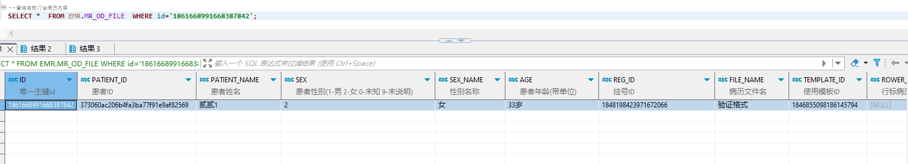

# 领域服务/病历领域 - 查询当前门诊病历内容 - 查询当前门诊病历内容 正向用例
## 请求参数：
``` json
{
  "fileIds": [
    "1861668991668387842"
  ]
}
```
## 返回参数：
``` json
{
    "exception": null,
    "apiCode": null,
    "data": {
        "list": [
            {
                "id": "1861668991693553665",
                "isDelete": "N",
                "createUserName": "测试医生",
                "createDate": "2024-10-22 09:27:50",
                "updateUserName": null,
                "updateDate": null,
                "updateKey": 289,
                "orgCode": "NXRMYY",
                "orgName": "[备注]\n患病天数：[天假数据元]\n起病时间：[起病时间]\n过敏源：[过敏源]\n体温：[0℃]\n心率：[心率]\n签名：[医师签名]",
                "hospCode": "NXRY",
                "hospName": "版本测试环境",
                "fileId": "1861668991668387842",
                "fileContent": "test",
                "contentText": "[备注]\n患病天数：[天假数据元]\n起病时间：[起病时间]\n过敏源：[过敏源]\n体温：[0℃]\n心率：[心率]\n签名：[医师签名]",
                "createUserId": "349365436797001728",
                "updateUserId": null
            }
        ]
    },
    "Code": 200,
    "Message": "操作成功"
}
```
## 数据校验：

# 领域服务/病历领域 - 查询当前门诊病历内容 - 必填校验-[fileIds]为空
## 请求参数：
``` json
{
  "fileIds": null
}
```
## 返回参数：
``` json
{
  "exception": null,
  "apiCode": null,
  "data": null,
  "Code": 1,
  "Message": "操作人姓名不能为空 \n 待查询门诊病历文书id集合不能为空 \n 医院编码不能为空 \n 院区编码不能为空 \n 操作人id不能为空"
}
```
# 领域服务/病历领域 - 查询当前门诊病历内容 - 类型校验-[fileIds]类型错误
## 请求参数：
``` json
{
  "fileIds": "abc"
}
```
## 返回参数：
``` json
{
  "exception": null,
  "apiCode": null,
  "data": null,
  "Code": 1,
  "Message": "请求参数错误"
}
```
# 领域服务/病历领域 - 查询当前门诊病历内容 - 依赖用例-[fileIds]赋值为[依赖用例测试值]
## 请求参数：
``` json
{
  "fileIds": [
    "依赖用例测试值"
  ]
}
```
## 返回参数：
``` json
{
  "exception": null,
  "apiCode": null,
  "data": null,
  "Code": 1,
  "Message": "操作人姓名不能为空 \n 医院编码不能为空 \n 院区编码不能为空 \n 操作人id不能为空"
}
```