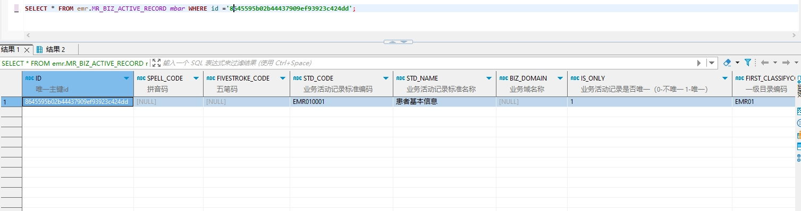

# 领域服务/病历领域 - 查询电子病历业务活动记录 - 查询电子病历业务活动记录 正向用例
## 请求参数：
``` json
{
  "pageIndex": 1,
  "orgCode": "NXRMYY",
  "pageSize": 1
}
```
## 返回参数：
``` json
{
  "exception": null,
  "apiCode": null,
  "data": {
    "list": [
      {
        "id": "8645595b02b44437909ef93923c424dd",
        "isDelete": "N",
        "createUserName": "CS彭彭彭",
        "createDate": "2024-03-26 11:42:00",
        "updateUserName": "CS彭彭彭",
        "updateDate": "2024-10-16 17:24:41",
        "updateKey": 1,
        "orgCode": "NXRMYY",
        "orgName": "版本测试环境",
        "hospCode": null,
        "hospName": null,
        "spellCode": null,
        "fivestrokeCode": null,
        "stdCode": "EMR010001",
        "stdName": "患者基本信息",
        "businessDomain": null,
        "isOnly": "1",
        "firstClassifyCode": "EMR01",
        "firstClassifyName": "病历概要",
        "scondClassifyCode": null,
        "scondClassifyName": null,
        "rowerTypeCode": "1",
        "rowerTypeName": "病历概要",
        "transferVerify": "0",
        "isNewPage": "1",
        "isFormMode": "0",
        "isSubmitVerifySign": "1",
        "createUserId": "282000000000000000",
        "updateUserId": "282475805660160000"
      }
    ],
    "totalCount": 59,
    "pageSize": 1,
    "pageNo": 1,
    "pageCount": 59
  },
  "Code": 200,
  "Message": "操作成功"
}
```
## 数据校验：

# 领域服务/病历领域 - 查询电子病历业务活动记录 - 必填校验-[orgCode]为空
## 请求参数：
``` json
{
  "pageIndex": 1,
  "orgCode": "",
  "pageSize": 1
}
```
## 返回参数：
``` json
{
  "exception": null,
  "apiCode": null,
  "data": null,
  "Code": 1,
  "Message": "医院编码不能为空"
}
```
# 领域服务/病历领域 - 查询电子病历业务活动记录 - 必填校验-[pageIndex]为空
## 请求参数：
``` json
{
  "pageIndex": null,
  "orgCode": "NXRMYY",
  "pageSize": 1
}
```
## 返回参数：
``` json
{
  "exception": null,
  "apiCode": null,
  "data": null,
  "Code": 1,
  "Message": "系统内部异常"
}
```
# 领域服务/病历领域 - 查询电子病历业务活动记录 - 必填校验-[pageSize]为空
## 请求参数：
``` json
{
  "pageIndex": 1,
  "orgCode": "NXRMYY",
  "pageSize": null
}
```
## 返回参数：
``` json
{
  "exception": null,
  "apiCode": null,
  "data": null,
  "Code": 1,
  "Message": "系统内部异常"
}
```
# 领域服务/病历领域 - 查询电子病历业务活动记录 - 类型校验-[pageSize]类型错误
## 请求参数：
``` json
{
  "pageIndex": 1,
  "orgCode": "NXRMYY",
  "pageSize": "abc"
}
```
## 返回参数：
``` json
{
  "exception": null,
  "apiCode": null,
  "data": null,
  "Code": 1,
  "Message": "请求参数错误"
}
```
# 领域服务/病历领域 - 查询电子病历业务活动记录 - 类型校验-[pageIndex]类型错误
## 请求参数：
``` json
{
  "pageIndex": "abc",
  "orgCode": "NXRMYY",
  "pageSize": 1
}
```
## 返回参数：
``` json
{
  "exception": null,
  "apiCode": null,
  "data": null,
  "Code": 1,
  "Message": "请求参数错误"
}
```
# 领域服务/病历领域 - 查询电子病历业务活动记录 - 依赖用例-[orgCode]赋值为依赖用例测试值
## 请求参数：
``` json
{
  "pageIndex": 1,
  "orgCode": "依赖用例测试值",
  "pageSize": 1
}
```
## 返回参数：
``` json
{
  "exception": null,
  "apiCode": null,
  "data": {
    "list": [],
    "totalCount": 0,
    "pageSize": 1,
    "pageNo": 1,
    "pageCount": 0
  },
  "Code": 200,
  "Message": "操作成功"
}
```