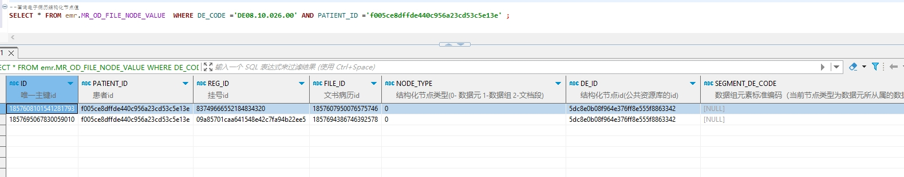

# 领域服务/病历领域 - 查询电子病历结构化节点值 - 查询电子病历结构化节点值 正向用例
## 请求参数：
``` json
{
    "hospCode": "NXRY",
    "orgCode": "NXRMYY",
    "patientId": "f005ce8dffde440c956a23cd53c5e13e",
    "nodeCodes": [
        "DE08.10.026.00"
    ]
}
```
## 返回参数：
``` json
{
    "exception": null,
    "apiCode": null,
    "data": [
        {
            "id": "1857608101541281793",
            "isDelete": "N",
            "createUserName": "测试医生",
            "createDate": "2024-11-16 10:14:18",
            "updateUserName": null,
            "updateDate": null,
            "updateKey": 421,
            "orgCode": "NXRMYY",
            "orgName": "版本测试环境",
            "hospCode": "NXRY",
            "hospName": "版本测试环境",
            "patientId": "f005ce8dffde440c956a23cd53c5e13e",
            "visitId": "83749666552184834320",
            "scopeType": "1",
            "fileId": "1857607950076575746",
            "nodeType": "0",
            "deId": "5dc8e0b08f964e376ff8e555f8863342",
            "recordNodeId": "1784415557823549441NXRMYY",
            "deCode": "DE08.10.026.00",
            "deName": "科室名称",
            "stdRecordId": "5a7064dd26bd4ac7a3eab64194e7304b",
            "stdRecordCode": "EMR020001",
            "stdRecordName": "门(急)诊病历",
            "nodeName": "就诊科室",
            "dataType": "0",
            "value": "内分泌科(门)",
            "code": null,
            "dictCode": null,
            "controlId": "e87f721f-b6cc-4c9b-9278-afc0263d82b1",
            "dataSetDeCode": null,
            "segmentDeNode": null,
            "createUserId": "349365436797001728",
            "updateUserId": null
        },
        {
            "id": "1857695067830059010",
            "isDelete": "N",
            "createUserName": "测试医生",
            "createDate": "2024-11-16 15:59:53",
            "updateUserName": null,
            "updateDate": null,
            "updateKey": 466,
            "orgCode": "NXRMYY",
            "orgName": "版本测试环境",
            "hospCode": "NXRY",
            "hospName": "版本测试环境",
            "patientId": "f005ce8dffde440c956a23cd53c5e13e",
            "visitId": "09a85701caa641548e42c7fa94b22ee5",
            "scopeType": "1",
            "fileId": "1857694386746392578",
            "nodeType": "0",
            "deId": "5dc8e0b08f964e376ff8e555f8863342",
            "recordNodeId": "1784415557823549441NXRMYY",
            "deCode": "DE08.10.026.00",
            "deName": "科室名称",
            "stdRecordId": "5a7064dd26bd4ac7a3eab64194e7304b",
            "stdRecordCode": "EMR020001",
            "stdRecordName": "门(急)诊病历",
            "nodeName": "就诊科室",
            "dataType": "0",
            "value": "呼吸内科(门)",
            "code": null,
            "dictCode": null,
            "controlId": "e87f721f-b6cc-4c9b-9278-afc0263d82b1",
            "dataSetDeCode": null,
            "segmentDeNode": null,
            "createUserId": "349365436797001728",
            "updateUserId": null
        }
    ],
    "Code": 200,
    "Message": "操作成功"
}
```
## 数据校验：

# 领域服务/病历领域 - 查询电子病历结构化节点值 - 必填校验-[orgCode]为空
## 请求参数：
``` json
{
  "hospCode": "NXRY",
  "patientId": "39542b4771894578a1d6a9ad8568a894",
  "orgCode": ""
}
```
## 返回参数：
``` json
{
  "exception": null,
  "apiCode": null,
  "data": null,
  "Code": 1,
  "Message": "机构编码不能为空 \n 结构化节点编码集合不能为空"
}
```
# 领域服务/病历领域 - 查询电子病历结构化节点值 - 必填校验-[hospCode]为空
## 请求参数：
``` json
{
  "hospCode": "",
  "patientId": "39542b4771894578a1d6a9ad8568a894",
  "orgCode": "NXRMYY"
}
```
## 返回参数：
``` json
{
  "exception": null,
  "apiCode": null,
  "data": null,
  "Code": 1,
  "Message": "结构化节点编码集合不能为空 \n 院区编码不能为空"
}
```
# 领域服务/病历领域 - 查询电子病历结构化节点值 - 必填校验-[patientId]为空
## 请求参数：
``` json
{
  "hospCode": "NXRY",
  "patientId": "",
  "orgCode": "NXRMYY"
}
```
## 返回参数：
``` json
{
  "exception": null,
  "apiCode": null,
  "data": null,
  "Code": 1,
  "Message": "结构化节点编码集合不能为空 \n 患者id不能为空"
}
```
# 领域服务/病历领域 - 查询电子病历结构化节点值 - 依赖用例-[orgCode]赋值为依赖用例测试值
## 请求参数：
``` json
{
  "hospCode": "NXRY",
  "patientId": "39542b4771894578a1d6a9ad8568a894",
  "orgCode": "依赖用例测试值"
}
```
## 返回参数：
``` json
{
  "exception": null,
  "apiCode": null,
  "data": null,
  "Code": 1,
  "Message": "结构化节点编码集合不能为空"
}
```
# 领域服务/病历领域 - 查询电子病历结构化节点值 - 依赖用例-[patientId]赋值为依赖用例测试值
## 请求参数：
``` json
{
  "hospCode": "NXRY",
  "patientId": "依赖用例测试值",
  "orgCode": "NXRMYY"
}
```
## 返回参数：
``` json
{
  "exception": null,
  "apiCode": null,
  "data": null,
  "Code": 1,
  "Message": "结构化节点编码集合不能为空"
}
```
# 领域服务/病历领域 - 查询电子病历结构化节点值 - 依赖用例-[hospCode]赋值为依赖用例测试值
## 请求参数：
``` json
{
  "hospCode": "依赖用例测试值",
  "patientId": "39542b4771894578a1d6a9ad8568a894",
  "orgCode": "NXRMYY"
}
```
## 返回参数：
``` json
{
  "exception": null,
  "apiCode": null,
  "data": null,
  "Code": 1,
  "Message": "结构化节点编码集合不能为空"
}
```