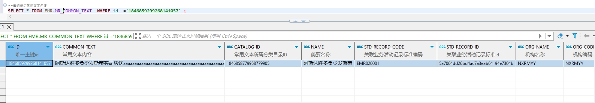

# 领域服务/病历领域 - 查询病历常用文本内容 - 查询病历常用文本内容 正向用例
## 请求参数：
``` json
{
  "stdCode": "EMR020001",
  "hospCode": "NXRY",
  "pageIndex": 1,
  "orgCode": "NXRMYY",
  "pageSize": 1,
  "operatorId": "349365436797001728"
}
```
## 返回参数：
``` json
{
    "exception": null,
    "apiCode": null,
    "data": {
        "list": [
            {
                "id": "1846859299268141057",
                "commonText": "阿斯达胜多负少发斯蒂芬司法送aaaaaaaaaaaaaaaaaaaaaaaaaaaaaaaaaaaaaaaaaaaaaaaaaaaaaaaaaaaaaaaa达发啥打法",
                "catalogId": "1846858779958779905",
                "name": "阿斯达胜多负少发斯蒂",
                "stdRecordCode": "EMR020001",
                "stdRecordId": "5a7064dd26bd4ac7a3eab64194e7304b",
                "orgName": "NXRMYY",
                "orgCode": "NXRMYY",
                "hospCode": "NXRY",
                "hospName": "版本测试环境",
                "createUser": "349365436797001728",
                "createUserName": "测试医生",
                "createDate": "2024-10-17 18:22:24",
                "updateUser": "349365436797001728",
                "updateUserName": "测试医生",
                "updateDate": "2024-11-25 16:08:29",
                "isDelete": "N",
                "updateKey": 2
            }
        ],
        "totalCount": 5,
        "pageSize": 1,
        "pageNo": 1,
        "pageCount": 5
    },
    "Code": 200,
    "Message": "操作成功"
}
```
## 数据校验：

# 领域服务/病历领域 - 查询病历常用文本内容 - 必填校验-[orgCode]为空
## 请求参数：
``` json
{
  "stdCode": "EMR020001",
  "hospCode": "NXRY",
  "pageIndex": 1,
  "orgCode": "",
  "pageSize": 1,
  "operatorId": "282475805660160000"
}
```
## 返回参数：
``` json
{
  "exception": null,
  "apiCode": null,
  "data": null,
  "Code": 1,
  "Message": "机构编码不能为空"
}
```
# 领域服务/病历领域 - 查询病历常用文本内容 - 必填校验-[hospCode]为空
## 请求参数：
``` json
{
  "stdCode": "EMR020001",
  "hospCode": "",
  "pageIndex": 1,
  "orgCode": "NXRMYY",
  "pageSize": 1,
  "operatorId": "282475805660160000"
}
```
## 返回参数：
``` json
{
  "exception": null,
  "apiCode": null,
  "data": null,
  "Code": 1,
  "Message": "院区编码不能为空"
}
```
# 领域服务/病历领域 - 查询病历常用文本内容 - 必填校验-[pageIndex]为空
## 请求参数：
``` json
{
  "stdCode": "EMR020001",
  "hospCode": "NXRY",
  "pageIndex": null,
  "orgCode": "NXRMYY",
  "pageSize": 1,
  "operatorId": "282475805660160000"
}
```
## 返回参数：
``` json
{
  "exception": null,
  "apiCode": null,
  "data": null,
  "Code": 1,
  "Message": "系统内部异常"
}
```
# 领域服务/病历领域 - 查询病历常用文本内容 - 必填校验-[pageSize]为空
## 请求参数：
``` json
{
  "stdCode": "EMR020001",
  "hospCode": "NXRY",
  "pageIndex": 1,
  "orgCode": "NXRMYY",
  "pageSize": null,
  "operatorId": "282475805660160000"
}
```
## 返回参数：
``` json
{
  "exception": null,
  "apiCode": null,
  "data": null,
  "Code": 1,
  "Message": "系统内部异常"
}
```
# 领域服务/病历领域 - 查询病历常用文本内容 - 必填校验-[operatorId]为空
## 请求参数：
``` json
{
  "stdCode": "EMR020001",
  "hospCode": "NXRY",
  "pageIndex": 1,
  "orgCode": "NXRMYY",
  "pageSize": 1,
  "operatorId": ""
}
```
## 返回参数：
``` json
{
  "exception": null,
  "apiCode": null,
  "data": null,
  "Code": 1,
  "Message": "操作人id不能为空"
}
```
# 领域服务/病历领域 - 查询病历常用文本内容 - 必填校验-[stdCode]为空
## 请求参数：
``` json
{
  "stdCode": "",
  "hospCode": "NXRY",
  "pageIndex": 1,
  "orgCode": "NXRMYY",
  "pageSize": 1,
  "operatorId": "282475805660160000"
}
```
## 返回参数：
``` json
{
  "exception": null,
  "apiCode": null,
  "data": null,
  "Code": 1,
  "Message": "病历所属业务活动记录标准编码不能为空"
}
```
# 领域服务/病历领域 - 查询病历常用文本内容 - 类型校验-[pageSize]类型错误
## 请求参数：
``` json
{
  "stdCode": "EMR020001",
  "hospCode": "NXRY",
  "pageIndex": 1,
  "orgCode": "NXRMYY",
  "pageSize": "abc",
  "operatorId": "282475805660160000"
}
```
## 返回参数：
``` json
{
  "exception": null,
  "apiCode": null,
  "data": null,
  "Code": 1,
  "Message": "请求参数错误"
}
```
# 领域服务/病历领域 - 查询病历常用文本内容 - 类型校验-[pageIndex]类型错误
## 请求参数：
``` json
{
  "stdCode": "EMR020001",
  "hospCode": "NXRY",
  "pageIndex": "abc",
  "orgCode": "NXRMYY",
  "pageSize": 1,
  "operatorId": "282475805660160000"
}
```
## 返回参数：
``` json
{
  "exception": null,
  "apiCode": null,
  "data": null,
  "Code": 1,
  "Message": "请求参数错误"
}
```
# 领域服务/病历领域 - 查询病历常用文本内容 - 依赖用例-[operatorId]赋值为依赖用例测试值
## 请求参数：
``` json
{
  "stdCode": "EMR020001",
  "hospCode": "NXRY",
  "pageIndex": 1,
  "orgCode": "NXRMYY",
  "pageSize": 1,
  "operatorId": "依赖用例测试值"
}
```
## 返回参数：
``` json
{
  "exception": null,
  "apiCode": null,
  "data": {
    "list": [],
    "totalCount": 0,
    "pageSize": 1,
    "pageNo": 1,
    "pageCount": 0
  },
  "Code": 200,
  "Message": "操作成功"
}
```
# 领域服务/病历领域 - 查询病历常用文本内容 - 依赖用例-[orgCode]赋值为依赖用例测试值
## 请求参数：
``` json
{
  "stdCode": "EMR020001",
  "hospCode": "NXRY",
  "pageIndex": 1,
  "orgCode": "依赖用例测试值",
  "pageSize": 1,
  "operatorId": "282475805660160000"
}
```
## 返回参数：
``` json
{
  "exception": null,
  "apiCode": null,
  "data": {
    "list": [],
    "totalCount": 0,
    "pageSize": 1,
    "pageNo": 1,
    "pageCount": 0
  },
  "Code": 200,
  "Message": "操作成功"
}
```
# 领域服务/病历领域 - 查询病历常用文本内容 - 依赖用例-[hospCode]赋值为依赖用例测试值
## 请求参数：
``` json
{
  "stdCode": "EMR020001",
  "hospCode": "依赖用例测试值",
  "pageIndex": 1,
  "orgCode": "NXRMYY",
  "pageSize": 1,
  "operatorId": "282475805660160000"
}
```
## 返回参数：
``` json
{
  "exception": null,
  "apiCode": null,
  "data": {
    "list": [],
    "totalCount": 0,
    "pageSize": 1,
    "pageNo": 1,
    "pageCount": 0
  },
  "Code": 200,
  "Message": "操作成功"
}
```
# 领域服务/病历领域 - 查询病历常用文本内容 - 依赖用例-[stdCode]赋值为依赖用例测试值
## 请求参数：
``` json
{
  "stdCode": "依赖用例测试值",
  "hospCode": "NXRY",
  "pageIndex": 1,
  "orgCode": "NXRMYY",
  "pageSize": 1,
  "operatorId": "282475805660160000"
}
```
## 返回参数：
``` json
{
  "exception": null,
  "apiCode": null,
  "data": {
    "list": [],
    "totalCount": 0,
    "pageSize": 1,
    "pageNo": 1,
    "pageCount": 0
  },
  "Code": 200,
  "Message": "操作成功"
}
```