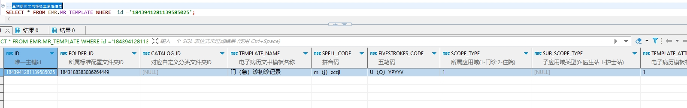

# 领域服务/病历领域 - 查询病历文书模板主属性信息 - 查询病历文书模板主属性信息 正向用例
## 请求参数：
``` json
{
  "pageSize": 1,
  "pageIndex": 1,
  "scopeType": "1",
  "orgCode": "NXRMYY",
  "folderId": "1843188383036264449"
}
```
## 返回参数：
``` json
{
    "exception": null,
    "apiCode": null,
    "data": {
        "list": [
            {
                "id": "1843941281139585025",
                "isDelete": "N",
                "createUserName": "测试医生",
                "createDate": "2024-10-09 17:07:14",
                "updateUserName": "CS创星管理员",
                "updateDate": "2024-10-11 14:45:48",
                "updateKey": 27,
                "orgCode": "NXRMYY",
                "orgName": "版本测试环境",
                "hospCode": "NXRY",
                "hospName": "版本测试环境",
                "catalogId": null,
                "deptId": null,
                "deptName": null,
                "diagnoseList": [],
                "editType": "2",
                "folderId": "1843188383036264449",
                "frmId": "1843202402790985730",
                "frmName": "门诊病历框架",
                "isDefault": "N",
                "isOpen": "1",
                "maxAge": null,
                "maxAgeUnit": "0",
                "minAge": null,
                "minAgeUnit": "0",
                "pullInTemplateId": null,
                "pullInTemplateName": null,
                "rangeType": "3",
                "rowerTypeCode": "2",
                "rowerTypeName": "门急诊病历",
                "scopeType": "1",
                "signDate": "2024-10-11 14:45:48",
                "signFlag": "1",
                "signId": "247536401569292288",
                "signLevel": "0",
                "signName": "CS创星管理员",
                "signTemplateId": null,
                "stdRecordCode": "EMR020001",
                "stdRecordId": "5a7064dd26bd4ac7a3eab64194e7304b",
                "stdRecordName": "门(急)诊病历",
                "suitSex": null,
                "templateAttr": "1",
                "templateName": "门（急）诊初诊记录",
                "spellCode": "m（j）zczjl",
                "fivestrokesCode": "U（Q）YPYYV",
                "templateContent": null,
                "datasetCode": null,
                "regId": null,
                "suitDeptId": null,
                "subScopeType": null,
                "subRowerTypeCode": null,
                "subRowerTypeName": null,
                "suitDeptList": null,
                "createUserId": "349365436797001728",
                "updateUserId": "247536401569292288"
            }
        ],
        "totalCount": 21,
        "pageSize": 10,
        "pageNo": 1,
        "pageCount": 1
    },
    "Code": 200,
    "Message": "操作成功"
}
```
## 数据校验：

# 领域服务/病历领域 - 查询病历文书模板主属性信息 - 必填校验-[orgCode]为空
## 请求参数：
``` json
{
  "pageSize": 1,
  "folderId": "1843189710776750081",
  "pageIndex": 1,
  "scopeType": "1",
  "orgCode": ""
}
```
## 返回参数：
``` json
{
  "exception": null,
  "apiCode": null,
  "data": null,
  "Code": 1,
  "Message": "机构编码不能为空"
}
```
# 领域服务/病历领域 - 查询病历文书模板主属性信息 - 必填校验-[pageIndex]为空
## 请求参数：
``` json
{
  "pageSize": 1,
  "folderId": "1843189710776750081",
  "pageIndex": null,
  "scopeType": "1",
  "orgCode": "NXRMYY"
}
```
## 返回参数：
``` json
{
  "exception": null,
  "apiCode": null,
  "data": {
    "list": [],
    "totalCount": 0,
    "pageSize": 10,
    "pageNo": 1,
    "pageCount": 1
  },
  "Code": 200,
  "Message": "操作成功"
}
```
# 领域服务/病历领域 - 查询病历文书模板主属性信息 - 必填校验-[pageSize]为空
## 请求参数：
``` json
{
  "pageSize": null,
  "folderId": "1843189710776750081",
  "pageIndex": 1,
  "scopeType": "1",
  "orgCode": "NXRMYY"
}
```
## 返回参数：
``` json
{
  "exception": null,
  "apiCode": null,
  "data": {
    "list": [],
    "totalCount": 0,
    "pageSize": 10,
    "pageNo": 1,
    "pageCount": 1
  },
  "Code": 200,
  "Message": "操作成功"
}
```
# 领域服务/病历领域 - 查询病历文书模板主属性信息 - 必填校验-[scopeType]为空
## 请求参数：
``` json
{
  "pageSize": 1,
  "folderId": "1843189710776750081",
  "pageIndex": 1,
  "scopeType": "",
  "orgCode": "NXRMYY"
}
```
## 返回参数：
``` json
{
  "exception": null,
  "apiCode": null,
  "data": null,
  "Code": 1,
  "Message": "入参id集合为空时，应用域类型和标准配置文件夹id不能为空"
}
```
# 领域服务/病历领域 - 查询病历文书模板主属性信息 - 必填校验-[folderId]为空
## 请求参数：
``` json
{
  "pageSize": 1,
  "folderId": "",
  "pageIndex": 1,
  "scopeType": "1",
  "orgCode": "NXRMYY"
}
```
## 返回参数：
``` json
{
  "exception": null,
  "apiCode": null,
  "data": null,
  "Code": 1,
  "Message": "入参id集合为空时，应用域类型和标准配置文件夹id不能为空"
}
```
# 领域服务/病历领域 - 查询病历文书模板主属性信息 - 类型校验-[pageIndex]类型错误
## 请求参数：
``` json
{
  "pageSize": 1,
  "folderId": "1843189710776750081",
  "pageIndex": "abc",
  "scopeType": "1",
  "orgCode": "NXRMYY"
}
```
## 返回参数：
``` json
{
  "exception": null,
  "apiCode": null,
  "data": null,
  "Code": 1,
  "Message": "请求参数错误"
}
```
# 领域服务/病历领域 - 查询病历文书模板主属性信息 - 类型校验-[pageSize]类型错误
## 请求参数：
``` json
{
  "pageSize": "abc",
  "folderId": "1843189710776750081",
  "pageIndex": 1,
  "scopeType": "1",
  "orgCode": "NXRMYY"
}
```
## 返回参数：
``` json
{
  "exception": null,
  "apiCode": null,
  "data": null,
  "Code": 1,
  "Message": "请求参数错误"
}
```
# 领域服务/病历领域 - 查询病历文书模板主属性信息 - 枚举用例-[scopeType] 枚举值为 1(应用域类型为门诊)
## 请求参数：
``` json
{
  "pageSize": 1,
  "folderId": "1843189710776750081",
  "pageIndex": 1,
  "scopeType": "1",
  "orgCode": "NXRMYY"
}
```
## 返回参数：
``` json
{
  "exception": null,
  "apiCode": null,
  "data": {
    "list": [],
    "totalCount": 0,
    "pageSize": 10,
    "pageNo": 1,
    "pageCount": 1
  },
  "Code": 200,
  "Message": "操作成功"
}
```
# 领域服务/病历领域 - 查询病历文书模板主属性信息 - 枚举用例-[scopeType] 枚举值为 2(应用域类型为住院)
## 请求参数：
``` json
{
  "pageSize": 1,
  "folderId": "1843189710776750081",
  "pageIndex": 1,
  "scopeType": "2",
  "orgCode": "NXRMYY"
}
```
## 返回参数：
``` json
{
  "exception": null,
  "apiCode": null,
  "data": {
    "list": [],
    "totalCount": 0,
    "pageSize": 10,
    "pageNo": 1,
    "pageCount": 1
  },
  "Code": 200,
  "Message": "操作成功"
}
```
# 领域服务/病历领域 - 查询病历文书模板主属性信息 - 依赖用例-[orgCode]赋值为依赖用例测试值
## 请求参数：
``` json
{
  "pageSize": 1,
  "folderId": "1843189710776750081",
  "pageIndex": 1,
  "scopeType": "1",
  "orgCode": "依赖用例测试值"
}
```
## 返回参数：
``` json
{
  "exception": null,
  "apiCode": null,
  "data": {
    "list": [],
    "totalCount": 0,
    "pageSize": 10,
    "pageNo": 1,
    "pageCount": 1
  },
  "Code": 200,
  "Message": "操作成功"
}
```
# 领域服务/病历领域 - 查询病历文书模板主属性信息 - 依赖用例-[folderId]赋值为依赖用例测试值
## 请求参数：
``` json
{
  "pageSize": 1,
  "folderId": "依赖用例测试值",
  "pageIndex": 1,
  "scopeType": "1",
  "orgCode": "NXRMYY"
}
```
## 返回参数：
``` json
{
  "exception": null,
  "apiCode": null,
  "data": {
    "list": [],
    "totalCount": 0,
    "pageSize": 10,
    "pageNo": 1,
    "pageCount": 1
  },
  "Code": 200,
  "Message": "操作成功"
}
```