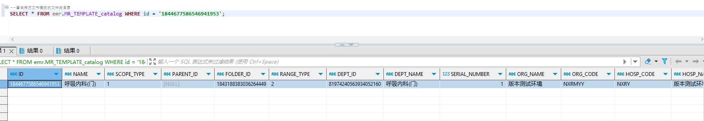

# 领域服务/病历领域 - 查询病历文书模板的文件夹目录 - 查询病历文书模板的文件夹目录 正向用例
## 请求参数：
``` json
{
  "hospCode": "NXRY",
  "pageIndex": 1,
  "scopeType": "1",
  "orgCode": "NXRMYY",
  "pageSize": 1
}
```
## 返回参数：
``` json
{
  "exception": null,
  "apiCode": null,
  "data": {
    "list": [
      {
        "id": "1844677586546941953",
        "isDelete": "N",
        "createUserName": "测试医生",
        "createDate": "2024-10-11 17:53:03",
        "updateUserName": null,
        "updateDate": null,
        "updateKey": 21,
        "orgCode": "NXRMYY",
        "orgName": "版本测试环境",
        "hospCode": "NXRY",
        "hospName": "版本测试环境",
        "deptId": "81974240563934052160",
        "deptName": "呼吸内科(门)",
        "folderId": "1843188383036264449",
        "name": "呼吸内科(门)",
        "parentId": null,
        "rangeType": "2",
        "scopeType": "1",
        "serialNumber": "1",
        "createUserId": "349365436797001728",
        "updateUserId": null
      }
    ],
    "totalCount": 8,
    "pageSize": 1,
    "pageNo": 1,
    "pageCount": 8
  },
  "Code": 200,
  "Message": "操作成功"
}
```
## 数据校验：

# 领域服务/病历领域 - 查询病历文书模板的文件夹目录 - 必填校验-[orgCode]为空
## 请求参数：
``` json
{
  "hospCode": "NXRY",
  "pageIndex": 1,
  "scopeType": "1",
  "orgCode": "",
  "pageSize": 1
}
```
## 返回参数：
``` json
{
  "exception": null,
  "apiCode": null,
  "data": null,
  "Code": 1,
  "Message": "机构编码不能为空"
}
```
# 领域服务/病历领域 - 查询病历文书模板的文件夹目录 - 必填校验-[hospCode]为空
## 请求参数：
``` json
{
  "hospCode": "",
  "pageIndex": 1,
  "scopeType": "1",
  "orgCode": "NXRMYY",
  "pageSize": 1
}
```
## 返回参数：
``` json
{
  "exception": null,
  "apiCode": null,
  "data": null,
  "Code": 1,
  "Message": "院区编码不能为空"
}
```
# 领域服务/病历领域 - 查询病历文书模板的文件夹目录 - 必填校验-[pageIndex]为空
## 请求参数：
``` json
{
  "hospCode": "NXRY",
  "pageIndex": null,
  "scopeType": "1",
  "orgCode": "NXRMYY",
  "pageSize": 1
}
```
## 返回参数：
``` json
{
  "exception": null,
  "apiCode": null,
  "data": null,
  "Code": 1,
  "Message": "系统内部异常"
}
```
# 领域服务/病历领域 - 查询病历文书模板的文件夹目录 - 必填校验-[pageSize]为空
## 请求参数：
``` json
{
  "hospCode": "NXRY",
  "pageIndex": 1,
  "scopeType": "1",
  "orgCode": "NXRMYY",
  "pageSize": null
}
```
## 返回参数：
``` json
{
  "exception": null,
  "apiCode": null,
  "data": null,
  "Code": 1,
  "Message": "系统内部异常"
}
```
# 领域服务/病历领域 - 查询病历文书模板的文件夹目录 - 必填校验-[scopeType]为空
## 请求参数：
``` json
{
  "hospCode": "NXRY",
  "pageIndex": 1,
  "scopeType": "",
  "orgCode": "NXRMYY",
  "pageSize": 1
}
```
## 返回参数：
``` json
{
  "exception": null,
  "apiCode": null,
  "data": null,
  "Code": 1,
  "Message": "应用域类型不能为空"
}
```
# 领域服务/病历领域 - 查询病历文书模板的文件夹目录 - 类型校验-[pageSize]类型错误
## 请求参数：
``` json
{
  "hospCode": "NXRY",
  "pageIndex": 1,
  "scopeType": "1",
  "orgCode": "NXRMYY",
  "pageSize": "abc"
}
```
## 返回参数：
``` json
{
  "exception": null,
  "apiCode": null,
  "data": null,
  "Code": 1,
  "Message": "请求参数错误"
}
```
# 领域服务/病历领域 - 查询病历文书模板的文件夹目录 - 类型校验-[pageIndex]类型错误
## 请求参数：
``` json
{
  "hospCode": "NXRY",
  "pageIndex": "abc",
  "scopeType": "1",
  "orgCode": "NXRMYY",
  "pageSize": 1
}
```
## 返回参数：
``` json
{
  "exception": null,
  "apiCode": null,
  "data": null,
  "Code": 1,
  "Message": "请求参数错误"
}
```
# 领域服务/病历领域 - 查询病历文书模板的文件夹目录 - 枚举用例-[scopeType] 枚举值为 1(应用域类型为门诊)
## 请求参数：
``` json
{
  "hospCode": "NXRY",
  "pageIndex": 1,
  "scopeType": "1",
  "orgCode": "NXRMYY",
  "pageSize": 1
}
```
## 返回参数：
``` json
{
  "exception": null,
  "apiCode": null,
  "data": {
    "list": [
      {
        "id": "1844677586546941953",
        "isDelete": "N",
        "createUserName": "测试医生",
        "createDate": "2024-10-11 17:53:03",
        "updateUserName": null,
        "updateDate": null,
        "updateKey": 21,
        "orgCode": "NXRMYY",
        "orgName": "版本测试环境",
        "hospCode": "NXRY",
        "hospName": "版本测试环境",
        "deptId": "81974240563934052160",
        "deptName": "呼吸内科(门)",
        "folderId": "1843188383036264449",
        "name": "呼吸内科(门)",
        "parentId": null,
        "rangeType": "2",
        "scopeType": "1",
        "serialNumber": "1",
        "createUserId": "349365436797001728",
        "updateUserId": null
      }
    ],
    "totalCount": 8,
    "pageSize": 1,
    "pageNo": 1,
    "pageCount": 8
  },
  "Code": 200,
  "Message": "操作成功"
}
```
# 领域服务/病历领域 - 查询病历文书模板的文件夹目录 - 枚举用例-[scopeType] 枚举值为 2(应用域类型为住院)
## 请求参数：
``` json
{
  "hospCode": "NXRY",
  "pageIndex": 1,
  "scopeType": "2",
  "orgCode": "NXRMYY",
  "pageSize": 1
}
```
## 返回参数：
``` json
{
  "exception": null,
  "apiCode": null,
  "data": {
    "list": [],
    "totalCount": 0,
    "pageSize": 1,
    "pageNo": 1,
    "pageCount": 0
  },
  "Code": 200,
  "Message": "操作成功"
}
```
# 领域服务/病历领域 - 查询病历文书模板的文件夹目录 - 依赖用例-[orgCode]赋值为依赖用例测试值
## 请求参数：
``` json
{
  "hospCode": "NXRY",
  "pageIndex": 1,
  "scopeType": "1",
  "orgCode": "依赖用例测试值",
  "pageSize": 1
}
```
## 返回参数：
``` json
{
  "exception": null,
  "apiCode": null,
  "data": {
    "list": [],
    "totalCount": 0,
    "pageSize": 1,
    "pageNo": 1,
    "pageCount": 0
  },
  "Code": 200,
  "Message": "操作成功"
}
```
# 领域服务/病历领域 - 查询病历文书模板的文件夹目录 - 依赖用例-[hospCode]赋值为依赖用例测试值
## 请求参数：
``` json
{
  "hospCode": "依赖用例测试值",
  "pageIndex": 1,
  "scopeType": "1",
  "orgCode": "NXRMYY",
  "pageSize": 1
}
```
## 返回参数：
``` json
{
  "exception": null,
  "apiCode": null,
  "data": {
    "list": [],
    "totalCount": 0,
    "pageSize": 1,
    "pageNo": 1,
    "pageCount": 0
  },
  "Code": 200,
  "Message": "操作成功"
}
```