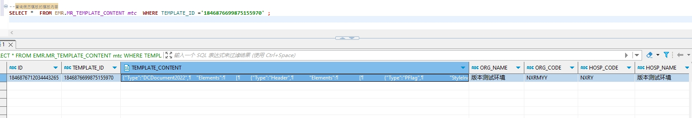

# 领域服务/病历领域 - 查询病历模板的模板内容 - 查询病历模板的模板内容 正向用例
## 请求参数：
``` json
{
  "hospCode": "NXRY",
  "templateIds": [
    "1846876699875155970"
  ],
  "orgCode": "NXRMYY"
}
```
## 返回参数：
``` json
{
  "exception": null,
  "apiCode": null,
  "data": [
    {
      "templateContent": "{\"Type\":\"DCDocument2022\",\n    \"Elements\":\n        [\n        {\"Type\":\"Header\",\n            \"Elements\":\n                [\n                {\"Type\":\"PFlag\",\n                    \"StyleIndex\":0,\n                    \"AutoCreate\":true\n                }\n                ],\n            \"EnableValueValidate\":true\n        },\n        {\"Type\":\"Body\",\n            \"EnableValueValidate\":true\n        },\n        {\"Type\":\"Footer\",\n            \"EnableValueValidate\":true\n        },\n        {\"Type\":\"HeaderForFirstPage\",\n            \"Elements\":\n                [\n                {\"Type\":\"PFlag\",\n                    \"StyleIndex\":0,\n                    \"AutoCreate\":true\n                }\n                ],\n            \"EnableValueValidate\":true\n        },\n        {\"Type\":\"FooterForFirstPage\",\n            \"EnableValueValidate\":true\n        }\n        ],\n    \"FileFormat\":\"json\",\n    \"ContentStyles\":\n        {\"Default\":\n                {\"FontName\":\"宋体\",\n                    \"FontSize\":12\n                },\n            \"Styles\":\n                [\n                {\"FontName\":\"宋体\",\n                    \"FontSize\":12,\n                    \"Index\":0,\n                    \"Align\":\"Center\"\n                }\n                ]\n        },\n    \"EditorVersionString\":\"1.0.0.0\",\n    \"EnableValueValidate\":true,\n    \"Info\":\n        {\"NumOfPage\":1,\n            \"Operator\":\"DCSoft.Writer Version:1.0.0.0\",\n            \"CreationTime\":\"2024-10-17 19:31:35\",\n            \"LastModifiedTime\":\"2024-10-17 19:31:43\",\n            \"LastPrintTime\":\"1980-01-01 00:00:00\"\n        }\n}",
      "templateId": "1846876699875155970",
      "signFlag": "0"
    }
  ],
  "Code": 200,
  "Message": "操作成功"
}
```
## 数据校验：

# 领域服务/病历领域 - 查询病历模板的模板内容 - 必填校验-[orgCode]为空
## 请求参数：
``` json
{
  "hospCode": "NXRY",
  "templateIds": [
    "1846876699875155970"
  ],
  "orgCode": ""
}
```
## 返回参数：
``` json
{
  "exception": null,
  "apiCode": null,
  "data": null,
  "Code": 1,
  "Message": "机构编码不能为空"
}
```
# 领域服务/病历领域 - 查询病历模板的模板内容 - 必填校验-[hospCode]为空
## 请求参数：
``` json
{
  "hospCode": "",
  "templateIds": [
    "1846876699875155970"
  ],
  "orgCode": "NXRMYY"
}
```
## 返回参数：
``` json
{
  "exception": null,
  "apiCode": null,
  "data": null,
  "Code": 1,
  "Message": "院区编码不能为空"
}
```
# 领域服务/病历领域 - 查询病历模板的模板内容 - 必填校验-[templateIds]为空
## 请求参数：
``` json
{
  "hospCode": "NXRY",
  "templateIds": null,
  "orgCode": "NXRMYY"
}
```
## 返回参数：
``` json
{
  "exception": null,
  "apiCode": null,
  "data": null,
  "Code": 1,
  "Message": "模板主键id集合不能为空"
}
```
# 领域服务/病历领域 - 查询病历模板的模板内容 - 类型校验-[templateIds]类型错误
## 请求参数：
``` json
{
  "hospCode": "NXRY",
  "templateIds": "abc",
  "orgCode": "NXRMYY"
}
```
## 返回参数：
``` json
{
  "exception": null,
  "apiCode": null,
  "data": null,
  "Code": 1,
  "Message": "请求参数错误"
}
```
# 领域服务/病历领域 - 查询病历模板的模板内容 - 依赖用例-[orgCode]赋值为依赖用例测试值
## 请求参数：
``` json
{
  "hospCode": "NXRY",
  "templateIds": [
    "1846876699875155970"
  ],
  "orgCode": "依赖用例测试值"
}
```
## 返回参数：
``` json
{
  "exception": null,
  "apiCode": null,
  "data": [],
  "Code": 200,
  "Message": "操作成功"
}
```
# 领域服务/病历领域 - 查询病历模板的模板内容 - 依赖用例-[templateIds]赋值为[依赖用例测试值]
## 请求参数：
``` json
{
  "hospCode": "NXRY",
  "templateIds": [
    "依赖用例测试值"
  ],
  "orgCode": "NXRMYY"
}
```
## 返回参数：
``` json
{
  "exception": null,
  "apiCode": null,
  "data": [],
  "Code": 200,
  "Message": "操作成功"
}
```
# 领域服务/病历领域 - 查询病历模板的模板内容 - 依赖用例-[hospCode]赋值为依赖用例测试值
## 请求参数：
``` json
{
  "hospCode": "依赖用例测试值",
  "templateIds": [
    "1846876699875155970"
  ],
  "orgCode": "NXRMYY"
}
```
## 返回参数：
``` json
{
  "exception": null,
  "apiCode": null,
  "data": [],
  "Code": 200,
  "Message": "操作成功"
}
```