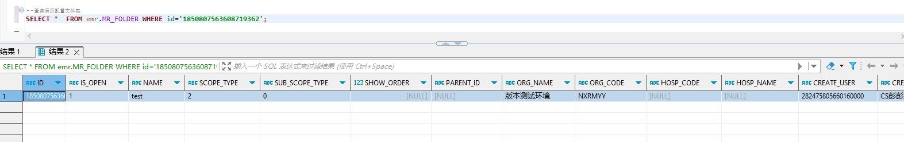

# 领域服务/病历领域 - 查询病历配置文件夹 - 查询病历配置文件夹(带允许的业务活动记录子集合) 正向用例
## 请求参数：
``` json
{
  "pageIndex": 1,
  "orgCode": "NXRMYY",
  "pageSize": 1,
  "folderType": "2"
}
```
## 返回参数：
``` json
{
  "exception": null,
  "apiCode": null,
  "data": {
    "list": [
      {
        "id": "1850807563608719362",
        "isDelete": "N",
        "createUserName": "CS彭彭彭",
        "createDate": "2024-10-16 17:25:06",
        "updateUserName": null,
        "updateDate": null,
        "updateKey": null,
        "orgCode": "NXRMYY",
        "orgName": "版本测试环境",
        "hospCode": null,
        "hospName": null,
        "name": "test",
        "scopeType": "2",
        "showOrder": null,
        "parentId": null,
        "isOpen": "1",
        "sourceId": null,
        "records": [
          {
            "id": "1850807563621302274",
            "isDelete": "N",
            "createUserName": "CS彭彭彭",
            "createDate": "2024-10-16 17:25:06",
            "updateUserName": null,
            "updateDate": null,
            "updateKey": 62,
            "orgCode": "NXRMYY",
            "orgName": "版本测试环境",
            "hospCode": null,
            "hospName": null,
            "folderId": "1850807563608719362",
            "stdCode": "EMR110001",
            "stdName": "长期医嘱",
            "folderName": null,
            "createUserId": "282475805660160000",
            "updateUserId": null
          }
        ],
        "subScopeType": "0",
        "suitDeptList": [],
        "createUserId": "282475805660160000",
        "updateUserId": null
      }
    ],
    "totalCount": 1,
    "pageSize": 1,
    "pageNo": 1,
    "pageCount": 1
  },
  "Code": 200,
  "Message": "操作成功"
}
```
## 数据校验：

# 领域服务/病历领域 - 查询病历配置文件夹 - 必填校验-[orgCode]为空
## 请求参数：
``` json
{
  "pageIndex": 1,
  "orgCode": "",
  "pageSize": 1,
  "folderType": "2"
}
```
## 返回参数：
``` json
{
  "exception": null,
  "apiCode": null,
  "data": null,
  "Code": 1,
  "Message": "机构编码不能为空"
}
```
# 领域服务/病历领域 - 查询病历配置文件夹 - 必填校验-[pageIndex]为空
## 请求参数：
``` json
{
  "pageIndex": null,
  "orgCode": "NXRMYY",
  "pageSize": 1,
  "folderType": "2"
}
```
## 返回参数：
``` json
{
  "exception": null,
  "apiCode": null,
  "data": null,
  "Code": 1,
  "Message": "系统内部异常"
}
```
# 领域服务/病历领域 - 查询病历配置文件夹 - 必填校验-[pageSize]为空
## 请求参数：
``` json
{
  "pageIndex": 1,
  "orgCode": "NXRMYY",
  "pageSize": null,
  "folderType": "2"
}
```
## 返回参数：
``` json
{
  "exception": null,
  "apiCode": null,
  "data": null,
  "Code": 1,
  "Message": "系统内部异常"
}
```
# 领域服务/病历领域 - 查询病历配置文件夹 - 必填校验-[folderType]为空
## 请求参数：
``` json
{
  "pageIndex": 1,
  "orgCode": "NXRMYY",
  "pageSize": 1,
  "folderType": ""
}
```
## 返回参数：
``` json
{
  "exception": null,
  "apiCode": null,
  "data": null,
  "Code": 1,
  "Message": "文件夹类型不能为空"
}
```
# 领域服务/病历领域 - 查询病历配置文件夹 - 类型校验-[pageSize]类型错误
## 请求参数：
``` json
{
  "pageIndex": 1,
  "orgCode": "NXRMYY",
  "pageSize": "abc",
  "folderType": "2"
}
```
## 返回参数：
``` json
{
  "exception": null,
  "apiCode": null,
  "data": null,
  "Code": 1,
  "Message": "请求参数错误"
}
```
# 领域服务/病历领域 - 查询病历配置文件夹 - 类型校验-[pageIndex]类型错误
## 请求参数：
``` json
{
  "pageIndex": "abc",
  "orgCode": "NXRMYY",
  "pageSize": 1,
  "folderType": "2"
}
```
## 返回参数：
``` json
{
  "exception": null,
  "apiCode": null,
  "data": null,
  "Code": 1,
  "Message": "请求参数错误"
}
```
# 领域服务/病历领域 - 查询病历配置文件夹 - 枚举用例-[folderType] 枚举值为 1(查询文件夹类型为门诊)
## 请求参数：
``` json
{
  "pageIndex": 1,
  "orgCode": "NXRMYY",
  "pageSize": 1,
  "folderType": "1"
}
```
## 返回参数：
``` json
{
  "exception": null,
  "apiCode": null,
  "data": {
    "list": [
      {
        "id": "1843188383036264449",
        "isDelete": "N",
        "createUserName": "CS邓亮",
        "createDate": "2024-10-07 15:15:29",
        "updateUserName": "CS彭彭彭",
        "updateDate": "2024-11-18 09:43:35",
        "updateKey": null,
        "orgCode": "NXRMYY",
        "orgName": "版本测试环境",
        "hospCode": null,
        "hospName": null,
        "name": "门诊病历",
        "scopeType": "1",
        "showOrder": null,
        "parentId": null,
        "isOpen": "1",
        "sourceId": null,
        "records": [
          {
            "id": "1858325146952105985",
            "isDelete": "N",
            "createUserName": "CS彭彭彭",
            "createDate": "2024-11-18 09:43:35",
            "updateUserName": null,
            "updateDate": null,
            "updateKey": 141,
            "orgCode": "NXRMYY",
            "orgName": "版本测试环境",
            "hospCode": null,
            "hospName": null,
            "folderId": "1843188383036264449",
            "stdCode": "EMR020001",
            "stdName": "门(急)诊病历",
            "folderName": null,
            "createUserId": "282475805660160000",
            "updateUserId": null
          }
        ],
        "subScopeType": "0",
        "suitDeptList": [],
        "createUserId": "20200327091607626",
        "updateUserId": "282475805660160000"
      }
    ],
    "totalCount": 5,
    "pageSize": 1,
    "pageNo": 1,
    "pageCount": 5
  },
  "Code": 200,
  "Message": "操作成功"
}
```
# 领域服务/病历领域 - 查询病历配置文件夹 - 枚举用例-[folderType] 枚举值为 2(查询文件夹类型为住院)
## 请求参数：
``` json
{
  "pageIndex": 1,
  "orgCode": "NXRMYY",
  "pageSize": 1,
  "folderType": "2"
}
```
## 返回参数：
``` json
{
  "exception": null,
  "apiCode": null,
  "data": {
    "list": [
      {
        "id": "1850807563608719362",
        "isDelete": "N",
        "createUserName": "CS彭彭彭",
        "createDate": "2024-10-16 17:25:06",
        "updateUserName": null,
        "updateDate": null,
        "updateKey": null,
        "orgCode": "NXRMYY",
        "orgName": "版本测试环境",
        "hospCode": null,
        "hospName": null,
        "name": "test",
        "scopeType": "2",
        "showOrder": null,
        "parentId": null,
        "isOpen": "1",
        "sourceId": null,
        "records": [
          {
            "id": "1850807563621302274",
            "isDelete": "N",
            "createUserName": "CS彭彭彭",
            "createDate": "2024-10-16 17:25:06",
            "updateUserName": null,
            "updateDate": null,
            "updateKey": 62,
            "orgCode": "NXRMYY",
            "orgName": "版本测试环境",
            "hospCode": null,
            "hospName": null,
            "folderId": "1850807563608719362",
            "stdCode": "EMR110001",
            "stdName": "长期医嘱",
            "folderName": null,
            "createUserId": "282475805660160000",
            "updateUserId": null
          }
        ],
        "subScopeType": "0",
        "suitDeptList": [],
        "createUserId": "282475805660160000",
        "updateUserId": null
      }
    ],
    "totalCount": 1,
    "pageSize": 1,
    "pageNo": 1,
    "pageCount": 1
  },
  "Code": 200,
  "Message": "操作成功"
}
```
# 领域服务/病历领域 - 查询病历配置文件夹 - 依赖用例-[orgCode]赋值为依赖用例测试值
## 请求参数：
``` json
{
  "pageIndex": 1,
  "orgCode": "依赖用例测试值",
  "pageSize": 1,
  "folderType": "2"
}
```
## 返回参数：
``` json
{
  "exception": null,
  "apiCode": null,
  "data": {
    "list": [],
    "totalCount": 0,
    "pageSize": 1,
    "pageNo": 1,
    "pageCount": 0
  },
  "Code": 200,
  "Message": "操作成功"
}
```