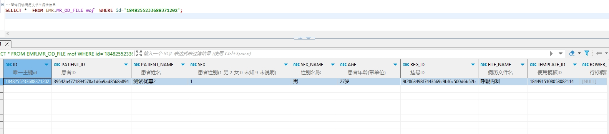

# 领域服务/病历领域 - 查询门诊病历文书主属性信息 - 查询门诊病历文书主属性信息 正向用例
## 请求参数：
``` json
{
  "hospCode": "NXRY",
  "patientId": "39542b4771894578a1d6a9ad8568a894",
  "orgCode": "NXRMYY",
  "regId": "9f2863498f7443569c9bf6c500d6b52b"
}
```
## 返回参数：
``` json
{
  "exception": null,
  "apiCode": null,
  "data": {
    "list": [
      {
        "id": "1848255233688371202",
        "isDelete": "N",
        "createUserName": "CS彭彭彭",
        "createDate": "2024-10-21 14:49:21",
        "updateUserName": "CS彭彭彭",
        "updateDate": "2024-10-21 16:51:18",
        "updateKey": 70,
        "orgCode": "NXRMYY",
        "orgName": "版本测试环境",
        "hospCode": "NXRY",
        "hospName": "版本测试环境",
        "patientId": "39542b4771894578a1d6a9ad8568a894",
        "regId": "9f2863498f7443569c9bf6c500d6b52b",
        "fileName": "呼吸内科",
        "templateId": "1844915108053082114",
        "rowerType": null,
        "isPrint": "1",
        "titleDate": "2024-10-21 14:49:20",
        "deptId": "224708989908054016",
        "deptName": "产科诊室",
        "internId": null,
        "internName": null,
        "stdRecordName": "门(急)诊病历",
        "stdRecordCode": "EMR020001",
        "signFlag": "1",
        "signId": "282475805660160000",
        "signName": "CS彭彭彭",
        "signDate": "2024-10-21 16:51:18",
        "fileNo": null,
        "folderId": "1843188383036264449",
        "printUserId": "282475805660160000",
        "printUserName": "CS彭彭彭",
        "printDate": "2024-10-16 14:25:27",
        "patientName": "测试优惠2",
        "sex": "1",
        "sexName": "男",
        "age": "27岁",
        "datasetCode": "07#23#01",
        "sourceId": null,
        "createUserId": "282475805660160000",
        "updateUserId": "282475805660160000"
      }
    ]
  },
  "Code": 200,
  "Message": "操作成功"
}
```
## 数据校验：

# 领域服务/病历领域 - 查询门诊病历文书主属性信息 - 必填校验-[hospCode]为空
## 请求参数：
``` json
{
  "hospCode": "",
  "patientId": "39542b4771894578a1d6a9ad8568a894",
  "orgCode": "NXRMYY",
  "regId": "9f2863498f7443569c9bf6c500d6b52b"
}
```
## 返回参数：
``` json
{
  "exception": null,
  "apiCode": null,
  "data": null,
  "Code": 1,
  "Message": "院区编码不能为空"
}
```
# 领域服务/病历领域 - 查询门诊病历文书主属性信息 - 必填校验-[orgCode]为空
## 请求参数：
``` json
{
  "hospCode": "NXRY",
  "patientId": "39542b4771894578a1d6a9ad8568a894",
  "orgCode": "",
  "regId": "9f2863498f7443569c9bf6c500d6b52b"
}
```
## 返回参数：
``` json
{
  "exception": null,
  "apiCode": null,
  "data": null,
  "Code": 1,
  "Message": "机构编码不能为空"
}
```
# 领域服务/病历领域 - 查询门诊病历文书主属性信息 - 必填校验-[patientId]为空
## 请求参数：
``` json
{
  "hospCode": "NXRY",
  "patientId": "",
  "orgCode": "NXRMYY",
  "regId": "9f2863498f7443569c9bf6c500d6b52b"
}
```
## 返回参数：
``` json
{
  "exception": null,
  "apiCode": null,
  "data": null,
  "Code": 1,
  "Message": "患者id不能为空"
}
```
# 领域服务/病历领域 - 查询门诊病历文书主属性信息 - 必填校验-[regId]为空
## 请求参数：
``` json
{
  "hospCode": "NXRY",
  "patientId": "39542b4771894578a1d6a9ad8568a894",
  "orgCode": "NXRMYY",
  "regId": ""
}
```
## 返回参数：
``` json
{
  "exception": null,
  "apiCode": null,
  "data": null,
  "Code": 1,
  "Message": "挂号id不能为空"
}
```
# 领域服务/病历领域 - 查询门诊病历文书主属性信息 - 依赖用例-[regId]赋值为依赖用例测试值
## 请求参数：
``` json
{
  "hospCode": "NXRY",
  "patientId": "39542b4771894578a1d6a9ad8568a894",
  "orgCode": "NXRMYY",
  "regId": "依赖用例测试值"
}
```
## 返回参数：
``` json
{
  "exception": null,
  "apiCode": null,
  "data": {
    "list": []
  },
  "Code": 200,
  "Message": "操作成功"
}
```
# 领域服务/病历领域 - 查询门诊病历文书主属性信息 - 依赖用例-[orgCode]赋值为依赖用例测试值
## 请求参数：
``` json
{
  "hospCode": "NXRY",
  "patientId": "39542b4771894578a1d6a9ad8568a894",
  "orgCode": "依赖用例测试值",
  "regId": "9f2863498f7443569c9bf6c500d6b52b"
}
```
## 返回参数：
``` json
{
  "exception": null,
  "apiCode": null,
  "data": {
    "list": []
  },
  "Code": 200,
  "Message": "操作成功"
}
```
# 领域服务/病历领域 - 查询门诊病历文书主属性信息 - 依赖用例-[patientId]赋值为依赖用例测试值
## 请求参数：
``` json
{
  "hospCode": "NXRY",
  "patientId": "依赖用例测试值",
  "orgCode": "NXRMYY",
  "regId": "9f2863498f7443569c9bf6c500d6b52b"
}
```
## 返回参数：
``` json
{
  "exception": null,
  "apiCode": null,
  "data": {
    "list": []
  },
  "Code": 200,
  "Message": "操作成功"
}
```
# 领域服务/病历领域 - 查询门诊病历文书主属性信息 - 依赖用例-[hospCode]赋值为依赖用例测试值
## 请求参数：
``` json
{
  "hospCode": "依赖用例测试值",
  "patientId": "39542b4771894578a1d6a9ad8568a894",
  "orgCode": "NXRMYY",
  "regId": "9f2863498f7443569c9bf6c500d6b52b"
}
```
## 返回参数：
``` json
{
  "exception": null,
  "apiCode": null,
  "data": {
    "list": []
  },
  "Code": 200,
  "Message": "操作成功"
}
```