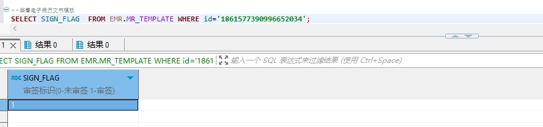

# 领域服务/病历领域 - 签署病历文书模板 - 签署病历文书模板 正向用例
## 请求参数：
``` json
{
  "orgName": "版本测试环境",
  "hospCode": "NXRY",
  "hospName": "版本测试环境",
  "orgCode": "NXRMYY",
  "list": [
    {
      "signFlag": "1",
      "signName": "测试医生",
      "id": "1861577390996652034",
      "signDate": "2024-10-19 15:28:41",
      "signId": "349365436797001728"
    }
  ],
  "operatorId": "349365436797001728",
  "operatorName": "测试医生",
  "operateDate": "2024-10-19 15:28:41"
}
```
## 返回参数：
``` json
{
    "exception": null,
    "apiCode": null,
    "data": null,
    "Code": 200,
    "Message": "操作成功"
}
```
## 数据校验：

# 领域服务/病历领域 - 签署病历文书模板 - 必填校验-[orgCode]为空
## 请求参数：
``` json
{
  "orgName": "版本测试环境",
  "hospCode": "NXRY",
  "hospName": "版本测试环境",
  "orgCode": "",
  "list": [
    {
      "signFlag": "1",
      "signName": "测试医生",
      "id": "1844677382372417537",
      "signDate": "2024-10-19 15:28:41",
      "signId": "349365436797001728"
    }
  ],
  "operatorId": "349365436797001728",
  "operatorName": "测试医生",
  "operateDate": "2024-10-19 15:28:41"
}
```
## 返回参数：
``` json
{
  "exception": null,
  "apiCode": null,
  "data": null,
  "Code": 1,
  "Message": "机构编码不能为空"
}
```
# 领域服务/病历领域 - 签署病历文书模板 - 必填校验-[orgName]为空
## 请求参数：
``` json
{
  "orgName": "",
  "hospCode": "NXRY",
  "hospName": "版本测试环境",
  "orgCode": "NXRMYY",
  "list": [
    {
      "signFlag": "1",
      "signName": "测试医生",
      "id": "1844677382372417537",
      "signDate": "2024-10-19 15:28:41",
      "signId": "349365436797001728"
    }
  ],
  "operatorId": "349365436797001728",
  "operatorName": "测试医生",
  "operateDate": "2024-10-19 15:28:41"
}
```
## 返回参数：
``` json
{
  "exception": null,
  "apiCode": null,
  "data": null,
  "Code": 1,
  "Message": "机构名称不能为空"
}
```
# 领域服务/病历领域 - 签署病历文书模板 - 必填校验-[hospCode]为空
## 请求参数：
``` json
{
  "orgName": "版本测试环境",
  "hospCode": "",
  "hospName": "版本测试环境",
  "orgCode": "NXRMYY",
  "list": [
    {
      "signFlag": "1",
      "signName": "测试医生",
      "id": "1844677382372417537",
      "signDate": "2024-10-19 15:28:41",
      "signId": "349365436797001728"
    }
  ],
  "operatorId": "349365436797001728",
  "operatorName": "测试医生",
  "operateDate": "2024-10-19 15:28:41"
}
```
## 返回参数：
``` json
{
  "exception": null,
  "apiCode": null,
  "data": null,
  "Code": 1,
  "Message": "院区编码不能为空"
}
```
# 领域服务/病历领域 - 签署病历文书模板 - 必填校验-[hospName]为空
## 请求参数：
``` json
{
  "orgName": "版本测试环境",
  "hospCode": "NXRY",
  "hospName": "",
  "orgCode": "NXRMYY",
  "list": [
    {
      "signFlag": "1",
      "signName": "测试医生",
      "id": "1844677382372417537",
      "signDate": "2024-10-19 15:28:41",
      "signId": "349365436797001728"
    }
  ],
  "operatorId": "349365436797001728",
  "operatorName": "测试医生",
  "operateDate": "2024-10-19 15:28:41"
}
```
## 返回参数：
``` json
{
  "exception": null,
  "apiCode": null,
  "data": null,
  "Code": 1,
  "Message": "院区名称不能为空"
}
```
# 领域服务/病历领域 - 签署病历文书模板 - 必填校验-[operatorId]为空
## 请求参数：
``` json
{
  "orgName": "版本测试环境",
  "hospCode": "NXRY",
  "hospName": "版本测试环境",
  "orgCode": "NXRMYY",
  "list": [
    {
      "signFlag": "1",
      "signName": "测试医生",
      "id": "1844677382372417537",
      "signDate": "2024-10-19 15:28:41",
      "signId": "349365436797001728"
    }
  ],
  "operatorId": "",
  "operatorName": "测试医生",
  "operateDate": "2024-10-19 15:28:41"
}
```
## 返回参数：
``` json
{
  "exception": null,
  "apiCode": null,
  "data": null,
  "Code": 1,
  "Message": "操作人id不能为空"
}
```
# 领域服务/病历领域 - 签署病历文书模板 - 必填校验-[operatorName]为空
## 请求参数：
``` json
{
  "orgName": "版本测试环境",
  "hospCode": "NXRY",
  "hospName": "版本测试环境",
  "orgCode": "NXRMYY",
  "list": [
    {
      "signFlag": "1",
      "signName": "测试医生",
      "id": "1844677382372417537",
      "signDate": "2024-10-19 15:28:41",
      "signId": "349365436797001728"
    }
  ],
  "operatorId": "349365436797001728",
  "operatorName": "",
  "operateDate": "2024-10-19 15:28:41"
}
```
## 返回参数：
``` json
{
  "exception": null,
  "apiCode": null,
  "data": null,
  "Code": 1,
  "Message": "操作人姓名不能为空"
}
```
# 领域服务/病历领域 - 签署病历文书模板 - 必填校验-[operateDate]为空
## 请求参数：
``` json
{
  "orgName": "版本测试环境",
  "hospCode": "NXRY",
  "hospName": "版本测试环境",
  "orgCode": "NXRMYY",
  "list": [
    {
      "signFlag": "1",
      "signName": "测试医生",
      "id": "1844677382372417537",
      "signDate": "2024-10-19 15:28:41",
      "signId": "349365436797001728"
    }
  ],
  "operatorId": "349365436797001728",
  "operatorName": "测试医生",
  "operateDate": ""
}
```
## 返回参数：
``` json
{
  "exception": null,
  "apiCode": null,
  "data": null,
  "Code": 1,
  "Message": "操作时间不能为空"
}
```
# 领域服务/病历领域 - 签署病历文书模板 - 必填校验-[list]为空
## 请求参数：
``` json
{
  "orgName": "版本测试环境",
  "hospCode": "NXRY",
  "hospName": "版本测试环境",
  "orgCode": "NXRMYY",
  "list": null,
  "operatorId": "349365436797001728",
  "operatorName": "测试医生",
  "operateDate": "2024-10-19 15:28:41"
}
```
## 返回参数：
``` json
{
  "exception": null,
  "apiCode": null,
  "data": null,
  "Code": 1,
  "Message": "待签署的电子病历文书模板集合不能为空"
}
```
# 领域服务/病历领域 - 签署病历文书模板 - 必填校验-[list.id]为空
## 请求参数：
``` json
{
  "orgName": "版本测试环境",
  "hospCode": "NXRY",
  "hospName": "版本测试环境",
  "orgCode": "NXRMYY",
  "list": [
    {
      "signFlag": "1",
      "signName": "测试医生",
      "id": null,
      "signDate": "2024-10-19 15:28:41",
      "signId": "349365436797001728"
    }
  ],
  "operatorId": "349365436797001728",
  "operatorName": "测试医生",
  "operateDate": "2024-10-19 15:28:41"
}
```
## 返回参数：
``` json
{
  "exception": null,
  "apiCode": null,
  "data": null,
  "Code": 1,
  "Message": "主键id不能为空"
}
```
# 领域服务/病历领域 - 签署病历文书模板 - 必填校验-[list.signId]为空
## 请求参数：
``` json
{
  "orgName": "版本测试环境",
  "hospCode": "NXRY",
  "hospName": "版本测试环境",
  "orgCode": "NXRMYY",
  "list": [
    {
      "signFlag": "1",
      "signName": "测试医生",
      "id": "1844677382372417537",
      "signDate": "2024-10-19 15:28:41",
      "signId": null
    }
  ],
  "operatorId": "349365436797001728",
  "operatorName": "测试医生",
  "operateDate": "2024-10-19 15:28:41"
}
```
## 返回参数：
``` json
{
  "exception": null,
  "apiCode": null,
  "data": null,
  "Code": 1,
  "Message": "签署人id不能为空"
}
```
# 领域服务/病历领域 - 签署病历文书模板 - 必填校验-[list.signName]为空
## 请求参数：
``` json
{
  "orgName": "版本测试环境",
  "hospCode": "NXRY",
  "hospName": "版本测试环境",
  "orgCode": "NXRMYY",
  "list": [
    {
      "signFlag": "1",
      "signName": null,
      "id": "1844677382372417537",
      "signDate": "2024-10-19 15:28:41",
      "signId": "349365436797001728"
    }
  ],
  "operatorId": "349365436797001728",
  "operatorName": "测试医生",
  "operateDate": "2024-10-19 15:28:41"
}
```
## 返回参数：
``` json
{
  "exception": null,
  "apiCode": null,
  "data": null,
  "Code": 1,
  "Message": "签署人姓名不能为空"
}
```
# 领域服务/病历领域 - 签署病历文书模板 - 必填校验-[list.signDate]为空
## 请求参数：
``` json
{
  "orgName": "版本测试环境",
  "hospCode": "NXRY",
  "hospName": "版本测试环境",
  "orgCode": "NXRMYY",
  "list": [
    {
      "signFlag": "1",
      "signName": "测试医生",
      "id": "1844677382372417537",
      "signDate": null,
      "signId": "349365436797001728"
    }
  ],
  "operatorId": "349365436797001728",
  "operatorName": "测试医生",
  "operateDate": "2024-10-19 15:28:41"
}
```
## 返回参数：
``` json
{
  "exception": null,
  "apiCode": null,
  "data": null,
  "Code": 1,
  "Message": "签署时间不能为空"
}
```
# 领域服务/病历领域 - 签署病历文书模板 - 必填校验-[list.signFlag]为空
## 请求参数：
``` json
{
  "orgName": "版本测试环境",
  "hospCode": "NXRY",
  "hospName": "版本测试环境",
  "orgCode": "NXRMYY",
  "list": [
    {
      "signFlag": null,
      "signName": "测试医生",
      "id": "1844677382372417537",
      "signDate": "2024-10-19 15:28:41",
      "signId": "349365436797001728"
    }
  ],
  "operatorId": "349365436797001728",
  "operatorName": "测试医生",
  "operateDate": "2024-10-19 15:28:41"
}
```
## 返回参数：
``` json
{
  "exception": null,
  "apiCode": null,
  "data": null,
  "Code": 1,
  "Message": "审签标识不能为空"
}
```
# 领域服务/病历领域 - 签署病历文书模板 - 枚举用例-[list.signFlag] 枚举值为 0(审签标识为未签署)
## 请求参数：
``` json
{
  "orgName": "版本测试环境",
  "hospCode": "NXRY",
  "hospName": "版本测试环境",
  "orgCode": "NXRMYY",
  "list": [
    {
      "signFlag": "0",
      "signName": "测试医生",
      "id": "1844677382372417537",
      "signDate": "2024-10-19 15:28:41",
      "signId": "349365436797001728"
    }
  ],
  "operatorId": "349365436797001728",
  "operatorName": "测试医生",
  "operateDate": "2024-10-19 15:28:41"
}
```
## 返回参数：
``` json
{
  "exception": null,
  "apiCode": null,
  "data": null,
  "Code": 1,
  "Message": "请先保存该病历文书模板再执行签署"
}
```
# 领域服务/病历领域 - 签署病历文书模板 - 枚举用例-[list.signFlag] 枚举值为 1(审签标识为签署)
## 请求参数：
``` json
{
  "orgName": "版本测试环境",
  "hospCode": "NXRY",
  "hospName": "版本测试环境",
  "orgCode": "NXRMYY",
  "list": [
    {
      "signFlag": "1",
      "signName": "测试医生",
      "id": "1844677382372417537",
      "signDate": "2024-10-19 15:28:41",
      "signId": "349365436797001728"
    }
  ],
  "operatorId": "349365436797001728",
  "operatorName": "测试医生",
  "operateDate": "2024-10-19 15:28:41"
}
```
## 返回参数：
``` json
{
  "exception": null,
  "apiCode": null,
  "data": null,
  "Code": 1,
  "Message": "请先保存该病历文书模板再执行签署"
}
```
# 领域服务/病历领域 - 签署病历文书模板 - 依赖用例-[operatorName]赋值为依赖用例测试值
## 请求参数：
``` json
{
  "orgName": "版本测试环境",
  "hospCode": "NXRY",
  "hospName": "版本测试环境",
  "orgCode": "NXRMYY",
  "list": [
    {
      "signFlag": "1",
      "signName": "测试医生",
      "id": "1844677382372417537",
      "signDate": "2024-10-19 15:28:41",
      "signId": "349365436797001728"
    }
  ],
  "operatorId": "349365436797001728",
  "operatorName": "依赖用例测试值",
  "operateDate": "2024-10-19 15:28:41"
}
```
## 返回参数：
``` json
{
  "exception": null,
  "apiCode": null,
  "data": null,
  "Code": 1,
  "Message": "请先保存该病历文书模板再执行签署"
}
```
# 领域服务/病历领域 - 签署病历文书模板 - 依赖用例-[operatorId]赋值为依赖用例测试值
## 请求参数：
``` json
{
  "orgName": "版本测试环境",
  "hospCode": "NXRY",
  "hospName": "版本测试环境",
  "orgCode": "NXRMYY",
  "list": [
    {
      "signFlag": "1",
      "signName": "测试医生",
      "id": "1844677382372417537",
      "signDate": "2024-10-19 15:28:41",
      "signId": "349365436797001728"
    }
  ],
  "operatorId": "依赖用例测试值",
  "operatorName": "测试医生",
  "operateDate": "2024-10-19 15:28:41"
}
```
## 返回参数：
``` json
{
  "exception": null,
  "apiCode": null,
  "data": null,
  "Code": 1,
  "Message": "请先保存该病历文书模板再执行签署"
}
```
# 领域服务/病历领域 - 签署病历文书模板 - 依赖用例-[list.signName]赋值为依赖用例测试值
## 请求参数：
``` json
{
  "orgName": "版本测试环境",
  "hospCode": "NXRY",
  "hospName": "版本测试环境",
  "orgCode": "NXRMYY",
  "list": [
    {
      "signFlag": "1",
      "signName": "依赖用例测试值",
      "id": "1844677382372417537",
      "signDate": "2024-10-19 15:28:41",
      "signId": "349365436797001728"
    }
  ],
  "operatorId": "349365436797001728",
  "operatorName": "测试医生",
  "operateDate": "2024-10-19 15:28:41"
}
```
## 返回参数：
``` json
{
  "exception": null,
  "apiCode": null,
  "data": null,
  "Code": 1,
  "Message": "请先保存该病历文书模板再执行签署"
}
```
# 领域服务/病历领域 - 签署病历文书模板 - 依赖用例-[list.id]赋值为依赖用例测试值
## 请求参数：
``` json
{
  "orgName": "版本测试环境",
  "hospCode": "NXRY",
  "hospName": "版本测试环境",
  "orgCode": "NXRMYY",
  "list": [
    {
      "signFlag": "1",
      "signName": "测试医生",
      "id": "依赖用例测试值",
      "signDate": "2024-10-19 15:28:41",
      "signId": "349365436797001728"
    }
  ],
  "operatorId": "349365436797001728",
  "operatorName": "测试医生",
  "operateDate": "2024-10-19 15:28:41"
}
```
## 返回参数：
``` json
{
  "exception": null,
  "apiCode": null,
  "data": null,
  "Code": 1,
  "Message": "请先保存该病历文书模板再执行签署"
}
```
# 领域服务/病历领域 - 签署病历文书模板 - 依赖用例-[list.signId]赋值为依赖用例测试值
## 请求参数：
``` json
{
  "orgName": "版本测试环境",
  "hospCode": "NXRY",
  "hospName": "版本测试环境",
  "orgCode": "NXRMYY",
  "list": [
    {
      "signFlag": "1",
      "signName": "测试医生",
      "id": "1844677382372417537",
      "signDate": "2024-10-19 15:28:41",
      "signId": "依赖用例测试值"
    }
  ],
  "operatorId": "349365436797001728",
  "operatorName": "测试医生",
  "operateDate": "2024-10-19 15:28:41"
}
```
## 返回参数：
``` json
{
  "exception": null,
  "apiCode": null,
  "data": null,
  "Code": 1,
  "Message": "请先保存该病历文书模板再执行签署"
}
```
# 领域服务/病历领域 - 签署病历文书模板 - 依赖用例-[orgCode]赋值为依赖用例测试值
## 请求参数：
``` json
{
  "orgName": "版本测试环境",
  "hospCode": "NXRY",
  "hospName": "版本测试环境",
  "orgCode": "依赖用例测试值",
  "list": [
    {
      "signFlag": "1",
      "signName": "测试医生",
      "id": "1844677382372417537",
      "signDate": "2024-10-19 15:28:41",
      "signId": "349365436797001728"
    }
  ],
  "operatorId": "349365436797001728",
  "operatorName": "测试医生",
  "operateDate": "2024-10-19 15:28:41"
}
```
## 返回参数：
``` json
{
  "exception": null,
  "apiCode": null,
  "data": null,
  "Code": 1,
  "Message": "请先保存该病历文书模板再执行签署"
}
```
# 领域服务/病历领域 - 签署病历文书模板 - 依赖用例-[hospName]赋值为依赖用例测试值
## 请求参数：
``` json
{
  "orgName": "版本测试环境",
  "hospCode": "NXRY",
  "hospName": "依赖用例测试值",
  "orgCode": "NXRMYY",
  "list": [
    {
      "signFlag": "1",
      "signName": "测试医生",
      "id": "1844677382372417537",
      "signDate": "2024-10-19 15:28:41",
      "signId": "349365436797001728"
    }
  ],
  "operatorId": "349365436797001728",
  "operatorName": "测试医生",
  "operateDate": "2024-10-19 15:28:41"
}
```
## 返回参数：
``` json
{
  "exception": null,
  "apiCode": null,
  "data": null,
  "Code": 1,
  "Message": "请先保存该病历文书模板再执行签署"
}
```
# 领域服务/病历领域 - 签署病历文书模板 - 依赖用例-[hospCode]赋值为依赖用例测试值
## 请求参数：
``` json
{
  "orgName": "版本测试环境",
  "hospCode": "依赖用例测试值",
  "hospName": "版本测试环境",
  "orgCode": "NXRMYY",
  "list": [
    {
      "signFlag": "1",
      "signName": "测试医生",
      "id": "1844677382372417537",
      "signDate": "2024-10-19 15:28:41",
      "signId": "349365436797001728"
    }
  ],
  "operatorId": "349365436797001728",
  "operatorName": "测试医生",
  "operateDate": "2024-10-19 15:28:41"
}
```
## 返回参数：
``` json
{
  "exception": null,
  "apiCode": null,
  "data": null,
  "Code": 1,
  "Message": "请先保存该病历文书模板再执行签署"
}
```
# 领域服务/病历领域 - 签署病历文书模板 - 依赖用例-[orgName]赋值为依赖用例测试值
## 请求参数：
``` json
{
  "orgName": "依赖用例测试值",
  "hospCode": "NXRY",
  "hospName": "版本测试环境",
  "orgCode": "NXRMYY",
  "list": [
    {
      "signFlag": "1",
      "signName": "测试医生",
      "id": "1844677382372417537",
      "signDate": "2024-10-19 15:28:41",
      "signId": "349365436797001728"
    }
  ],
  "operatorId": "349365436797001728",
  "operatorName": "测试医生",
  "operateDate": "2024-10-19 15:28:41"
}
```
## 返回参数：
``` json
{
  "exception": null,
  "apiCode": null,
  "data": null,
  "Code": 1,
  "Message": "请先保存该病历文书模板再执行签署"
}
```