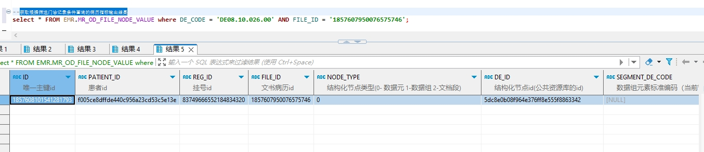

# 领域服务/病历领域 - 获取根据筛选门诊记录条件查询的病历指标输出结果 - 获取根据筛选门诊记录条件查询的病历指标输出结果 正向用例
## 请求参数：
``` json
{
  "nodeCodes": [
    "DE08.10.026.00"
  ],
  "hospCode": "NXRY",
  "fileIds": [
    "1857607950076575746"
  ],
  "orgCode": "NXRMYY"
}
```
## 返回参数：
``` json
{
    "exception": null,
    "apiCode": null,
    "data": {
        "list": [
            {
                "id": "1857608101541281793",
                "isDelete": "N",
                "createUserName": "测试医生",
                "createDate": "2024-11-16 10:14:18",
                "updateUserName": null,
                "updateDate": null,
                "updateKey": 421,
                "orgCode": "NXRMYY",
                "orgName": "版本测试环境",
                "hospCode": "NXRY",
                "hospName": "版本测试环境",
                "patientId": "f005ce8dffde440c956a23cd53c5e13e",
                "regId": "83749666552184834320",
                "fileId": "1857607950076575746",
                "nodeType": "0",
                "deId": "5dc8e0b08f964e376ff8e555f8863342",
                "recordNodeId": "1784415557823549441NXRMYY",
                "deCode": "DE08.10.026.00",
                "deName": "科室名称",
                "stdRecordId": "5a7064dd26bd4ac7a3eab64194e7304b",
                "stdRecordCode": "EMR020001",
                "stdRecordName": "门(急)诊病历",
                "nodeName": "就诊科室",
                "dataType": "0",
                "value": "内分泌科(门)",
                "code": null,
                "dictCode": null,
                "controlId": "e87f721f-b6cc-4c9b-9278-afc0263d82b1",
                "dataSetDeCode": null,
                "segmentDeNode": null,
                "createUserId": "349365436797001728",
                "updateUserId": null
            }
        ]
    },
    "Code": 200,
    "Message": "操作成功"
}
```
## 数据校验：

# 领域服务/病历领域 - 获取根据筛选门诊记录条件查询的病历指标输出结果 - 必填校验-[orgCode]为空
## 请求参数：
``` json
{
  "nodeCodes": [
    "DE04.01.011.00"
  ],
  "hospCode": "NXRY",
  "fileIds": [
    "1847097450695827457"
  ],
  "orgCode": ""
}
```
## 返回参数：
``` json
{
  "exception": null,
  "apiCode": null,
  "data": null,
  "Code": 1,
  "Message": "机构编码不能为空"
}
```
# 领域服务/病历领域 - 获取根据筛选门诊记录条件查询的病历指标输出结果 - 必填校验-[hospCode]为空
## 请求参数：
``` json
{
  "nodeCodes": [
    "DE04.01.011.00"
  ],
  "hospCode": "",
  "fileIds": [
    "1847097450695827457"
  ],
  "orgCode": "NXRMYY"
}
```
## 返回参数：
``` json
{
  "exception": null,
  "apiCode": null,
  "data": null,
  "Code": 1,
  "Message": "院区编码不能为空"
}
```
# 领域服务/病历领域 - 获取根据筛选门诊记录条件查询的病历指标输出结果 - 必填校验-[fileIds]为空
## 请求参数：
``` json
{
  "nodeCodes": [
    "DE04.01.011.00"
  ],
  "hospCode": "NXRY",
  "fileIds": null,
  "orgCode": "NXRMYY"
}
```
## 返回参数：
``` json
{
  "exception": null,
  "apiCode": null,
  "data": null,
  "Code": 1,
  "Message": "符合条件的病历记录id集合不能为空"
}
```
# 领域服务/病历领域 - 获取根据筛选门诊记录条件查询的病历指标输出结果 - 必填校验-[nodeCodes]为空
## 请求参数：
``` json
{
  "nodeCodes": null,
  "hospCode": "NXRY",
  "fileIds": [
    "1847097450695827457"
  ],
  "orgCode": "NXRMYY"
}
```
## 返回参数：
``` json
{
  "exception": null,
  "apiCode": null,
  "data": null,
  "Code": 1,
  "Message": "查询结构化指标标准码集合不能为空"
}
```
# 领域服务/病历领域 - 获取根据筛选门诊记录条件查询的病历指标输出结果 - 类型校验-[fileIds]类型错误
## 请求参数：
``` json
{
  "nodeCodes": [
    "DE04.01.011.00"
  ],
  "hospCode": "NXRY",
  "fileIds": "abc",
  "orgCode": "NXRMYY"
}
```
## 返回参数：
``` json
{
  "exception": null,
  "apiCode": null,
  "data": null,
  "Code": 1,
  "Message": "请求参数错误"
}
```
# 领域服务/病历领域 - 获取根据筛选门诊记录条件查询的病历指标输出结果 - 类型校验-[nodeCodes]类型错误
## 请求参数：
``` json
{
  "nodeCodes": "abc",
  "hospCode": "NXRY",
  "fileIds": [
    "1847097450695827457"
  ],
  "orgCode": "NXRMYY"
}
```
## 返回参数：
``` json
{
  "exception": null,
  "apiCode": null,
  "data": null,
  "Code": 1,
  "Message": "请求参数错误"
}
```
# 领域服务/病历领域 - 获取根据筛选门诊记录条件查询的病历指标输出结果 - 依赖用例-[orgCode]赋值为依赖用例测试值
## 请求参数：
``` json
{
  "nodeCodes": [
    "DE04.01.011.00"
  ],
  "hospCode": "NXRY",
  "fileIds": [
    "1847097450695827457"
  ],
  "orgCode": "依赖用例测试值"
}
```
## 返回参数：
``` json
{
  "exception": null,
  "apiCode": null,
  "data": {
    "list": []
  },
  "Code": 200,
  "Message": "操作成功"
}
```
# 领域服务/病历领域 - 获取根据筛选门诊记录条件查询的病历指标输出结果 - 依赖用例-[fileIds]赋值为[依赖用例测试值]
## 请求参数：
``` json
{
  "nodeCodes": [
    "DE04.01.011.00"
  ],
  "hospCode": "NXRY",
  "fileIds": [
    "依赖用例测试值"
  ],
  "orgCode": "NXRMYY"
}
```
## 返回参数：
``` json
{
  "exception": null,
  "apiCode": null,
  "data": {
    "list": []
  },
  "Code": 200,
  "Message": "操作成功"
}
```
# 领域服务/病历领域 - 获取根据筛选门诊记录条件查询的病历指标输出结果 - 依赖用例-[hospCode]赋值为依赖用例测试值
## 请求参数：
``` json
{
  "nodeCodes": [
    "DE04.01.011.00"
  ],
  "hospCode": "依赖用例测试值",
  "fileIds": [
    "1847097450695827457"
  ],
  "orgCode": "NXRMYY"
}
```
## 返回参数：
``` json
{
  "exception": null,
  "apiCode": null,
  "data": {
    "list": []
  },
  "Code": 200,
  "Message": "操作成功"
}
```
# 领域服务/病历领域 - 获取根据筛选门诊记录条件查询的病历指标输出结果 - 依赖用例-[nodeCodes]赋值为[依赖用例测试值]
## 请求参数：
``` json
{
  "nodeCodes": [
    "依赖用例测试值"
  ],
  "hospCode": "NXRY",
  "fileIds": [
    "1847097450695827457"
  ],
  "orgCode": "NXRMYY"
}
```
## 返回参数：
``` json
{
  "exception": null,
  "apiCode": null,
  "data": {
    "list": []
  },
  "Code": 200,
  "Message": "操作成功"
}
```