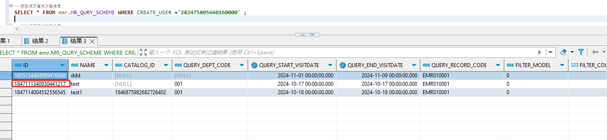

# 领域服务/病历领域 - 获取病历查询方案信息（包括组合条件，查询指标信息） - 获取病历查询方案信息（包括组合条件，查询指标信息） 正向用例
## 请求参数：
``` json
{
  "hospCode": "NXRY",
  "pageIndex": 1,
  "orgCode": "NXRMYY",
  "pageSize": 1,
  "operatorId": "282475805660160000"
}
```
## 返回参数：
``` json
{
    "exception": null,
    "apiCode": null,
    "data": {
        "list": [
            {
                "id": "1847111340930441217",
                "isDelete": "N",
                "createUserName": "CS彭彭彭",
                "createDate": "2024-10-18 11:03:55",
                "updateUserName": "CS彭彭彭",
                "updateDate": "2024-10-31 14:14:17",
                "updateKey": 1,
                "orgCode": "NXRMYY",
                "orgName": "版本测试环境",
                "hospCode": "NXRY",
                "hospName": "版本测试环境",
                "createUserId": null,
                "updateUserId": null,
                "name": "test",
                "catalogId": null,
                "queryDeptCode": "001",
                "queryStartVisitDate": "2024-10-17 00:00:00",
                "queryEndVisitDate": "2024-10-17 00:00:00",
                "queryStdRecordCode": "EMR010001",
                "filterModel": "0",
                "filterCount": "5",
                "sourceId": null,
                "queryConditionDetailList": [
                    {
                        "id": "1851870289151983618",
                        "isDelete": null,
                        "createUserName": null,
                        "createDate": null,
                        "updateUserName": null,
                        "updateDate": null,
                        "updateKey": null,
                        "orgCode": null,
                        "orgName": null,
                        "hospCode": null,
                        "hospName": null,
                        "queryType": "0",
                        "nodeCode": "DE02.01.039.00",
                        "nodeName": "姓名",
                        "operatorSymbol": ">",
                        "value": "1",
                        "dataType": "0",
                        "logicRelation": null,
                        "serialNumber": "0",
                        "schemeId": "1847111340930441217",
                        "createUserId": null,
                        "updateUserId": null
                    }
                ],
                "queryTargetList": [
                    {
                        "id": "1851870289151983619",
                        "isDelete": null,
                        "createUserName": null,
                        "createDate": null,
                        "updateUserName": null,
                        "updateDate": null,
                        "updateKey": null,
                        "orgCode": null,
                        "orgName": null,
                        "hospCode": null,
                        "hospName": null,
                        "targetType": "0",
                        "nodeCode": "DE04.01.011.00",
                        "nodeName": "多梦标志",
                        "serialNumber": "0",
                        "schemeId": "1847111340930441217",
                        "dataType": null,
                        "createUserId": null,
                        "updateUserId": null
                    }
                ]
            }
        ],
        "totalCount": 3,
        "pageSize": 1,
        "pageNo": 1,
        "pageCount": 3
    },
    "Code": 200,
    "Message": "操作成功"
}
```
## 数据校验：

# 领域服务/病历领域 - 获取病历查询方案信息（包括组合条件，查询指标信息） - 必填校验-[orgCode]为空
## 请求参数：
``` json
{
  "hospCode": "NXRY",
  "pageIndex": 1,
  "orgCode": "",
  "pageSize": 1,
  "operatorId": "247536401569292288"
}
```
## 返回参数：
``` json
{
  "exception": null,
  "apiCode": null,
  "data": null,
  "Code": 1,
  "Message": "机构编码不能为空"
}
```
# 领域服务/病历领域 - 获取病历查询方案信息（包括组合条件，查询指标信息） - 必填校验-[hospCode]为空
## 请求参数：
``` json
{
  "hospCode": "",
  "pageIndex": 1,
  "orgCode": "NXRMYY",
  "pageSize": 1,
  "operatorId": "247536401569292288"
}
```
## 返回参数：
``` json
{
  "exception": null,
  "apiCode": null,
  "data": null,
  "Code": 1,
  "Message": "院区编码不能为空"
}
```
# 领域服务/病历领域 - 获取病历查询方案信息（包括组合条件，查询指标信息） - 必填校验-[pageIndex]为空
## 请求参数：
``` json
{
  "hospCode": "NXRY",
  "pageIndex": null,
  "orgCode": "NXRMYY",
  "pageSize": 1,
  "operatorId": "247536401569292288"
}
```
## 返回参数：
``` json
{
  "exception": null,
  "apiCode": null,
  "data": null,
  "Code": 1,
  "Message": "系统内部异常"
}
```
# 领域服务/病历领域 - 获取病历查询方案信息（包括组合条件，查询指标信息） - 必填校验-[pageSize]为空
## 请求参数：
``` json
{
  "hospCode": "NXRY",
  "pageIndex": 1,
  "orgCode": "NXRMYY",
  "pageSize": null,
  "operatorId": "247536401569292288"
}
```
## 返回参数：
``` json
{
  "exception": null,
  "apiCode": null,
  "data": null,
  "Code": 1,
  "Message": "系统内部异常"
}
```
# 领域服务/病历领域 - 获取病历查询方案信息（包括组合条件，查询指标信息） - 必填校验-[operatorId]为空
## 请求参数：
``` json
{
  "hospCode": "NXRY",
  "pageIndex": 1,
  "orgCode": "NXRMYY",
  "pageSize": 1,
  "operatorId": ""
}
```
## 返回参数：
``` json
{
  "exception": null,
  "apiCode": null,
  "data": null,
  "Code": 1,
  "Message": "操作人id不能为空"
}
```
# 领域服务/病历领域 - 获取病历查询方案信息（包括组合条件，查询指标信息） - 类型校验-[pageSize]类型错误
## 请求参数：
``` json
{
  "hospCode": "NXRY",
  "pageIndex": 1,
  "orgCode": "NXRMYY",
  "pageSize": "abc",
  "operatorId": "247536401569292288"
}
```
## 返回参数：
``` json
{
  "exception": null,
  "apiCode": null,
  "data": null,
  "Code": 1,
  "Message": "请求参数错误"
}
```
# 领域服务/病历领域 - 获取病历查询方案信息（包括组合条件，查询指标信息） - 类型校验-[pageIndex]类型错误
## 请求参数：
``` json
{
  "hospCode": "NXRY",
  "pageIndex": "abc",
  "orgCode": "NXRMYY",
  "pageSize": 1,
  "operatorId": "247536401569292288"
}
```
## 返回参数：
``` json
{
  "exception": null,
  "apiCode": null,
  "data": null,
  "Code": 1,
  "Message": "请求参数错误"
}
```
# 领域服务/病历领域 - 获取病历查询方案信息（包括组合条件，查询指标信息） - 依赖用例-[operatorId]赋值为依赖用例测试值
## 请求参数：
``` json
{
  "hospCode": "NXRY",
  "pageIndex": 1,
  "orgCode": "NXRMYY",
  "pageSize": 1,
  "operatorId": "依赖用例测试值"
}
```
## 返回参数：
``` json
{
  "exception": null,
  "apiCode": null,
  "data": {
    "list": [],
    "totalCount": 0,
    "pageSize": 1,
    "pageNo": 1,
    "pageCount": 0
  },
  "Code": 200,
  "Message": "操作成功"
}
```
# 领域服务/病历领域 - 获取病历查询方案信息（包括组合条件，查询指标信息） - 依赖用例-[orgCode]赋值为依赖用例测试值
## 请求参数：
``` json
{
  "hospCode": "NXRY",
  "pageIndex": 1,
  "orgCode": "依赖用例测试值",
  "pageSize": 1,
  "operatorId": "247536401569292288"
}
```
## 返回参数：
``` json
{
  "exception": null,
  "apiCode": null,
  "data": {
    "list": [],
    "totalCount": 0,
    "pageSize": 1,
    "pageNo": 1,
    "pageCount": 0
  },
  "Code": 200,
  "Message": "操作成功"
}
```
# 领域服务/病历领域 - 获取病历查询方案信息（包括组合条件，查询指标信息） - 依赖用例-[hospCode]赋值为依赖用例测试值
## 请求参数：
``` json
{
  "hospCode": "依赖用例测试值",
  "pageIndex": 1,
  "orgCode": "NXRMYY",
  "pageSize": 1,
  "operatorId": "247536401569292288"
}
```
## 返回参数：
``` json
{
  "exception": null,
  "apiCode": null,
  "data": {
    "list": [],
    "totalCount": 0,
    "pageSize": 1,
    "pageNo": 1,
    "pageCount": 0
  },
  "Code": 200,
  "Message": "操作成功"
}
```