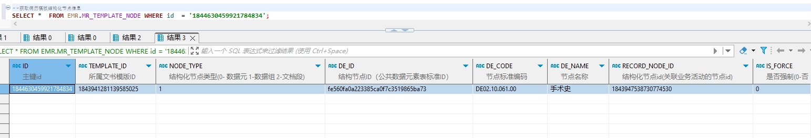

# 领域服务/病历领域 - 获取病历模板结构化节点信息 - 获取病历模板结构化节点信息 正向用例
## 请求参数：
``` json
{
  "hospCode": "NXRY",
  "pageIndex": 1,
  "orgCode": "NXRMYY",
  "pageSize": 1,
  "templateId": "1843941281139585025"
}
```
## 返回参数：
``` json
{
    "exception": null,
    "apiCode": null,
    "data": {
        "list": [
            {
                "id": "1844630459921784834",
                "isDelete": "N",
                "createUserName": "CS创星管理员",
                "createDate": "2024-10-11 14:45:46",
                "updateUserName": null,
                "updateDate": null,
                "updateKey": 46,
                "orgCode": "NXRMYY",
                "orgName": "版本测试环境",
                "hospCode": "NXRY",
                "hospName": "测试修改机构名称714",
                "dataType": "0",
                "deCode": "DE02.10.061.00",
                "deId": "fe560fa0a223385ca0f7c3519865ba73",
                "deName": "手术史",
                "hisdataCatalogCode": null,
                "hisdataFieldCode": null,
                "hisdataFieldName": null,
                "isForce": "0",
                "isHisdataSource": "0",
                "isMultiplex": "0",
                "isMust": "0",
                "nodeType": "1",
                "recordNodeId": "1843947538730774530",
                "stdRecordCode": "EMR020001",
                "stdRecordId": "5a7064dd26bd4ac7a3eab64194e7304b",
                "stdRecordName": "门(急)诊病历",
                "templateId": "1843941281139585025",
                "controlId": null,
                "isDirectEdit": "0",
                "isSignControl": "0",
                "signLevel": "0",
                "code": "DE02.10.061.00",
                "name": "手术史",
                "defaultValue": null,
                "backText": null,
                "lableText": null,
                "unitText": null,
                "isBinarylength": null,
                "minLength": null,
                "maxLength": null,
                "dictCode": null,
                "dictType": "0",
                "dateFormat": null,
                "minDatetimeValue": null,
                "maxDatetimeValue": null,
                "hisdataSeparator": null,
                "hisdataDateformat": null,
                "isOpen": null,
                "isAutosum": null,
                "dictShowField": null,
                "showBoundField": null,
                "identificationBoundField": null,
                "fuzzyMatchField": null,
                "createUserId": "247536401569292288",
                "updateUserId": null
            }
        ],
        "totalCount": 2,
        "pageSize": 1,
        "pageNo": 1,
        "pageCount": 2
    },
    "Code": 200,
    "Message": "操作成功"
}
```
## 数据校验：

# 领域服务/病历领域 - 获取病历模板结构化节点信息 - 必填校验-[orgCode]为空
## 请求参数：
``` json
{
  "hospCode": "NXRY",
  "pageIndex": 1,
  "orgCode": "",
  "pageSize": 1,
  "templateId": "1843202402790985730"
}
```
## 返回参数：
``` json
{
  "exception": null,
  "apiCode": null,
  "data": null,
  "Code": 1,
  "Message": "院区编码不能为空"
}
```
# 领域服务/病历领域 - 获取病历模板结构化节点信息 - 必填校验-[hospCode]为空
## 请求参数：
``` json
{
  "hospCode": "",
  "pageIndex": 1,
  "orgCode": "NXRMYY",
  "pageSize": 1,
  "templateId": "1843202402790985730"
}
```
## 返回参数：
``` json
{
  "exception": null,
  "apiCode": null,
  "data": null,
  "Code": 1,
  "Message": "院区编码不能为空"
}
```
# 领域服务/病历领域 - 获取病历模板结构化节点信息 - 必填校验-[pageIndex]为空
## 请求参数：
``` json
{
  "hospCode": "NXRY",
  "pageIndex": null,
  "orgCode": "NXRMYY",
  "pageSize": 1,
  "templateId": "1843202402790985730"
}
```
## 返回参数：
``` json
{
  "exception": null,
  "apiCode": null,
  "data": null,
  "Code": 1,
  "Message": "系统内部异常"
}
```
# 领域服务/病历领域 - 获取病历模板结构化节点信息 - 必填校验-[pageSize]为空
## 请求参数：
``` json
{
  "hospCode": "NXRY",
  "pageIndex": 1,
  "orgCode": "NXRMYY",
  "pageSize": null,
  "templateId": "1843202402790985730"
}
```
## 返回参数：
``` json
{
  "exception": null,
  "apiCode": null,
  "data": null,
  "Code": 1,
  "Message": "系统内部异常"
}
```
# 领域服务/病历领域 - 获取病历模板结构化节点信息 - 必填校验-[templateId]为空
## 请求参数：
``` json
{
  "hospCode": "NXRY",
  "pageIndex": 1,
  "orgCode": "NXRMYY",
  "pageSize": 1,
  "templateId": ""
}
```
## 返回参数：
``` json
{
  "exception": null,
  "apiCode": null,
  "data": null,
  "Code": 1,
  "Message": "模板id不能为空"
}
```
# 领域服务/病历领域 - 获取病历模板结构化节点信息 - 类型校验-[pageSize]类型错误
## 请求参数：
``` json
{
  "hospCode": "NXRY",
  "pageIndex": 1,
  "orgCode": "NXRMYY",
  "pageSize": "abc",
  "templateId": "1843202402790985730"
}
```
## 返回参数：
``` json
{
  "exception": null,
  "apiCode": null,
  "data": null,
  "Code": 1,
  "Message": "请求参数错误"
}
```
# 领域服务/病历领域 - 获取病历模板结构化节点信息 - 类型校验-[pageIndex]类型错误
## 请求参数：
``` json
{
  "hospCode": "NXRY",
  "pageIndex": "abc",
  "orgCode": "NXRMYY",
  "pageSize": 1,
  "templateId": "1843202402790985730"
}
```
## 返回参数：
``` json
{
  "exception": null,
  "apiCode": null,
  "data": null,
  "Code": 1,
  "Message": "请求参数错误"
}
```
# 领域服务/病历领域 - 获取病历模板结构化节点信息 - 依赖用例-[templateId]赋值为依赖用例测试值
## 请求参数：
``` json
{
  "hospCode": "NXRY",
  "pageIndex": 1,
  "orgCode": "NXRMYY",
  "pageSize": 1,
  "templateId": "依赖用例测试值"
}
```
## 返回参数：
``` json
{
  "exception": null,
  "apiCode": null,
  "data": {
    "list": [],
    "totalCount": 0,
    "pageSize": 1,
    "pageNo": 1,
    "pageCount": 0
  },
  "Code": 200,
  "Message": "操作成功"
}
```
# 领域服务/病历领域 - 获取病历模板结构化节点信息 - 依赖用例-[orgCode]赋值为依赖用例测试值
## 请求参数：
``` json
{
  "hospCode": "NXRY",
  "pageIndex": 1,
  "orgCode": "依赖用例测试值",
  "pageSize": 1,
  "templateId": "1843202402790985730"
}
```
## 返回参数：
``` json
{
  "exception": null,
  "apiCode": null,
  "data": {
    "list": [],
    "totalCount": 0,
    "pageSize": 1,
    "pageNo": 1,
    "pageCount": 0
  },
  "Code": 200,
  "Message": "操作成功"
}
```
# 领域服务/病历领域 - 获取病历模板结构化节点信息 - 依赖用例-[hospCode]赋值为依赖用例测试值
## 请求参数：
``` json
{
  "hospCode": "依赖用例测试值",
  "pageIndex": 1,
  "orgCode": "NXRMYY",
  "pageSize": 1,
  "templateId": "1843202402790985730"
}
```
## 返回参数：
``` json
{
  "exception": null,
  "apiCode": null,
  "data": {
    "list": [],
    "totalCount": 0,
    "pageSize": 1,
    "pageNo": 1,
    "pageCount": 0
  },
  "Code": 200,
  "Message": "操作成功"
}
```