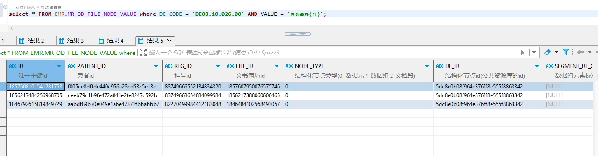

# 领域服务/病历领域 - 获取门诊病历筛选结果集 - 获取门诊病历筛选结果集 正向用例
## 请求参数：
``` json
{
  "hospCode": "NXRY",
  "orgCode": "NXRMYY",
  "queryConditionList": [
    {
      "nodeName": "科室名称",
      "serialNumber": "0",
      "operatorSymbol": "=",
      "dataType": "0",
      "nodeCode": "DE08.10.026.00",
      "schemeId": "1847114004552556545",
      "value": "内分泌科(门)",
      "queryType": "0"
    }
  ]
}
```
## 返回参数：
``` json
{
    "exception": null,
    "apiCode": null,
    "data": [
        {
            "age": "24岁",
            "createDate": "2024-10-16 17:31:30",
            "createUserId": "349365436797001728",
            "createUserName": "测试医生",
            "deptId": "224707910793326592",
            "deptName": "内分泌科(门)",
            "fileName": "呼吸内科",
            "fileNo": null,
            "folderId": "1843188383036264449",
            "hospCode": "NXRY",
            "hospName": "版本测试环境",
            "id": "1846484102568493057",
            "internId": null,
            "internName": null,
            "isPrint": "0",
            "orgCode": "NXRMYY",
            "orgName": "版本测试环境",
            "patientName": "国庆",
            "patinetId": "aabdf89b70e049e1a6e47373fbbabbb7",
            "printDate": null,
            "printUserId": null,
            "printUserName": null,
            "regId": "82270499984412183048",
            "rowerType": null,
            "sex": "2",
            "sexName": "女",
            "signDate": "2024-10-17 13:57:25",
            "signFlag": "1",
            "signId": "349365436797001728",
            "signName": null,
            "stdRecordCode": "EMR020001",
            "stdRecordName": "门(急)诊病历",
            "templateId": "1844915108053082114",
            "titleDate": "2024-10-16 17:31:29",
            "updateDate": "2024-10-17 13:57:25",
            "updateUserId": "349365436797001728",
            "updateUserName": "测试医生"
        },
        {
            "age": "25岁",
            "createDate": "2024-11-12 14:08:06",
            "createUserId": "349365436797001728",
            "createUserName": "测试医生",
            "deptId": "224707910793326592",
            "deptName": "内分泌科(门)",
            "fileName": "初诊记录",
            "fileNo": null,
            "folderId": "1843188383036264449",
            "hospCode": "NXRY",
            "hospName": "版本测试环境",
            "id": "1856217388060606465",
            "internId": null,
            "internName": null,
            "isPrint": "1",
            "orgCode": "NXRMYY",
            "orgName": "版本测试环境",
            "patientName": "门赳乌",
            "patinetId": "ceeb79c1b9fe472a841e2fe8247c592b",
            "printDate": "2024-11-19 15:26:09",
            "printUserId": "349365436797001728",
            "printUserName": "测试医生",
            "regId": "83749668654884099584",
            "rowerType": null,
            "sex": "2",
            "sexName": "女",
            "signDate": "2024-11-12 14:08:29",
            "signFlag": "1",
            "signId": "349365436797001728",
            "signName": null,
            "stdRecordCode": "EMR020001",
            "stdRecordName": "门(急)诊病历",
            "templateId": "1844676429078421505",
            "titleDate": "2024-11-12 14:08:06",
            "updateDate": "2024-11-19 15:26:09",
            "updateUserId": "349365436797001728",
            "updateUserName": "测试医生"
        },
        {
            "age": "35岁",
            "createDate": "2024-11-16 10:13:42",
            "createUserId": "349365436797001728",
            "createUserName": "测试医生",
            "deptId": "224707910793326592",
            "deptName": "内分泌科(门)",
            "fileName": "测试门诊",
            "fileNo": null,
            "folderId": "1843188383036264449",
            "hospCode": "NXRY",
            "hospName": "版本测试环境",
            "id": "1857607950076575746",
            "internId": null,
            "internName": null,
            "isPrint": "1",
            "orgCode": "NXRMYY",
            "orgName": "版本测试环境",
            "patientName": "柳柳",
            "patinetId": "f005ce8dffde440c956a23cd53c5e13e",
            "printDate": "2024-11-19 15:56:21",
            "printUserId": "349365436797001728",
            "printUserName": "测试医生",
            "regId": "83749666552184834320",
            "rowerType": null,
            "sex": "1",
            "sexName": "男",
            "signDate": "2024-11-16 10:14:18",
            "signFlag": "1",
            "signId": "349365436797001728",
            "signName": null,
            "stdRecordCode": "EMR020001",
            "stdRecordName": "门(急)诊病历",
            "templateId": "1844323706369794050",
            "titleDate": "2024-11-16 10:13:41",
            "updateDate": "2024-11-19 15:56:21",
            "updateUserId": "349365436797001728",
            "updateUserName": "测试医生"
        }
    ],
    "Code": 200,
    "Message": "操作成功"
}
```
## 数据校验：

# 领域服务/病历领域 - 获取门诊病历筛选结果集 - 必填校验-[queryConditionList]为空
## 请求参数：
``` json
{
  "hospCode": "NXRY",
  "orgCode": "NXRMYY",
  "queryConditionList": null
}
```
## 返回参数：
``` json
{
  "exception": null,
  "apiCode": null,
  "data": null,
  "Code": 1,
  "Message": "机构编码不能为空"
}
```
# 领域服务/病历领域 - 获取门诊病历筛选结果集 - 必填校验-[orgCode]为空
## 请求参数：
``` json
{
  "hospCode": "NXRY",
  "orgCode": "",
  "queryConditionList": [
    {
      "nodeName": "姓名",
      "serialNumber": "0",
      "operatorSymbol": ">",
      "dataType": "0",
      "nodeCode": "DE02.01.039.00",
      "schemeId": "1847114004552556545",
      "value": "1",
      "queryType": "0"
    }
  ]
}
```
## 返回参数：
``` json
{
  "exception": null,
  "apiCode": null,
  "data": null,
  "Code": 1,
  "Message": "机构编码不能为空"
}
```
# 领域服务/病历领域 - 获取门诊病历筛选结果集 - 必填校验-[hospCode]为空
## 请求参数：
``` json
{
  "hospCode": "",
  "orgCode": "NXRMYY",
  "queryConditionList": [
    {
      "nodeName": "姓名",
      "serialNumber": "0",
      "operatorSymbol": ">",
      "dataType": "0",
      "nodeCode": "DE02.01.039.00",
      "schemeId": "1847114004552556545",
      "value": "1",
      "queryType": "0"
    }
  ]
}
```
## 返回参数：
``` json
{
  "exception": null,
  "apiCode": null,
  "data": null,
  "Code": 1,
  "Message": "院区编码不能为空"
}
```
# 领域服务/病历领域 - 获取门诊病历筛选结果集 - 必填校验-[queryConditionList.queryType]为空
## 请求参数：
``` json
{
  "hospCode": "NXRY",
  "orgCode": "NXRMYY",
  "queryConditionList": [
    {
      "nodeName": "姓名",
      "serialNumber": "0",
      "operatorSymbol": ">",
      "dataType": "0",
      "nodeCode": "DE02.01.039.00",
      "schemeId": "1847114004552556545",
      "value": "1",
      "queryType": null
    }
  ]
}
```
## 返回参数：
``` json
{
  "exception": null,
  "apiCode": null,
  "data": null,
  "Code": 1,
  "Message": "查询病历结构化节点类型不能为空"
}
```
# 领域服务/病历领域 - 获取门诊病历筛选结果集 - 必填校验-[queryConditionList.nodeCode]为空
## 请求参数：
``` json
{
  "hospCode": "NXRY",
  "orgCode": "NXRMYY",
  "queryConditionList": [
    {
      "nodeName": "姓名",
      "serialNumber": "0",
      "operatorSymbol": ">",
      "dataType": "0",
      "nodeCode": null,
      "schemeId": "1847114004552556545",
      "value": "1",
      "queryType": "0"
    }
  ]
}
```
## 返回参数：
``` json
{
  "exception": null,
  "apiCode": null,
  "data": null,
  "Code": 1,
  "Message": "查询节点的标准编码不能为空"
}
```
# 领域服务/病历领域 - 获取门诊病历筛选结果集 - 必填校验-[queryConditionList.nodeName]为空
## 请求参数：
``` json
{
  "hospCode": "NXRY",
  "orgCode": "NXRMYY",
  "queryConditionList": [
    {
      "nodeName": null,
      "serialNumber": "0",
      "operatorSymbol": ">",
      "dataType": "0",
      "nodeCode": "DE02.01.039.00",
      "schemeId": "1847114004552556545",
      "value": "1",
      "queryType": "0"
    }
  ]
}
```
## 返回参数：
``` json
{
  "exception": null,
  "apiCode": null,
  "data": null,
  "Code": 1,
  "Message": "查询节点的标准名称不能为空"
}
```
# 领域服务/病历领域 - 获取门诊病历筛选结果集 - 必填校验-[queryConditionList.operatorSymbol]为空
## 请求参数：
``` json
{
  "hospCode": "NXRY",
  "orgCode": "NXRMYY",
  "queryConditionList": [
    {
      "nodeName": "姓名",
      "serialNumber": "0",
      "operatorSymbol": null,
      "dataType": "0",
      "nodeCode": "DE02.01.039.00",
      "schemeId": "1847114004552556545",
      "value": "1",
      "queryType": "0"
    }
  ]
}
```
## 返回参数：
``` json
{
  "exception": null,
  "apiCode": null,
  "data": null,
  "Code": 1,
  "Message": "条件操作符不能为空"
}
```
# 领域服务/病历领域 - 获取门诊病历筛选结果集 - 必填校验-[queryConditionList.value]为空
## 请求参数：
``` json
{
  "hospCode": "NXRY",
  "orgCode": "NXRMYY",
  "queryConditionList": [
    {
      "nodeName": "姓名",
      "serialNumber": "0",
      "operatorSymbol": ">",
      "dataType": "0",
      "nodeCode": "DE02.01.039.00",
      "schemeId": "1847114004552556545",
      "value": null,
      "queryType": "0"
    }
  ]
}
```
## 返回参数：
``` json
{
  "exception": null,
  "apiCode": null,
  "data": null,
  "Code": 1,
  "Message": "条件值不能为空"
}
```
# 领域服务/病历领域 - 获取门诊病历筛选结果集 - 必填校验-[queryConditionList.dataType]为空
## 请求参数：
``` json
{
  "hospCode": "NXRY",
  "orgCode": "NXRMYY",
  "queryConditionList": [
    {
      "nodeName": "姓名",
      "serialNumber": "0",
      "operatorSymbol": ">",
      "dataType": null,
      "nodeCode": "DE02.01.039.00",
      "schemeId": "1847114004552556545",
      "value": "1",
      "queryType": "0"
    }
  ]
}
```
## 返回参数：
``` json
{
  "exception": null,
  "apiCode": null,
  "data": null,
  "Code": 1,
  "Message": "值输入样式不能为空"
}
```
# 领域服务/病历领域 - 获取门诊病历筛选结果集 - 必填校验-[queryConditionList.serialNumber]为空
## 请求参数：
``` json
{
  "hospCode": "NXRY",
  "orgCode": "NXRMYY",
  "queryConditionList": [
    {
      "nodeName": "姓名",
      "serialNumber": null,
      "operatorSymbol": ">",
      "dataType": "0",
      "nodeCode": "DE02.01.039.00",
      "schemeId": "1847114004552556545",
      "value": "1",
      "queryType": "0"
    }
  ]
}
```
## 返回参数：
``` json
{
  "exception": null,
  "apiCode": null,
  "data": null,
  "Code": 1,
  "Message": "排列序号不能为空"
}
```
# 领域服务/病历领域 - 获取门诊病历筛选结果集 - 枚举用例-[queryConditionList.dataType] 枚举值为 0(值输入样式为文本字符)
## 请求参数：
``` json
{
  "hospCode": "NXRY",
  "orgCode": "NXRMYY",
  "queryConditionList": [
    {
      "nodeName": "姓名",
      "serialNumber": "0",
      "operatorSymbol": ">",
      "dataType": "0",
      "nodeCode": "DE02.01.039.00",
      "schemeId": "1847114004552556545",
      "value": "1",
      "queryType": "0"
    }
  ]
}
```
## 返回参数：
``` json
{
  "exception": null,
  "apiCode": null,
  "data": [
    {
      "age": "27岁",
      "createDate": "2024-10-16 15:20:29",
      "createUserId": "282475805660160000",
      "createUserName": "CS彭彭彭",
      "deptId": "224708989908054016",
      "deptName": "产科诊室",
      "fileName": "呼吸内科1",
      "fileNo": null,
      "folderId": "1843188383036264449",
      "hospCode": "NXRY",
      "hospName": "版本测试环境",
      "id": "1846451130251362306",
      "internId": null,
      "internName": null,
      "isPrint": "0",
      "orgCode": "NXRMYY",
      "orgName": "版本测试环境",
      "patientName": "测试优惠2",
      "patinetId": "39542b4771894578a1d6a9ad8568a894",
      "printDate": null,
      "printUserId": null,
      "printUserName": null,
      "regId": "1846435449783234561",
      "rowerType": null,
      "sex": "1",
      "sexName": "男",
      "signDate": "2024-10-17 19:19:06",
      "signFlag": "1",
      "signId": "282475805660160000",
      "signName": null,
      "stdRecordCode": "EMR020001",
      "stdRecordName": "门(急)诊病历",
      "templateId": "1844915108053082114",
      "titleDate": "2024-10-16 15:20:29",
      "updateDate": "2024-10-16 16:18:26",
      "updateUserId": "282475805660160000",
      "updateUserName": "CS彭彭彭"
    },
    {
      "age": "24岁",
      "createDate": "2024-10-18 10:08:44",
      "createUserId": "282475805660160000",
      "createUserName": "CS彭彭彭",
      "deptId": "224708989908054016",
      "deptName": "产科诊室",
      "fileName": "呼吸内科",
      "fileNo": null,
      "folderId": "1843188383036264449",
      "hospCode": "NXRY",
      "hospName": "版本测试环境",
      "id": "1847097450695827457",
      "internId": null,
      "internName": null,
      "isPrint": "0",
      "orgCode": "NXRMYY",
      "orgName": "版本测试环境",
      "patientName": "与",
      "patinetId": "93587a7c8028404c85b09f8bc9803a7c",
      "printDate": null,
      "printUserId": null,
      "printUserName": null,
      "regId": "1847086960947335169",
      "rowerType": null,
      "sex": "2",
      "sexName": "女",
      "signDate": null,
      "signFlag": "0",
      "signId": null,
      "signName": null,
      "stdRecordCode": "EMR020001",
      "stdRecordName": "门(急)诊病历",
      "templateId": "1844915108053082114",
      "titleDate": "2024-10-18 10:08:45",
      "updateDate": "2024-10-18 10:09:50",
      "updateUserId": "282475805660160000",
      "updateUserName": "CS彭彭彭"
    },
    {
      "age": "27岁",
      "createDate": "2024-10-21 14:49:21",
      "createUserId": "282475805660160000",
      "createUserName": "CS彭彭彭",
      "deptId": "224708989908054016",
      "deptName": "产科诊室",
      "fileName": "呼吸内科",
      "fileNo": null,
      "folderId": "1843188383036264449",
      "hospCode": "NXRY",
      "hospName": "版本测试环境",
      "id": "1848255233688371202",
      "internId": null,
      "internName": null,
      "isPrint": "1",
      "orgCode": "NXRMYY",
      "orgName": "版本测试环境",
      "patientName": "测试优惠2",
      "patinetId": "39542b4771894578a1d6a9ad8568a894",
      "printDate": "2024-10-16 14:25:27",
      "printUserId": "282475805660160000",
      "printUserName": "CS彭彭彭",
      "regId": "9f2863498f7443569c9bf6c500d6b52b",
      "rowerType": null,
      "sex": "1",
      "sexName": "男",
      "signDate": null,
      "signFlag": "0",
      "signId": null,
      "signName": null,
      "stdRecordCode": "EMR020001",
      "stdRecordName": "门(急)诊病历",
      "templateId": "1844915108053082114",
      "titleDate": "2024-10-21 14:49:20",
      "updateDate": "2024-10-16 14:25:27",
      "updateUserId": "282475805660160000",
      "updateUserName": "CS彭彭彭"
    },
    {
      "age": "33岁",
      "createDate": "2024-10-22 10:20:18",
      "createUserId": "349365436797001728",
      "createUserName": "测试医生",
      "deptId": "224707726571106304",
      "deptName": "呼吸内科(门)",
      "fileName": "初诊记录",
      "fileNo": null,
      "folderId": "1843188383036264449",
      "hospCode": "NXRY",
      "hospName": "版本测试环境",
      "id": "1848549912363450369",
      "internId": null,
      "internName": null,
      "isPrint": "0",
      "orgCode": "NXRMYY",
      "orgName": "版本测试环境",
      "patientName": "贰贰1",
      "patinetId": "373060ac206b4fa3ba77f91e9af82569",
      "printDate": null,
      "printUserId": null,
      "printUserName": null,
      "regId": "1848198423971672066",
      "rowerType": null,
      "sex": "2",
      "sexName": "女",
      "signDate": "2024-10-22 10:20:25",
      "signFlag": "1",
      "signId": "349365436797001728",
      "signName": null,
      "stdRecordCode": "EMR020001",
      "stdRecordName": "门(急)诊病历",
      "templateId": "1844676429078421505",
      "titleDate": "2024-10-22 10:20:17",
      "updateDate": "2024-10-22 10:20:25",
      "updateUserId": "349365436797001728",
      "updateUserName": "测试医生"
    },
    {
      "age": "24岁",
      "createDate": "2024-10-25 11:11:30",
      "createUserId": "282475805660160000",
      "createUserName": "CS彭彭彭",
      "deptId": "224708989908054016",
      "deptName": "产科诊室",
      "fileName": "呼吸内科",
      "fileNo": null,
      "folderId": "1843188383036264449",
      "hospCode": "NXRY",
      "hospName": "版本测试环境",
      "id": "1849649961495494657",
      "internId": null,
      "internName": null,
      "isPrint": "0",
      "orgCode": "NXRMYY",
      "orgName": "版本测试环境",
      "patientName": "与",
      "patinetId": "93587a7c8028404c85b09f8bc9803a7c",
      "printDate": null,
      "printUserId": null,
      "printUserName": null,
      "regId": "1849648279084912641",
      "rowerType": null,
      "sex": "2",
      "sexName": "女",
      "signDate": "2024-10-25 11:11:50",
      "signFlag": "1",
      "signId": "282475805660160000",
      "signName": null,
      "stdRecordCode": "EMR020001",
      "stdRecordName": "门(急)诊病历",
      "templateId": "1844915108053082114",
      "titleDate": "2024-10-25 11:11:29",
      "updateDate": "2024-10-25 11:11:50",
      "updateUserId": "282475805660160000",
      "updateUserName": "CS彭彭彭"
    },
    {
      "age": "24岁",
      "createDate": "2024-11-12 14:00:09",
      "createUserId": "349365436797001728",
      "createUserName": "测试医生",
      "deptId": "224707726571106304",
      "deptName": "呼吸内科(门)",
      "fileName": "初诊记录",
      "fileNo": null,
      "folderId": "1843188383036264449",
      "hospCode": "NXRY",
      "hospName": "版本测试环境",
      "id": "1856215385330778114",
      "internId": null,
      "internName": null,
      "isPrint": "0",
      "orgCode": "NXRMYY",
      "orgName": "版本测试环境",
      "patientName": "与",
      "patinetId": "93587a7c8028404c85b09f8bc9803a7c",
      "printDate": null,
      "printUserId": null,
      "printUserName": null,
      "regId": "1855820643640332289",
      "rowerType": null,
      "sex": "2",
      "sexName": "女",
      "signDate": "2024-11-12 14:01:03",
      "signFlag": "1",
      "signId": "349365436797001728",
      "signName": null,
      "stdRecordCode": "EMR020001",
      "stdRecordName": "门(急)诊病历",
      "templateId": "1844676429078421505",
      "titleDate": "2024-11-12 14:00:08",
      "updateDate": "2024-11-12 14:01:03",
      "updateUserId": "349365436797001728",
      "updateUserName": "测试医生"
    },
    {
      "age": "25岁",
      "createDate": "2024-11-12 14:08:06",
      "createUserId": "349365436797001728",
      "createUserName": "测试医生",
      "deptId": "224707910793326592",
      "deptName": "内分泌科(门)",
      "fileName": "初诊记录",
      "fileNo": null,
      "folderId": "1843188383036264449",
      "hospCode": "NXRY",
      "hospName": "版本测试环境",
      "id": "1856217388060606465",
      "internId": null,
      "internName": null,
      "isPrint": "1",
      "orgCode": "NXRMYY",
      "orgName": "版本测试环境",
      "patientName": "门赳乌",
      "patinetId": "ceeb79c1b9fe472a841e2fe8247c592b",
      "printDate": "2024-11-19 15:26:09",
      "printUserId": "349365436797001728",
      "printUserName": "测试医生",
      "regId": "83749668654884099584",
      "rowerType": null,
      "sex": "2",
      "sexName": "女",
      "signDate": "2024-11-12 14:08:29",
      "signFlag": "1",
      "signId": "349365436797001728",
      "signName": null,
      "stdRecordCode": "EMR020001",
      "stdRecordName": "门(急)诊病历",
      "templateId": "1844676429078421505",
      "titleDate": "2024-11-12 14:08:06",
      "updateDate": "2024-11-19 15:26:09",
      "updateUserId": "349365436797001728",
      "updateUserName": "测试医生"
    },
    {
      "age": "35岁",
      "createDate": "2024-11-16 10:13:42",
      "createUserId": "349365436797001728",
      "createUserName": "测试医生",
      "deptId": "224707910793326592",
      "deptName": "内分泌科(门)",
      "fileName": "测试门诊",
      "fileNo": null,
      "folderId": "1843188383036264449",
      "hospCode": "NXRY",
      "hospName": "版本测试环境",
      "id": "1857607950076575746",
      "internId": null,
      "internName": null,
      "isPrint": "1",
      "orgCode": "NXRMYY",
      "orgName": "版本测试环境",
      "patientName": "柳柳",
      "patinetId": "f005ce8dffde440c956a23cd53c5e13e",
      "printDate": "2024-11-19 15:56:21",
      "printUserId": "349365436797001728",
      "printUserName": "测试医生",
      "regId": "83749666552184834320",
      "rowerType": null,
      "sex": "1",
      "sexName": "男",
      "signDate": "2024-11-16 10:14:18",
      "signFlag": "1",
      "signId": "349365436797001728",
      "signName": null,
      "stdRecordCode": "EMR020001",
      "stdRecordName": "门(急)诊病历",
      "templateId": "1844323706369794050",
      "titleDate": "2024-11-16 10:13:41",
      "updateDate": "2024-11-19 15:56:21",
      "updateUserId": "349365436797001728",
      "updateUserName": "测试医生"
    },
    {
      "age": "35岁",
      "createDate": "2024-11-16 15:57:10",
      "createUserId": "349365436797001728",
      "createUserName": "测试医生",
      "deptId": "224707910793326592",
      "deptName": "内分泌科(门)",
      "fileName": "测试门诊",
      "fileNo": null,
      "folderId": "1843188383036264449",
      "hospCode": "NXRY",
      "hospName": "版本测试环境",
      "id": "1857694386746392578",
      "internId": null,
      "internName": null,
      "isPrint": "1",
      "orgCode": "NXRMYY",
      "orgName": "版本测试环境",
      "patientName": "柳柳",
      "patinetId": "f005ce8dffde440c956a23cd53c5e13e",
      "printDate": "2024-11-16 16:59:06",
      "printUserId": "349365436797001728",
      "printUserName": "测试医生",
      "regId": "09a85701caa641548e42c7fa94b22ee5",
      "rowerType": null,
      "sex": "1",
      "sexName": "男",
      "signDate": "2024-11-16 15:59:53",
      "signFlag": "1",
      "signId": "349365436797001728",
      "signName": null,
      "stdRecordCode": "EMR020001",
      "stdRecordName": "门(急)诊病历",
      "templateId": "1844323706369794050",
      "titleDate": "2024-11-16 15:57:10",
      "updateDate": "2024-11-16 16:59:06",
      "updateUserId": "349365436797001728",
      "updateUserName": "测试医生"
    }
  ],
  "Code": 200,
  "Message": "操作成功"
}
```
# 领域服务/病历领域 - 获取门诊病历筛选结果集 - 枚举用例-[queryConditionList.dataType] 枚举值为 1(值输入样式为数值)
## 请求参数：
``` json
{
  "hospCode": "NXRY",
  "orgCode": "NXRMYY",
  "queryConditionList": [
    {
      "nodeName": "姓名",
      "serialNumber": "0",
      "operatorSymbol": ">",
      "dataType": "1",
      "nodeCode": "DE02.01.039.00",
      "schemeId": "1847114004552556545",
      "value": "1",
      "queryType": "0"
    }
  ]
}
```
## 返回参数：
``` json
{
  "exception": null,
  "apiCode": null,
  "data": [
    {
      "age": "27岁",
      "createDate": "2024-10-16 15:20:29",
      "createUserId": "282475805660160000",
      "createUserName": "CS彭彭彭",
      "deptId": "224708989908054016",
      "deptName": "产科诊室",
      "fileName": "呼吸内科1",
      "fileNo": null,
      "folderId": "1843188383036264449",
      "hospCode": "NXRY",
      "hospName": "版本测试环境",
      "id": "1846451130251362306",
      "internId": null,
      "internName": null,
      "isPrint": "0",
      "orgCode": "NXRMYY",
      "orgName": "版本测试环境",
      "patientName": "测试优惠2",
      "patinetId": "39542b4771894578a1d6a9ad8568a894",
      "printDate": null,
      "printUserId": null,
      "printUserName": null,
      "regId": "1846435449783234561",
      "rowerType": null,
      "sex": "1",
      "sexName": "男",
      "signDate": "2024-10-17 19:19:06",
      "signFlag": "1",
      "signId": "282475805660160000",
      "signName": null,
      "stdRecordCode": "EMR020001",
      "stdRecordName": "门(急)诊病历",
      "templateId": "1844915108053082114",
      "titleDate": "2024-10-16 15:20:29",
      "updateDate": "2024-10-16 16:18:26",
      "updateUserId": "282475805660160000",
      "updateUserName": "CS彭彭彭"
    },
    {
      "age": "24岁",
      "createDate": "2024-10-18 10:08:44",
      "createUserId": "282475805660160000",
      "createUserName": "CS彭彭彭",
      "deptId": "224708989908054016",
      "deptName": "产科诊室",
      "fileName": "呼吸内科",
      "fileNo": null,
      "folderId": "1843188383036264449",
      "hospCode": "NXRY",
      "hospName": "版本测试环境",
      "id": "1847097450695827457",
      "internId": null,
      "internName": null,
      "isPrint": "0",
      "orgCode": "NXRMYY",
      "orgName": "版本测试环境",
      "patientName": "与",
      "patinetId": "93587a7c8028404c85b09f8bc9803a7c",
      "printDate": null,
      "printUserId": null,
      "printUserName": null,
      "regId": "1847086960947335169",
      "rowerType": null,
      "sex": "2",
      "sexName": "女",
      "signDate": null,
      "signFlag": "0",
      "signId": null,
      "signName": null,
      "stdRecordCode": "EMR020001",
      "stdRecordName": "门(急)诊病历",
      "templateId": "1844915108053082114",
      "titleDate": "2024-10-18 10:08:45",
      "updateDate": "2024-10-18 10:09:50",
      "updateUserId": "282475805660160000",
      "updateUserName": "CS彭彭彭"
    },
    {
      "age": "27岁",
      "createDate": "2024-10-21 14:49:21",
      "createUserId": "282475805660160000",
      "createUserName": "CS彭彭彭",
      "deptId": "224708989908054016",
      "deptName": "产科诊室",
      "fileName": "呼吸内科",
      "fileNo": null,
      "folderId": "1843188383036264449",
      "hospCode": "NXRY",
      "hospName": "版本测试环境",
      "id": "1848255233688371202",
      "internId": null,
      "internName": null,
      "isPrint": "1",
      "orgCode": "NXRMYY",
      "orgName": "版本测试环境",
      "patientName": "测试优惠2",
      "patinetId": "39542b4771894578a1d6a9ad8568a894",
      "printDate": "2024-10-16 14:25:27",
      "printUserId": "282475805660160000",
      "printUserName": "CS彭彭彭",
      "regId": "9f2863498f7443569c9bf6c500d6b52b",
      "rowerType": null,
      "sex": "1",
      "sexName": "男",
      "signDate": null,
      "signFlag": "0",
      "signId": null,
      "signName": null,
      "stdRecordCode": "EMR020001",
      "stdRecordName": "门(急)诊病历",
      "templateId": "1844915108053082114",
      "titleDate": "2024-10-21 14:49:20",
      "updateDate": "2024-10-16 14:25:27",
      "updateUserId": "282475805660160000",
      "updateUserName": "CS彭彭彭"
    },
    {
      "age": "33岁",
      "createDate": "2024-10-22 10:20:18",
      "createUserId": "349365436797001728",
      "createUserName": "测试医生",
      "deptId": "224707726571106304",
      "deptName": "呼吸内科(门)",
      "fileName": "初诊记录",
      "fileNo": null,
      "folderId": "1843188383036264449",
      "hospCode": "NXRY",
      "hospName": "版本测试环境",
      "id": "1848549912363450369",
      "internId": null,
      "internName": null,
      "isPrint": "0",
      "orgCode": "NXRMYY",
      "orgName": "版本测试环境",
      "patientName": "贰贰1",
      "patinetId": "373060ac206b4fa3ba77f91e9af82569",
      "printDate": null,
      "printUserId": null,
      "printUserName": null,
      "regId": "1848198423971672066",
      "rowerType": null,
      "sex": "2",
      "sexName": "女",
      "signDate": "2024-10-22 10:20:25",
      "signFlag": "1",
      "signId": "349365436797001728",
      "signName": null,
      "stdRecordCode": "EMR020001",
      "stdRecordName": "门(急)诊病历",
      "templateId": "1844676429078421505",
      "titleDate": "2024-10-22 10:20:17",
      "updateDate": "2024-10-22 10:20:25",
      "updateUserId": "349365436797001728",
      "updateUserName": "测试医生"
    },
    {
      "age": "24岁",
      "createDate": "2024-10-25 11:11:30",
      "createUserId": "282475805660160000",
      "createUserName": "CS彭彭彭",
      "deptId": "224708989908054016",
      "deptName": "产科诊室",
      "fileName": "呼吸内科",
      "fileNo": null,
      "folderId": "1843188383036264449",
      "hospCode": "NXRY",
      "hospName": "版本测试环境",
      "id": "1849649961495494657",
      "internId": null,
      "internName": null,
      "isPrint": "0",
      "orgCode": "NXRMYY",
      "orgName": "版本测试环境",
      "patientName": "与",
      "patinetId": "93587a7c8028404c85b09f8bc9803a7c",
      "printDate": null,
      "printUserId": null,
      "printUserName": null,
      "regId": "1849648279084912641",
      "rowerType": null,
      "sex": "2",
      "sexName": "女",
      "signDate": "2024-10-25 11:11:50",
      "signFlag": "1",
      "signId": "282475805660160000",
      "signName": null,
      "stdRecordCode": "EMR020001",
      "stdRecordName": "门(急)诊病历",
      "templateId": "1844915108053082114",
      "titleDate": "2024-10-25 11:11:29",
      "updateDate": "2024-10-25 11:11:50",
      "updateUserId": "282475805660160000",
      "updateUserName": "CS彭彭彭"
    },
    {
      "age": "24岁",
      "createDate": "2024-11-12 14:00:09",
      "createUserId": "349365436797001728",
      "createUserName": "测试医生",
      "deptId": "224707726571106304",
      "deptName": "呼吸内科(门)",
      "fileName": "初诊记录",
      "fileNo": null,
      "folderId": "1843188383036264449",
      "hospCode": "NXRY",
      "hospName": "版本测试环境",
      "id": "1856215385330778114",
      "internId": null,
      "internName": null,
      "isPrint": "0",
      "orgCode": "NXRMYY",
      "orgName": "版本测试环境",
      "patientName": "与",
      "patinetId": "93587a7c8028404c85b09f8bc9803a7c",
      "printDate": null,
      "printUserId": null,
      "printUserName": null,
      "regId": "1855820643640332289",
      "rowerType": null,
      "sex": "2",
      "sexName": "女",
      "signDate": "2024-11-12 14:01:03",
      "signFlag": "1",
      "signId": "349365436797001728",
      "signName": null,
      "stdRecordCode": "EMR020001",
      "stdRecordName": "门(急)诊病历",
      "templateId": "1844676429078421505",
      "titleDate": "2024-11-12 14:00:08",
      "updateDate": "2024-11-12 14:01:03",
      "updateUserId": "349365436797001728",
      "updateUserName": "测试医生"
    },
    {
      "age": "25岁",
      "createDate": "2024-11-12 14:08:06",
      "createUserId": "349365436797001728",
      "createUserName": "测试医生",
      "deptId": "224707910793326592",
      "deptName": "内分泌科(门)",
      "fileName": "初诊记录",
      "fileNo": null,
      "folderId": "1843188383036264449",
      "hospCode": "NXRY",
      "hospName": "版本测试环境",
      "id": "1856217388060606465",
      "internId": null,
      "internName": null,
      "isPrint": "1",
      "orgCode": "NXRMYY",
      "orgName": "版本测试环境",
      "patientName": "门赳乌",
      "patinetId": "ceeb79c1b9fe472a841e2fe8247c592b",
      "printDate": "2024-11-19 15:26:09",
      "printUserId": "349365436797001728",
      "printUserName": "测试医生",
      "regId": "83749668654884099584",
      "rowerType": null,
      "sex": "2",
      "sexName": "女",
      "signDate": "2024-11-12 14:08:29",
      "signFlag": "1",
      "signId": "349365436797001728",
      "signName": null,
      "stdRecordCode": "EMR020001",
      "stdRecordName": "门(急)诊病历",
      "templateId": "1844676429078421505",
      "titleDate": "2024-11-12 14:08:06",
      "updateDate": "2024-11-19 15:26:09",
      "updateUserId": "349365436797001728",
      "updateUserName": "测试医生"
    },
    {
      "age": "35岁",
      "createDate": "2024-11-16 10:13:42",
      "createUserId": "349365436797001728",
      "createUserName": "测试医生",
      "deptId": "224707910793326592",
      "deptName": "内分泌科(门)",
      "fileName": "测试门诊",
      "fileNo": null,
      "folderId": "1843188383036264449",
      "hospCode": "NXRY",
      "hospName": "版本测试环境",
      "id": "1857607950076575746",
      "internId": null,
      "internName": null,
      "isPrint": "1",
      "orgCode": "NXRMYY",
      "orgName": "版本测试环境",
      "patientName": "柳柳",
      "patinetId": "f005ce8dffde440c956a23cd53c5e13e",
      "printDate": "2024-11-19 15:56:21",
      "printUserId": "349365436797001728",
      "printUserName": "测试医生",
      "regId": "83749666552184834320",
      "rowerType": null,
      "sex": "1",
      "sexName": "男",
      "signDate": "2024-11-16 10:14:18",
      "signFlag": "1",
      "signId": "349365436797001728",
      "signName": null,
      "stdRecordCode": "EMR020001",
      "stdRecordName": "门(急)诊病历",
      "templateId": "1844323706369794050",
      "titleDate": "2024-11-16 10:13:41",
      "updateDate": "2024-11-19 15:56:21",
      "updateUserId": "349365436797001728",
      "updateUserName": "测试医生"
    },
    {
      "age": "35岁",
      "createDate": "2024-11-16 15:57:10",
      "createUserId": "349365436797001728",
      "createUserName": "测试医生",
      "deptId": "224707910793326592",
      "deptName": "内分泌科(门)",
      "fileName": "测试门诊",
      "fileNo": null,
      "folderId": "1843188383036264449",
      "hospCode": "NXRY",
      "hospName": "版本测试环境",
      "id": "1857694386746392578",
      "internId": null,
      "internName": null,
      "isPrint": "1",
      "orgCode": "NXRMYY",
      "orgName": "版本测试环境",
      "patientName": "柳柳",
      "patinetId": "f005ce8dffde440c956a23cd53c5e13e",
      "printDate": "2024-11-16 16:59:06",
      "printUserId": "349365436797001728",
      "printUserName": "测试医生",
      "regId": "09a85701caa641548e42c7fa94b22ee5",
      "rowerType": null,
      "sex": "1",
      "sexName": "男",
      "signDate": "2024-11-16 15:59:53",
      "signFlag": "1",
      "signId": "349365436797001728",
      "signName": null,
      "stdRecordCode": "EMR020001",
      "stdRecordName": "门(急)诊病历",
      "templateId": "1844323706369794050",
      "titleDate": "2024-11-16 15:57:10",
      "updateDate": "2024-11-16 16:59:06",
      "updateUserId": "349365436797001728",
      "updateUserName": "测试医生"
    }
  ],
  "Code": 200,
  "Message": "操作成功"
}
```
# 领域服务/病历领域 - 获取门诊病历筛选结果集 - 枚举用例-[queryConditionList.dataType] 枚举值为 2(值输入样式为日期时间)
## 请求参数：
``` json
{
  "hospCode": "NXRY",
  "orgCode": "NXRMYY",
  "queryConditionList": [
    {
      "nodeName": "姓名",
      "serialNumber": "0",
      "operatorSymbol": ">",
      "dataType": "2",
      "nodeCode": "DE02.01.039.00",
      "schemeId": "1847114004552556545",
      "value": "1",
      "queryType": "0"
    }
  ]
}
```
## 返回参数：
``` json
{
  "exception": null,
  "apiCode": null,
  "data": [
    {
      "age": "27岁",
      "createDate": "2024-10-16 15:20:29",
      "createUserId": "282475805660160000",
      "createUserName": "CS彭彭彭",
      "deptId": "224708989908054016",
      "deptName": "产科诊室",
      "fileName": "呼吸内科1",
      "fileNo": null,
      "folderId": "1843188383036264449",
      "hospCode": "NXRY",
      "hospName": "版本测试环境",
      "id": "1846451130251362306",
      "internId": null,
      "internName": null,
      "isPrint": "0",
      "orgCode": "NXRMYY",
      "orgName": "版本测试环境",
      "patientName": "测试优惠2",
      "patinetId": "39542b4771894578a1d6a9ad8568a894",
      "printDate": null,
      "printUserId": null,
      "printUserName": null,
      "regId": "1846435449783234561",
      "rowerType": null,
      "sex": "1",
      "sexName": "男",
      "signDate": "2024-10-17 19:19:06",
      "signFlag": "1",
      "signId": "282475805660160000",
      "signName": null,
      "stdRecordCode": "EMR020001",
      "stdRecordName": "门(急)诊病历",
      "templateId": "1844915108053082114",
      "titleDate": "2024-10-16 15:20:29",
      "updateDate": "2024-10-16 16:18:26",
      "updateUserId": "282475805660160000",
      "updateUserName": "CS彭彭彭"
    },
    {
      "age": "24岁",
      "createDate": "2024-10-18 10:08:44",
      "createUserId": "282475805660160000",
      "createUserName": "CS彭彭彭",
      "deptId": "224708989908054016",
      "deptName": "产科诊室",
      "fileName": "呼吸内科",
      "fileNo": null,
      "folderId": "1843188383036264449",
      "hospCode": "NXRY",
      "hospName": "版本测试环境",
      "id": "1847097450695827457",
      "internId": null,
      "internName": null,
      "isPrint": "0",
      "orgCode": "NXRMYY",
      "orgName": "版本测试环境",
      "patientName": "与",
      "patinetId": "93587a7c8028404c85b09f8bc9803a7c",
      "printDate": null,
      "printUserId": null,
      "printUserName": null,
      "regId": "1847086960947335169",
      "rowerType": null,
      "sex": "2",
      "sexName": "女",
      "signDate": null,
      "signFlag": "0",
      "signId": null,
      "signName": null,
      "stdRecordCode": "EMR020001",
      "stdRecordName": "门(急)诊病历",
      "templateId": "1844915108053082114",
      "titleDate": "2024-10-18 10:08:45",
      "updateDate": "2024-10-18 10:09:50",
      "updateUserId": "282475805660160000",
      "updateUserName": "CS彭彭彭"
    },
    {
      "age": "27岁",
      "createDate": "2024-10-21 14:49:21",
      "createUserId": "282475805660160000",
      "createUserName": "CS彭彭彭",
      "deptId": "224708989908054016",
      "deptName": "产科诊室",
      "fileName": "呼吸内科",
      "fileNo": null,
      "folderId": "1843188383036264449",
      "hospCode": "NXRY",
      "hospName": "版本测试环境",
      "id": "1848255233688371202",
      "internId": null,
      "internName": null,
      "isPrint": "1",
      "orgCode": "NXRMYY",
      "orgName": "版本测试环境",
      "patientName": "测试优惠2",
      "patinetId": "39542b4771894578a1d6a9ad8568a894",
      "printDate": "2024-10-16 14:25:27",
      "printUserId": "282475805660160000",
      "printUserName": "CS彭彭彭",
      "regId": "9f2863498f7443569c9bf6c500d6b52b",
      "rowerType": null,
      "sex": "1",
      "sexName": "男",
      "signDate": null,
      "signFlag": "0",
      "signId": null,
      "signName": null,
      "stdRecordCode": "EMR020001",
      "stdRecordName": "门(急)诊病历",
      "templateId": "1844915108053082114",
      "titleDate": "2024-10-21 14:49:20",
      "updateDate": "2024-10-16 14:25:27",
      "updateUserId": "282475805660160000",
      "updateUserName": "CS彭彭彭"
    },
    {
      "age": "33岁",
      "createDate": "2024-10-22 10:20:18",
      "createUserId": "349365436797001728",
      "createUserName": "测试医生",
      "deptId": "224707726571106304",
      "deptName": "呼吸内科(门)",
      "fileName": "初诊记录",
      "fileNo": null,
      "folderId": "1843188383036264449",
      "hospCode": "NXRY",
      "hospName": "版本测试环境",
      "id": "1848549912363450369",
      "internId": null,
      "internName": null,
      "isPrint": "0",
      "orgCode": "NXRMYY",
      "orgName": "版本测试环境",
      "patientName": "贰贰1",
      "patinetId": "373060ac206b4fa3ba77f91e9af82569",
      "printDate": null,
      "printUserId": null,
      "printUserName": null,
      "regId": "1848198423971672066",
      "rowerType": null,
      "sex": "2",
      "sexName": "女",
      "signDate": "2024-10-22 10:20:25",
      "signFlag": "1",
      "signId": "349365436797001728",
      "signName": null,
      "stdRecordCode": "EMR020001",
      "stdRecordName": "门(急)诊病历",
      "templateId": "1844676429078421505",
      "titleDate": "2024-10-22 10:20:17",
      "updateDate": "2024-10-22 10:20:25",
      "updateUserId": "349365436797001728",
      "updateUserName": "测试医生"
    },
    {
      "age": "24岁",
      "createDate": "2024-10-25 11:11:30",
      "createUserId": "282475805660160000",
      "createUserName": "CS彭彭彭",
      "deptId": "224708989908054016",
      "deptName": "产科诊室",
      "fileName": "呼吸内科",
      "fileNo": null,
      "folderId": "1843188383036264449",
      "hospCode": "NXRY",
      "hospName": "版本测试环境",
      "id": "1849649961495494657",
      "internId": null,
      "internName": null,
      "isPrint": "0",
      "orgCode": "NXRMYY",
      "orgName": "版本测试环境",
      "patientName": "与",
      "patinetId": "93587a7c8028404c85b09f8bc9803a7c",
      "printDate": null,
      "printUserId": null,
      "printUserName": null,
      "regId": "1849648279084912641",
      "rowerType": null,
      "sex": "2",
      "sexName": "女",
      "signDate": "2024-10-25 11:11:50",
      "signFlag": "1",
      "signId": "282475805660160000",
      "signName": null,
      "stdRecordCode": "EMR020001",
      "stdRecordName": "门(急)诊病历",
      "templateId": "1844915108053082114",
      "titleDate": "2024-10-25 11:11:29",
      "updateDate": "2024-10-25 11:11:50",
      "updateUserId": "282475805660160000",
      "updateUserName": "CS彭彭彭"
    },
    {
      "age": "24岁",
      "createDate": "2024-11-12 14:00:09",
      "createUserId": "349365436797001728",
      "createUserName": "测试医生",
      "deptId": "224707726571106304",
      "deptName": "呼吸内科(门)",
      "fileName": "初诊记录",
      "fileNo": null,
      "folderId": "1843188383036264449",
      "hospCode": "NXRY",
      "hospName": "版本测试环境",
      "id": "1856215385330778114",
      "internId": null,
      "internName": null,
      "isPrint": "0",
      "orgCode": "NXRMYY",
      "orgName": "版本测试环境",
      "patientName": "与",
      "patinetId": "93587a7c8028404c85b09f8bc9803a7c",
      "printDate": null,
      "printUserId": null,
      "printUserName": null,
      "regId": "1855820643640332289",
      "rowerType": null,
      "sex": "2",
      "sexName": "女",
      "signDate": "2024-11-12 14:01:03",
      "signFlag": "1",
      "signId": "349365436797001728",
      "signName": null,
      "stdRecordCode": "EMR020001",
      "stdRecordName": "门(急)诊病历",
      "templateId": "1844676429078421505",
      "titleDate": "2024-11-12 14:00:08",
      "updateDate": "2024-11-12 14:01:03",
      "updateUserId": "349365436797001728",
      "updateUserName": "测试医生"
    },
    {
      "age": "25岁",
      "createDate": "2024-11-12 14:08:06",
      "createUserId": "349365436797001728",
      "createUserName": "测试医生",
      "deptId": "224707910793326592",
      "deptName": "内分泌科(门)",
      "fileName": "初诊记录",
      "fileNo": null,
      "folderId": "1843188383036264449",
      "hospCode": "NXRY",
      "hospName": "版本测试环境",
      "id": "1856217388060606465",
      "internId": null,
      "internName": null,
      "isPrint": "1",
      "orgCode": "NXRMYY",
      "orgName": "版本测试环境",
      "patientName": "门赳乌",
      "patinetId": "ceeb79c1b9fe472a841e2fe8247c592b",
      "printDate": "2024-11-19 15:26:09",
      "printUserId": "349365436797001728",
      "printUserName": "测试医生",
      "regId": "83749668654884099584",
      "rowerType": null,
      "sex": "2",
      "sexName": "女",
      "signDate": "2024-11-12 14:08:29",
      "signFlag": "1",
      "signId": "349365436797001728",
      "signName": null,
      "stdRecordCode": "EMR020001",
      "stdRecordName": "门(急)诊病历",
      "templateId": "1844676429078421505",
      "titleDate": "2024-11-12 14:08:06",
      "updateDate": "2024-11-19 15:26:09",
      "updateUserId": "349365436797001728",
      "updateUserName": "测试医生"
    },
    {
      "age": "35岁",
      "createDate": "2024-11-16 10:13:42",
      "createUserId": "349365436797001728",
      "createUserName": "测试医生",
      "deptId": "224707910793326592",
      "deptName": "内分泌科(门)",
      "fileName": "测试门诊",
      "fileNo": null,
      "folderId": "1843188383036264449",
      "hospCode": "NXRY",
      "hospName": "版本测试环境",
      "id": "1857607950076575746",
      "internId": null,
      "internName": null,
      "isPrint": "1",
      "orgCode": "NXRMYY",
      "orgName": "版本测试环境",
      "patientName": "柳柳",
      "patinetId": "f005ce8dffde440c956a23cd53c5e13e",
      "printDate": "2024-11-19 15:56:21",
      "printUserId": "349365436797001728",
      "printUserName": "测试医生",
      "regId": "83749666552184834320",
      "rowerType": null,
      "sex": "1",
      "sexName": "男",
      "signDate": "2024-11-16 10:14:18",
      "signFlag": "1",
      "signId": "349365436797001728",
      "signName": null,
      "stdRecordCode": "EMR020001",
      "stdRecordName": "门(急)诊病历",
      "templateId": "1844323706369794050",
      "titleDate": "2024-11-16 10:13:41",
      "updateDate": "2024-11-19 15:56:21",
      "updateUserId": "349365436797001728",
      "updateUserName": "测试医生"
    },
    {
      "age": "35岁",
      "createDate": "2024-11-16 15:57:10",
      "createUserId": "349365436797001728",
      "createUserName": "测试医生",
      "deptId": "224707910793326592",
      "deptName": "内分泌科(门)",
      "fileName": "测试门诊",
      "fileNo": null,
      "folderId": "1843188383036264449",
      "hospCode": "NXRY",
      "hospName": "版本测试环境",
      "id": "1857694386746392578",
      "internId": null,
      "internName": null,
      "isPrint": "1",
      "orgCode": "NXRMYY",
      "orgName": "版本测试环境",
      "patientName": "柳柳",
      "patinetId": "f005ce8dffde440c956a23cd53c5e13e",
      "printDate": "2024-11-16 16:59:06",
      "printUserId": "349365436797001728",
      "printUserName": "测试医生",
      "regId": "09a85701caa641548e42c7fa94b22ee5",
      "rowerType": null,
      "sex": "1",
      "sexName": "男",
      "signDate": "2024-11-16 15:59:53",
      "signFlag": "1",
      "signId": "349365436797001728",
      "signName": null,
      "stdRecordCode": "EMR020001",
      "stdRecordName": "门(急)诊病历",
      "templateId": "1844323706369794050",
      "titleDate": "2024-11-16 15:57:10",
      "updateDate": "2024-11-16 16:59:06",
      "updateUserId": "349365436797001728",
      "updateUserName": "测试医生"
    }
  ],
  "Code": 200,
  "Message": "操作成功"
}
```
# 领域服务/病历领域 - 获取门诊病历筛选结果集 - 枚举用例-[queryConditionList.dataType] 枚举值为 3(值输入样式为字典)
## 请求参数：
``` json
{
  "hospCode": "NXRY",
  "orgCode": "NXRMYY",
  "queryConditionList": [
    {
      "nodeName": "姓名",
      "serialNumber": "0",
      "operatorSymbol": ">",
      "dataType": "3",
      "nodeCode": "DE02.01.039.00",
      "schemeId": "1847114004552556545",
      "value": "1",
      "queryType": "0"
    }
  ]
}
```
## 返回参数：
``` json
{
  "exception": null,
  "apiCode": null,
  "data": [
    {
      "age": "27岁",
      "createDate": "2024-10-16 15:20:29",
      "createUserId": "282475805660160000",
      "createUserName": "CS彭彭彭",
      "deptId": "224708989908054016",
      "deptName": "产科诊室",
      "fileName": "呼吸内科1",
      "fileNo": null,
      "folderId": "1843188383036264449",
      "hospCode": "NXRY",
      "hospName": "版本测试环境",
      "id": "1846451130251362306",
      "internId": null,
      "internName": null,
      "isPrint": "0",
      "orgCode": "NXRMYY",
      "orgName": "版本测试环境",
      "patientName": "测试优惠2",
      "patinetId": "39542b4771894578a1d6a9ad8568a894",
      "printDate": null,
      "printUserId": null,
      "printUserName": null,
      "regId": "1846435449783234561",
      "rowerType": null,
      "sex": "1",
      "sexName": "男",
      "signDate": "2024-10-17 19:19:06",
      "signFlag": "1",
      "signId": "282475805660160000",
      "signName": null,
      "stdRecordCode": "EMR020001",
      "stdRecordName": "门(急)诊病历",
      "templateId": "1844915108053082114",
      "titleDate": "2024-10-16 15:20:29",
      "updateDate": "2024-10-16 16:18:26",
      "updateUserId": "282475805660160000",
      "updateUserName": "CS彭彭彭"
    },
    {
      "age": "24岁",
      "createDate": "2024-10-18 10:08:44",
      "createUserId": "282475805660160000",
      "createUserName": "CS彭彭彭",
      "deptId": "224708989908054016",
      "deptName": "产科诊室",
      "fileName": "呼吸内科",
      "fileNo": null,
      "folderId": "1843188383036264449",
      "hospCode": "NXRY",
      "hospName": "版本测试环境",
      "id": "1847097450695827457",
      "internId": null,
      "internName": null,
      "isPrint": "0",
      "orgCode": "NXRMYY",
      "orgName": "版本测试环境",
      "patientName": "与",
      "patinetId": "93587a7c8028404c85b09f8bc9803a7c",
      "printDate": null,
      "printUserId": null,
      "printUserName": null,
      "regId": "1847086960947335169",
      "rowerType": null,
      "sex": "2",
      "sexName": "女",
      "signDate": null,
      "signFlag": "0",
      "signId": null,
      "signName": null,
      "stdRecordCode": "EMR020001",
      "stdRecordName": "门(急)诊病历",
      "templateId": "1844915108053082114",
      "titleDate": "2024-10-18 10:08:45",
      "updateDate": "2024-10-18 10:09:50",
      "updateUserId": "282475805660160000",
      "updateUserName": "CS彭彭彭"
    },
    {
      "age": "27岁",
      "createDate": "2024-10-21 14:49:21",
      "createUserId": "282475805660160000",
      "createUserName": "CS彭彭彭",
      "deptId": "224708989908054016",
      "deptName": "产科诊室",
      "fileName": "呼吸内科",
      "fileNo": null,
      "folderId": "1843188383036264449",
      "hospCode": "NXRY",
      "hospName": "版本测试环境",
      "id": "1848255233688371202",
      "internId": null,
      "internName": null,
      "isPrint": "1",
      "orgCode": "NXRMYY",
      "orgName": "版本测试环境",
      "patientName": "测试优惠2",
      "patinetId": "39542b4771894578a1d6a9ad8568a894",
      "printDate": "2024-10-16 14:25:27",
      "printUserId": "282475805660160000",
      "printUserName": "CS彭彭彭",
      "regId": "9f2863498f7443569c9bf6c500d6b52b",
      "rowerType": null,
      "sex": "1",
      "sexName": "男",
      "signDate": null,
      "signFlag": "0",
      "signId": null,
      "signName": null,
      "stdRecordCode": "EMR020001",
      "stdRecordName": "门(急)诊病历",
      "templateId": "1844915108053082114",
      "titleDate": "2024-10-21 14:49:20",
      "updateDate": "2024-10-16 14:25:27",
      "updateUserId": "282475805660160000",
      "updateUserName": "CS彭彭彭"
    },
    {
      "age": "33岁",
      "createDate": "2024-10-22 10:20:18",
      "createUserId": "349365436797001728",
      "createUserName": "测试医生",
      "deptId": "224707726571106304",
      "deptName": "呼吸内科(门)",
      "fileName": "初诊记录",
      "fileNo": null,
      "folderId": "1843188383036264449",
      "hospCode": "NXRY",
      "hospName": "版本测试环境",
      "id": "1848549912363450369",
      "internId": null,
      "internName": null,
      "isPrint": "0",
      "orgCode": "NXRMYY",
      "orgName": "版本测试环境",
      "patientName": "贰贰1",
      "patinetId": "373060ac206b4fa3ba77f91e9af82569",
      "printDate": null,
      "printUserId": null,
      "printUserName": null,
      "regId": "1848198423971672066",
      "rowerType": null,
      "sex": "2",
      "sexName": "女",
      "signDate": "2024-10-22 10:20:25",
      "signFlag": "1",
      "signId": "349365436797001728",
      "signName": null,
      "stdRecordCode": "EMR020001",
      "stdRecordName": "门(急)诊病历",
      "templateId": "1844676429078421505",
      "titleDate": "2024-10-22 10:20:17",
      "updateDate": "2024-10-22 10:20:25",
      "updateUserId": "349365436797001728",
      "updateUserName": "测试医生"
    },
    {
      "age": "24岁",
      "createDate": "2024-10-25 11:11:30",
      "createUserId": "282475805660160000",
      "createUserName": "CS彭彭彭",
      "deptId": "224708989908054016",
      "deptName": "产科诊室",
      "fileName": "呼吸内科",
      "fileNo": null,
      "folderId": "1843188383036264449",
      "hospCode": "NXRY",
      "hospName": "版本测试环境",
      "id": "1849649961495494657",
      "internId": null,
      "internName": null,
      "isPrint": "0",
      "orgCode": "NXRMYY",
      "orgName": "版本测试环境",
      "patientName": "与",
      "patinetId": "93587a7c8028404c85b09f8bc9803a7c",
      "printDate": null,
      "printUserId": null,
      "printUserName": null,
      "regId": "1849648279084912641",
      "rowerType": null,
      "sex": "2",
      "sexName": "女",
      "signDate": "2024-10-25 11:11:50",
      "signFlag": "1",
      "signId": "282475805660160000",
      "signName": null,
      "stdRecordCode": "EMR020001",
      "stdRecordName": "门(急)诊病历",
      "templateId": "1844915108053082114",
      "titleDate": "2024-10-25 11:11:29",
      "updateDate": "2024-10-25 11:11:50",
      "updateUserId": "282475805660160000",
      "updateUserName": "CS彭彭彭"
    },
    {
      "age": "24岁",
      "createDate": "2024-11-12 14:00:09",
      "createUserId": "349365436797001728",
      "createUserName": "测试医生",
      "deptId": "224707726571106304",
      "deptName": "呼吸内科(门)",
      "fileName": "初诊记录",
      "fileNo": null,
      "folderId": "1843188383036264449",
      "hospCode": "NXRY",
      "hospName": "版本测试环境",
      "id": "1856215385330778114",
      "internId": null,
      "internName": null,
      "isPrint": "0",
      "orgCode": "NXRMYY",
      "orgName": "版本测试环境",
      "patientName": "与",
      "patinetId": "93587a7c8028404c85b09f8bc9803a7c",
      "printDate": null,
      "printUserId": null,
      "printUserName": null,
      "regId": "1855820643640332289",
      "rowerType": null,
      "sex": "2",
      "sexName": "女",
      "signDate": "2024-11-12 14:01:03",
      "signFlag": "1",
      "signId": "349365436797001728",
      "signName": null,
      "stdRecordCode": "EMR020001",
      "stdRecordName": "门(急)诊病历",
      "templateId": "1844676429078421505",
      "titleDate": "2024-11-12 14:00:08",
      "updateDate": "2024-11-12 14:01:03",
      "updateUserId": "349365436797001728",
      "updateUserName": "测试医生"
    },
    {
      "age": "25岁",
      "createDate": "2024-11-12 14:08:06",
      "createUserId": "349365436797001728",
      "createUserName": "测试医生",
      "deptId": "224707910793326592",
      "deptName": "内分泌科(门)",
      "fileName": "初诊记录",
      "fileNo": null,
      "folderId": "1843188383036264449",
      "hospCode": "NXRY",
      "hospName": "版本测试环境",
      "id": "1856217388060606465",
      "internId": null,
      "internName": null,
      "isPrint": "1",
      "orgCode": "NXRMYY",
      "orgName": "版本测试环境",
      "patientName": "门赳乌",
      "patinetId": "ceeb79c1b9fe472a841e2fe8247c592b",
      "printDate": "2024-11-19 15:26:09",
      "printUserId": "349365436797001728",
      "printUserName": "测试医生",
      "regId": "83749668654884099584",
      "rowerType": null,
      "sex": "2",
      "sexName": "女",
      "signDate": "2024-11-12 14:08:29",
      "signFlag": "1",
      "signId": "349365436797001728",
      "signName": null,
      "stdRecordCode": "EMR020001",
      "stdRecordName": "门(急)诊病历",
      "templateId": "1844676429078421505",
      "titleDate": "2024-11-12 14:08:06",
      "updateDate": "2024-11-19 15:26:09",
      "updateUserId": "349365436797001728",
      "updateUserName": "测试医生"
    },
    {
      "age": "35岁",
      "createDate": "2024-11-16 10:13:42",
      "createUserId": "349365436797001728",
      "createUserName": "测试医生",
      "deptId": "224707910793326592",
      "deptName": "内分泌科(门)",
      "fileName": "测试门诊",
      "fileNo": null,
      "folderId": "1843188383036264449",
      "hospCode": "NXRY",
      "hospName": "版本测试环境",
      "id": "1857607950076575746",
      "internId": null,
      "internName": null,
      "isPrint": "1",
      "orgCode": "NXRMYY",
      "orgName": "版本测试环境",
      "patientName": "柳柳",
      "patinetId": "f005ce8dffde440c956a23cd53c5e13e",
      "printDate": "2024-11-19 15:56:21",
      "printUserId": "349365436797001728",
      "printUserName": "测试医生",
      "regId": "83749666552184834320",
      "rowerType": null,
      "sex": "1",
      "sexName": "男",
      "signDate": "2024-11-16 10:14:18",
      "signFlag": "1",
      "signId": "349365436797001728",
      "signName": null,
      "stdRecordCode": "EMR020001",
      "stdRecordName": "门(急)诊病历",
      "templateId": "1844323706369794050",
      "titleDate": "2024-11-16 10:13:41",
      "updateDate": "2024-11-19 15:56:21",
      "updateUserId": "349365436797001728",
      "updateUserName": "测试医生"
    },
    {
      "age": "35岁",
      "createDate": "2024-11-16 15:57:10",
      "createUserId": "349365436797001728",
      "createUserName": "测试医生",
      "deptId": "224707910793326592",
      "deptName": "内分泌科(门)",
      "fileName": "测试门诊",
      "fileNo": null,
      "folderId": "1843188383036264449",
      "hospCode": "NXRY",
      "hospName": "版本测试环境",
      "id": "1857694386746392578",
      "internId": null,
      "internName": null,
      "isPrint": "1",
      "orgCode": "NXRMYY",
      "orgName": "版本测试环境",
      "patientName": "柳柳",
      "patinetId": "f005ce8dffde440c956a23cd53c5e13e",
      "printDate": "2024-11-16 16:59:06",
      "printUserId": "349365436797001728",
      "printUserName": "测试医生",
      "regId": "09a85701caa641548e42c7fa94b22ee5",
      "rowerType": null,
      "sex": "1",
      "sexName": "男",
      "signDate": "2024-11-16 15:59:53",
      "signFlag": "1",
      "signId": "349365436797001728",
      "signName": null,
      "stdRecordCode": "EMR020001",
      "stdRecordName": "门(急)诊病历",
      "templateId": "1844323706369794050",
      "titleDate": "2024-11-16 15:57:10",
      "updateDate": "2024-11-16 16:59:06",
      "updateUserId": "349365436797001728",
      "updateUserName": "测试医生"
    }
  ],
  "Code": 200,
  "Message": "操作成功"
}
```
# 领域服务/病历领域 - 获取门诊病历筛选结果集 - 枚举用例-[queryConditionList.queryType] 枚举值为 0(查询病历结构化节点类型为数据元)
## 请求参数：
``` json
{
  "hospCode": "NXRY",
  "orgCode": "NXRMYY",
  "queryConditionList": [
    {
      "nodeName": "姓名",
      "serialNumber": "0",
      "operatorSymbol": ">",
      "dataType": "0",
      "nodeCode": "DE02.01.039.00",
      "schemeId": "1847114004552556545",
      "value": "1",
      "queryType": "0"
    }
  ]
}
```
## 返回参数：
``` json
{
  "exception": null,
  "apiCode": null,
  "data": [
    {
      "age": "27岁",
      "createDate": "2024-10-16 15:20:29",
      "createUserId": "282475805660160000",
      "createUserName": "CS彭彭彭",
      "deptId": "224708989908054016",
      "deptName": "产科诊室",
      "fileName": "呼吸内科1",
      "fileNo": null,
      "folderId": "1843188383036264449",
      "hospCode": "NXRY",
      "hospName": "版本测试环境",
      "id": "1846451130251362306",
      "internId": null,
      "internName": null,
      "isPrint": "0",
      "orgCode": "NXRMYY",
      "orgName": "版本测试环境",
      "patientName": "测试优惠2",
      "patinetId": "39542b4771894578a1d6a9ad8568a894",
      "printDate": null,
      "printUserId": null,
      "printUserName": null,
      "regId": "1846435449783234561",
      "rowerType": null,
      "sex": "1",
      "sexName": "男",
      "signDate": "2024-10-17 19:19:06",
      "signFlag": "1",
      "signId": "282475805660160000",
      "signName": null,
      "stdRecordCode": "EMR020001",
      "stdRecordName": "门(急)诊病历",
      "templateId": "1844915108053082114",
      "titleDate": "2024-10-16 15:20:29",
      "updateDate": "2024-10-16 16:18:26",
      "updateUserId": "282475805660160000",
      "updateUserName": "CS彭彭彭"
    },
    {
      "age": "24岁",
      "createDate": "2024-10-18 10:08:44",
      "createUserId": "282475805660160000",
      "createUserName": "CS彭彭彭",
      "deptId": "224708989908054016",
      "deptName": "产科诊室",
      "fileName": "呼吸内科",
      "fileNo": null,
      "folderId": "1843188383036264449",
      "hospCode": "NXRY",
      "hospName": "版本测试环境",
      "id": "1847097450695827457",
      "internId": null,
      "internName": null,
      "isPrint": "0",
      "orgCode": "NXRMYY",
      "orgName": "版本测试环境",
      "patientName": "与",
      "patinetId": "93587a7c8028404c85b09f8bc9803a7c",
      "printDate": null,
      "printUserId": null,
      "printUserName": null,
      "regId": "1847086960947335169",
      "rowerType": null,
      "sex": "2",
      "sexName": "女",
      "signDate": null,
      "signFlag": "0",
      "signId": null,
      "signName": null,
      "stdRecordCode": "EMR020001",
      "stdRecordName": "门(急)诊病历",
      "templateId": "1844915108053082114",
      "titleDate": "2024-10-18 10:08:45",
      "updateDate": "2024-10-18 10:09:50",
      "updateUserId": "282475805660160000",
      "updateUserName": "CS彭彭彭"
    },
    {
      "age": "27岁",
      "createDate": "2024-10-21 14:49:21",
      "createUserId": "282475805660160000",
      "createUserName": "CS彭彭彭",
      "deptId": "224708989908054016",
      "deptName": "产科诊室",
      "fileName": "呼吸内科",
      "fileNo": null,
      "folderId": "1843188383036264449",
      "hospCode": "NXRY",
      "hospName": "版本测试环境",
      "id": "1848255233688371202",
      "internId": null,
      "internName": null,
      "isPrint": "1",
      "orgCode": "NXRMYY",
      "orgName": "版本测试环境",
      "patientName": "测试优惠2",
      "patinetId": "39542b4771894578a1d6a9ad8568a894",
      "printDate": "2024-10-16 14:25:27",
      "printUserId": "282475805660160000",
      "printUserName": "CS彭彭彭",
      "regId": "9f2863498f7443569c9bf6c500d6b52b",
      "rowerType": null,
      "sex": "1",
      "sexName": "男",
      "signDate": null,
      "signFlag": "0",
      "signId": null,
      "signName": null,
      "stdRecordCode": "EMR020001",
      "stdRecordName": "门(急)诊病历",
      "templateId": "1844915108053082114",
      "titleDate": "2024-10-21 14:49:20",
      "updateDate": "2024-10-16 14:25:27",
      "updateUserId": "282475805660160000",
      "updateUserName": "CS彭彭彭"
    },
    {
      "age": "33岁",
      "createDate": "2024-10-22 10:20:18",
      "createUserId": "349365436797001728",
      "createUserName": "测试医生",
      "deptId": "224707726571106304",
      "deptName": "呼吸内科(门)",
      "fileName": "初诊记录",
      "fileNo": null,
      "folderId": "1843188383036264449",
      "hospCode": "NXRY",
      "hospName": "版本测试环境",
      "id": "1848549912363450369",
      "internId": null,
      "internName": null,
      "isPrint": "0",
      "orgCode": "NXRMYY",
      "orgName": "版本测试环境",
      "patientName": "贰贰1",
      "patinetId": "373060ac206b4fa3ba77f91e9af82569",
      "printDate": null,
      "printUserId": null,
      "printUserName": null,
      "regId": "1848198423971672066",
      "rowerType": null,
      "sex": "2",
      "sexName": "女",
      "signDate": "2024-10-22 10:20:25",
      "signFlag": "1",
      "signId": "349365436797001728",
      "signName": null,
      "stdRecordCode": "EMR020001",
      "stdRecordName": "门(急)诊病历",
      "templateId": "1844676429078421505",
      "titleDate": "2024-10-22 10:20:17",
      "updateDate": "2024-10-22 10:20:25",
      "updateUserId": "349365436797001728",
      "updateUserName": "测试医生"
    },
    {
      "age": "24岁",
      "createDate": "2024-10-25 11:11:30",
      "createUserId": "282475805660160000",
      "createUserName": "CS彭彭彭",
      "deptId": "224708989908054016",
      "deptName": "产科诊室",
      "fileName": "呼吸内科",
      "fileNo": null,
      "folderId": "1843188383036264449",
      "hospCode": "NXRY",
      "hospName": "版本测试环境",
      "id": "1849649961495494657",
      "internId": null,
      "internName": null,
      "isPrint": "0",
      "orgCode": "NXRMYY",
      "orgName": "版本测试环境",
      "patientName": "与",
      "patinetId": "93587a7c8028404c85b09f8bc9803a7c",
      "printDate": null,
      "printUserId": null,
      "printUserName": null,
      "regId": "1849648279084912641",
      "rowerType": null,
      "sex": "2",
      "sexName": "女",
      "signDate": "2024-10-25 11:11:50",
      "signFlag": "1",
      "signId": "282475805660160000",
      "signName": null,
      "stdRecordCode": "EMR020001",
      "stdRecordName": "门(急)诊病历",
      "templateId": "1844915108053082114",
      "titleDate": "2024-10-25 11:11:29",
      "updateDate": "2024-10-25 11:11:50",
      "updateUserId": "282475805660160000",
      "updateUserName": "CS彭彭彭"
    },
    {
      "age": "24岁",
      "createDate": "2024-11-12 14:00:09",
      "createUserId": "349365436797001728",
      "createUserName": "测试医生",
      "deptId": "224707726571106304",
      "deptName": "呼吸内科(门)",
      "fileName": "初诊记录",
      "fileNo": null,
      "folderId": "1843188383036264449",
      "hospCode": "NXRY",
      "hospName": "版本测试环境",
      "id": "1856215385330778114",
      "internId": null,
      "internName": null,
      "isPrint": "0",
      "orgCode": "NXRMYY",
      "orgName": "版本测试环境",
      "patientName": "与",
      "patinetId": "93587a7c8028404c85b09f8bc9803a7c",
      "printDate": null,
      "printUserId": null,
      "printUserName": null,
      "regId": "1855820643640332289",
      "rowerType": null,
      "sex": "2",
      "sexName": "女",
      "signDate": "2024-11-12 14:01:03",
      "signFlag": "1",
      "signId": "349365436797001728",
      "signName": null,
      "stdRecordCode": "EMR020001",
      "stdRecordName": "门(急)诊病历",
      "templateId": "1844676429078421505",
      "titleDate": "2024-11-12 14:00:08",
      "updateDate": "2024-11-12 14:01:03",
      "updateUserId": "349365436797001728",
      "updateUserName": "测试医生"
    },
    {
      "age": "25岁",
      "createDate": "2024-11-12 14:08:06",
      "createUserId": "349365436797001728",
      "createUserName": "测试医生",
      "deptId": "224707910793326592",
      "deptName": "内分泌科(门)",
      "fileName": "初诊记录",
      "fileNo": null,
      "folderId": "1843188383036264449",
      "hospCode": "NXRY",
      "hospName": "版本测试环境",
      "id": "1856217388060606465",
      "internId": null,
      "internName": null,
      "isPrint": "1",
      "orgCode": "NXRMYY",
      "orgName": "版本测试环境",
      "patientName": "门赳乌",
      "patinetId": "ceeb79c1b9fe472a841e2fe8247c592b",
      "printDate": "2024-11-19 15:26:09",
      "printUserId": "349365436797001728",
      "printUserName": "测试医生",
      "regId": "83749668654884099584",
      "rowerType": null,
      "sex": "2",
      "sexName": "女",
      "signDate": "2024-11-12 14:08:29",
      "signFlag": "1",
      "signId": "349365436797001728",
      "signName": null,
      "stdRecordCode": "EMR020001",
      "stdRecordName": "门(急)诊病历",
      "templateId": "1844676429078421505",
      "titleDate": "2024-11-12 14:08:06",
      "updateDate": "2024-11-19 15:26:09",
      "updateUserId": "349365436797001728",
      "updateUserName": "测试医生"
    },
    {
      "age": "35岁",
      "createDate": "2024-11-16 10:13:42",
      "createUserId": "349365436797001728",
      "createUserName": "测试医生",
      "deptId": "224707910793326592",
      "deptName": "内分泌科(门)",
      "fileName": "测试门诊",
      "fileNo": null,
      "folderId": "1843188383036264449",
      "hospCode": "NXRY",
      "hospName": "版本测试环境",
      "id": "1857607950076575746",
      "internId": null,
      "internName": null,
      "isPrint": "1",
      "orgCode": "NXRMYY",
      "orgName": "版本测试环境",
      "patientName": "柳柳",
      "patinetId": "f005ce8dffde440c956a23cd53c5e13e",
      "printDate": "2024-11-19 15:56:21",
      "printUserId": "349365436797001728",
      "printUserName": "测试医生",
      "regId": "83749666552184834320",
      "rowerType": null,
      "sex": "1",
      "sexName": "男",
      "signDate": "2024-11-16 10:14:18",
      "signFlag": "1",
      "signId": "349365436797001728",
      "signName": null,
      "stdRecordCode": "EMR020001",
      "stdRecordName": "门(急)诊病历",
      "templateId": "1844323706369794050",
      "titleDate": "2024-11-16 10:13:41",
      "updateDate": "2024-11-19 15:56:21",
      "updateUserId": "349365436797001728",
      "updateUserName": "测试医生"
    },
    {
      "age": "35岁",
      "createDate": "2024-11-16 15:57:10",
      "createUserId": "349365436797001728",
      "createUserName": "测试医生",
      "deptId": "224707910793326592",
      "deptName": "内分泌科(门)",
      "fileName": "测试门诊",
      "fileNo": null,
      "folderId": "1843188383036264449",
      "hospCode": "NXRY",
      "hospName": "版本测试环境",
      "id": "1857694386746392578",
      "internId": null,
      "internName": null,
      "isPrint": "1",
      "orgCode": "NXRMYY",
      "orgName": "版本测试环境",
      "patientName": "柳柳",
      "patinetId": "f005ce8dffde440c956a23cd53c5e13e",
      "printDate": "2024-11-16 16:59:06",
      "printUserId": "349365436797001728",
      "printUserName": "测试医生",
      "regId": "09a85701caa641548e42c7fa94b22ee5",
      "rowerType": null,
      "sex": "1",
      "sexName": "男",
      "signDate": "2024-11-16 15:59:53",
      "signFlag": "1",
      "signId": "349365436797001728",
      "signName": null,
      "stdRecordCode": "EMR020001",
      "stdRecordName": "门(急)诊病历",
      "templateId": "1844323706369794050",
      "titleDate": "2024-11-16 15:57:10",
      "updateDate": "2024-11-16 16:59:06",
      "updateUserId": "349365436797001728",
      "updateUserName": "测试医生"
    }
  ],
  "Code": 200,
  "Message": "操作成功"
}
```
# 领域服务/病历领域 - 获取门诊病历筛选结果集 - 枚举用例-[queryConditionList.queryType] 枚举值为 1(查询病历结构化节点类型为数据组)
## 请求参数：
``` json
{
  "hospCode": "NXRY",
  "orgCode": "NXRMYY",
  "queryConditionList": [
    {
      "nodeName": "姓名",
      "serialNumber": "0",
      "operatorSymbol": ">",
      "dataType": "0",
      "nodeCode": "DE02.01.039.00",
      "schemeId": "1847114004552556545",
      "value": "1",
      "queryType": "1"
    }
  ]
}
```
## 返回参数：
``` json
{
  "exception": null,
  "apiCode": null,
  "data": [
    {
      "age": "27岁",
      "createDate": "2024-10-16 15:20:29",
      "createUserId": "282475805660160000",
      "createUserName": "CS彭彭彭",
      "deptId": "224708989908054016",
      "deptName": "产科诊室",
      "fileName": "呼吸内科1",
      "fileNo": null,
      "folderId": "1843188383036264449",
      "hospCode": "NXRY",
      "hospName": "版本测试环境",
      "id": "1846451130251362306",
      "internId": null,
      "internName": null,
      "isPrint": "0",
      "orgCode": "NXRMYY",
      "orgName": "版本测试环境",
      "patientName": "测试优惠2",
      "patinetId": "39542b4771894578a1d6a9ad8568a894",
      "printDate": null,
      "printUserId": null,
      "printUserName": null,
      "regId": "1846435449783234561",
      "rowerType": null,
      "sex": "1",
      "sexName": "男",
      "signDate": "2024-10-17 19:19:06",
      "signFlag": "1",
      "signId": "282475805660160000",
      "signName": null,
      "stdRecordCode": "EMR020001",
      "stdRecordName": "门(急)诊病历",
      "templateId": "1844915108053082114",
      "titleDate": "2024-10-16 15:20:29",
      "updateDate": "2024-10-16 16:18:26",
      "updateUserId": "282475805660160000",
      "updateUserName": "CS彭彭彭"
    },
    {
      "age": "24岁",
      "createDate": "2024-10-18 10:08:44",
      "createUserId": "282475805660160000",
      "createUserName": "CS彭彭彭",
      "deptId": "224708989908054016",
      "deptName": "产科诊室",
      "fileName": "呼吸内科",
      "fileNo": null,
      "folderId": "1843188383036264449",
      "hospCode": "NXRY",
      "hospName": "版本测试环境",
      "id": "1847097450695827457",
      "internId": null,
      "internName": null,
      "isPrint": "0",
      "orgCode": "NXRMYY",
      "orgName": "版本测试环境",
      "patientName": "与",
      "patinetId": "93587a7c8028404c85b09f8bc9803a7c",
      "printDate": null,
      "printUserId": null,
      "printUserName": null,
      "regId": "1847086960947335169",
      "rowerType": null,
      "sex": "2",
      "sexName": "女",
      "signDate": null,
      "signFlag": "0",
      "signId": null,
      "signName": null,
      "stdRecordCode": "EMR020001",
      "stdRecordName": "门(急)诊病历",
      "templateId": "1844915108053082114",
      "titleDate": "2024-10-18 10:08:45",
      "updateDate": "2024-10-18 10:09:50",
      "updateUserId": "282475805660160000",
      "updateUserName": "CS彭彭彭"
    },
    {
      "age": "27岁",
      "createDate": "2024-10-21 14:49:21",
      "createUserId": "282475805660160000",
      "createUserName": "CS彭彭彭",
      "deptId": "224708989908054016",
      "deptName": "产科诊室",
      "fileName": "呼吸内科",
      "fileNo": null,
      "folderId": "1843188383036264449",
      "hospCode": "NXRY",
      "hospName": "版本测试环境",
      "id": "1848255233688371202",
      "internId": null,
      "internName": null,
      "isPrint": "1",
      "orgCode": "NXRMYY",
      "orgName": "版本测试环境",
      "patientName": "测试优惠2",
      "patinetId": "39542b4771894578a1d6a9ad8568a894",
      "printDate": "2024-10-16 14:25:27",
      "printUserId": "282475805660160000",
      "printUserName": "CS彭彭彭",
      "regId": "9f2863498f7443569c9bf6c500d6b52b",
      "rowerType": null,
      "sex": "1",
      "sexName": "男",
      "signDate": null,
      "signFlag": "0",
      "signId": null,
      "signName": null,
      "stdRecordCode": "EMR020001",
      "stdRecordName": "门(急)诊病历",
      "templateId": "1844915108053082114",
      "titleDate": "2024-10-21 14:49:20",
      "updateDate": "2024-10-16 14:25:27",
      "updateUserId": "282475805660160000",
      "updateUserName": "CS彭彭彭"
    },
    {
      "age": "33岁",
      "createDate": "2024-10-22 10:20:18",
      "createUserId": "349365436797001728",
      "createUserName": "测试医生",
      "deptId": "224707726571106304",
      "deptName": "呼吸内科(门)",
      "fileName": "初诊记录",
      "fileNo": null,
      "folderId": "1843188383036264449",
      "hospCode": "NXRY",
      "hospName": "版本测试环境",
      "id": "1848549912363450369",
      "internId": null,
      "internName": null,
      "isPrint": "0",
      "orgCode": "NXRMYY",
      "orgName": "版本测试环境",
      "patientName": "贰贰1",
      "patinetId": "373060ac206b4fa3ba77f91e9af82569",
      "printDate": null,
      "printUserId": null,
      "printUserName": null,
      "regId": "1848198423971672066",
      "rowerType": null,
      "sex": "2",
      "sexName": "女",
      "signDate": "2024-10-22 10:20:25",
      "signFlag": "1",
      "signId": "349365436797001728",
      "signName": null,
      "stdRecordCode": "EMR020001",
      "stdRecordName": "门(急)诊病历",
      "templateId": "1844676429078421505",
      "titleDate": "2024-10-22 10:20:17",
      "updateDate": "2024-10-22 10:20:25",
      "updateUserId": "349365436797001728",
      "updateUserName": "测试医生"
    },
    {
      "age": "24岁",
      "createDate": "2024-10-25 11:11:30",
      "createUserId": "282475805660160000",
      "createUserName": "CS彭彭彭",
      "deptId": "224708989908054016",
      "deptName": "产科诊室",
      "fileName": "呼吸内科",
      "fileNo": null,
      "folderId": "1843188383036264449",
      "hospCode": "NXRY",
      "hospName": "版本测试环境",
      "id": "1849649961495494657",
      "internId": null,
      "internName": null,
      "isPrint": "0",
      "orgCode": "NXRMYY",
      "orgName": "版本测试环境",
      "patientName": "与",
      "patinetId": "93587a7c8028404c85b09f8bc9803a7c",
      "printDate": null,
      "printUserId": null,
      "printUserName": null,
      "regId": "1849648279084912641",
      "rowerType": null,
      "sex": "2",
      "sexName": "女",
      "signDate": "2024-10-25 11:11:50",
      "signFlag": "1",
      "signId": "282475805660160000",
      "signName": null,
      "stdRecordCode": "EMR020001",
      "stdRecordName": "门(急)诊病历",
      "templateId": "1844915108053082114",
      "titleDate": "2024-10-25 11:11:29",
      "updateDate": "2024-10-25 11:11:50",
      "updateUserId": "282475805660160000",
      "updateUserName": "CS彭彭彭"
    },
    {
      "age": "24岁",
      "createDate": "2024-11-12 14:00:09",
      "createUserId": "349365436797001728",
      "createUserName": "测试医生",
      "deptId": "224707726571106304",
      "deptName": "呼吸内科(门)",
      "fileName": "初诊记录",
      "fileNo": null,
      "folderId": "1843188383036264449",
      "hospCode": "NXRY",
      "hospName": "版本测试环境",
      "id": "1856215385330778114",
      "internId": null,
      "internName": null,
      "isPrint": "0",
      "orgCode": "NXRMYY",
      "orgName": "版本测试环境",
      "patientName": "与",
      "patinetId": "93587a7c8028404c85b09f8bc9803a7c",
      "printDate": null,
      "printUserId": null,
      "printUserName": null,
      "regId": "1855820643640332289",
      "rowerType": null,
      "sex": "2",
      "sexName": "女",
      "signDate": "2024-11-12 14:01:03",
      "signFlag": "1",
      "signId": "349365436797001728",
      "signName": null,
      "stdRecordCode": "EMR020001",
      "stdRecordName": "门(急)诊病历",
      "templateId": "1844676429078421505",
      "titleDate": "2024-11-12 14:00:08",
      "updateDate": "2024-11-12 14:01:03",
      "updateUserId": "349365436797001728",
      "updateUserName": "测试医生"
    },
    {
      "age": "25岁",
      "createDate": "2024-11-12 14:08:06",
      "createUserId": "349365436797001728",
      "createUserName": "测试医生",
      "deptId": "224707910793326592",
      "deptName": "内分泌科(门)",
      "fileName": "初诊记录",
      "fileNo": null,
      "folderId": "1843188383036264449",
      "hospCode": "NXRY",
      "hospName": "版本测试环境",
      "id": "1856217388060606465",
      "internId": null,
      "internName": null,
      "isPrint": "1",
      "orgCode": "NXRMYY",
      "orgName": "版本测试环境",
      "patientName": "门赳乌",
      "patinetId": "ceeb79c1b9fe472a841e2fe8247c592b",
      "printDate": "2024-11-19 15:26:09",
      "printUserId": "349365436797001728",
      "printUserName": "测试医生",
      "regId": "83749668654884099584",
      "rowerType": null,
      "sex": "2",
      "sexName": "女",
      "signDate": "2024-11-12 14:08:29",
      "signFlag": "1",
      "signId": "349365436797001728",
      "signName": null,
      "stdRecordCode": "EMR020001",
      "stdRecordName": "门(急)诊病历",
      "templateId": "1844676429078421505",
      "titleDate": "2024-11-12 14:08:06",
      "updateDate": "2024-11-19 15:26:09",
      "updateUserId": "349365436797001728",
      "updateUserName": "测试医生"
    },
    {
      "age": "35岁",
      "createDate": "2024-11-16 10:13:42",
      "createUserId": "349365436797001728",
      "createUserName": "测试医生",
      "deptId": "224707910793326592",
      "deptName": "内分泌科(门)",
      "fileName": "测试门诊",
      "fileNo": null,
      "folderId": "1843188383036264449",
      "hospCode": "NXRY",
      "hospName": "版本测试环境",
      "id": "1857607950076575746",
      "internId": null,
      "internName": null,
      "isPrint": "1",
      "orgCode": "NXRMYY",
      "orgName": "版本测试环境",
      "patientName": "柳柳",
      "patinetId": "f005ce8dffde440c956a23cd53c5e13e",
      "printDate": "2024-11-19 15:56:21",
      "printUserId": "349365436797001728",
      "printUserName": "测试医生",
      "regId": "83749666552184834320",
      "rowerType": null,
      "sex": "1",
      "sexName": "男",
      "signDate": "2024-11-16 10:14:18",
      "signFlag": "1",
      "signId": "349365436797001728",
      "signName": null,
      "stdRecordCode": "EMR020001",
      "stdRecordName": "门(急)诊病历",
      "templateId": "1844323706369794050",
      "titleDate": "2024-11-16 10:13:41",
      "updateDate": "2024-11-19 15:56:21",
      "updateUserId": "349365436797001728",
      "updateUserName": "测试医生"
    },
    {
      "age": "35岁",
      "createDate": "2024-11-16 15:57:10",
      "createUserId": "349365436797001728",
      "createUserName": "测试医生",
      "deptId": "224707910793326592",
      "deptName": "内分泌科(门)",
      "fileName": "测试门诊",
      "fileNo": null,
      "folderId": "1843188383036264449",
      "hospCode": "NXRY",
      "hospName": "版本测试环境",
      "id": "1857694386746392578",
      "internId": null,
      "internName": null,
      "isPrint": "1",
      "orgCode": "NXRMYY",
      "orgName": "版本测试环境",
      "patientName": "柳柳",
      "patinetId": "f005ce8dffde440c956a23cd53c5e13e",
      "printDate": "2024-11-16 16:59:06",
      "printUserId": "349365436797001728",
      "printUserName": "测试医生",
      "regId": "09a85701caa641548e42c7fa94b22ee5",
      "rowerType": null,
      "sex": "1",
      "sexName": "男",
      "signDate": "2024-11-16 15:59:53",
      "signFlag": "1",
      "signId": "349365436797001728",
      "signName": null,
      "stdRecordCode": "EMR020001",
      "stdRecordName": "门(急)诊病历",
      "templateId": "1844323706369794050",
      "titleDate": "2024-11-16 15:57:10",
      "updateDate": "2024-11-16 16:59:06",
      "updateUserId": "349365436797001728",
      "updateUserName": "测试医生"
    }
  ],
  "Code": 200,
  "Message": "操作成功"
}
```
# 领域服务/病历领域 - 获取门诊病历筛选结果集 - 依赖用例-[orgCode]赋值为依赖用例测试值
## 请求参数：
``` json
{
  "hospCode": "NXRY",
  "orgCode": "依赖用例测试值",
  "queryConditionList": [
    {
      "nodeName": "姓名",
      "serialNumber": "0",
      "operatorSymbol": ">",
      "dataType": "0",
      "nodeCode": "DE02.01.039.00",
      "schemeId": "1847114004552556545",
      "value": "1",
      "queryType": "0"
    }
  ]
}
```
## 返回参数：
``` json
{
  "exception": null,
  "apiCode": null,
  "data": [],
  "Code": 200,
  "Message": "操作成功"
}
```
# 领域服务/病历领域 - 获取门诊病历筛选结果集 - 依赖用例-[hospCode]赋值为依赖用例测试值
## 请求参数：
``` json
{
  "hospCode": "依赖用例测试值",
  "orgCode": "NXRMYY",
  "queryConditionList": [
    {
      "nodeName": "姓名",
      "serialNumber": "0",
      "operatorSymbol": ">",
      "dataType": "0",
      "nodeCode": "DE02.01.039.00",
      "schemeId": "1847114004552556545",
      "value": "1",
      "queryType": "0"
    }
  ]
}
```
## 返回参数：
``` json
{
  "exception": null,
  "apiCode": null,
  "data": [],
  "Code": 200,
  "Message": "操作成功"
}
```