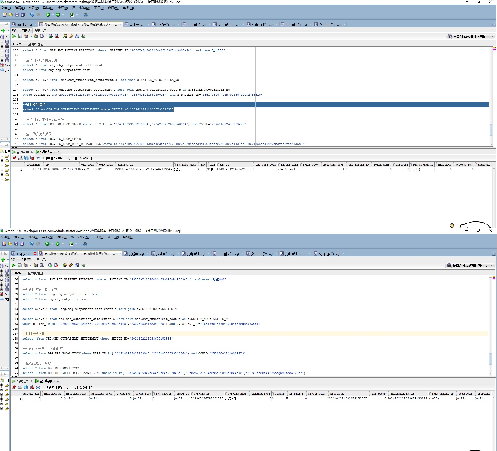

# 领域服务/结算领域 - 临时挂号结算 - 临时挂号结算 正向用例
## 请求参数：
``` json
{
  "chargeInfo": {
    "patientName": "贰贰1",
    "orderNo": "2024102111033679125059",
    "patientId": "373060ac206b4fa3ba77f91e9af82569",
    "sex": "2",
    "settleDate": "2024-10-21 11:03:36",
    "patientType": "07",
    "backtrackBatch": "2024102111033679153814",
    "settleNo": "2024102111033679152555",
    "oldSettleId": "0",
    "visitId": "1848198423971672066",
    "chgTypeCode": "1",
    "id": "1848198423937929219",
    "businessType": "1",
    "payStatus": "1",
    "age": "33岁",
    "statusFlag": "0"
  },
  "hospCode": "NXRY",
  "orgCode": "NXRMYY",
  "operatorId": "349365436797001728",
  "operatorName": "测试医生"
}
```
## 返回参数：
``` json
{
    "exception": null,
    "apiCode": null,
    "data": {
        "chargeInfo": {
            "orderNo": "2024102111033679125059",
            "settleDate": "2024-10-21 11:03:36",
            "settleId": "1859880893532147713",
            "settleNo": "2024102111033679152555"
        }
    },
    "Code": 200,
    "Message": "操作成功"
}
```
## 数据校验：



# 领域服务/结算领域 - 临时挂号结算 - 必填校验-[orgCode]为空
## 请求参数：
``` json
{
  "chargeInfo": {
    "patientName": "贰贰1",
    "orderNo": "2024102111033679125059",
    "patientId": "373060ac206b4fa3ba77f91e9af82569",
    "sex": "2",
    "settleDate": "2024-10-21 11:03:36",
    "patientType": "07",
    "backtrackBatch": "2024102111033679153814",
    "settleNo": "2024102111033679152554",
    "oldSettleId": "0",
    "visitId": "1848198423971672066",
    "chgTypeCode": "1",
    "id": "1848198423937929219",
    "businessType": "1",
    "payStatus": "1",
    "age": "33岁",
    "statusFlag": "0"
  },
  "hospCode": "NXRY",
  "orgCode": "",
  "operatorId": "349365436797001728",
  "operatorName": "测试医生"
}
```
## 返回参数：
``` json
{
  "exception": null,
  "apiCode": null,
  "data": null,
  "Code": 1,
  "Message": "医院编码不能为空"
}
```
# 领域服务/结算领域 - 临时挂号结算 - 必填校验-[hospCode]为空
## 请求参数：
``` json
{
  "chargeInfo": {
    "patientName": "贰贰1",
    "orderNo": "2024102111033679125059",
    "patientId": "373060ac206b4fa3ba77f91e9af82569",
    "sex": "2",
    "settleDate": "2024-10-21 11:03:36",
    "patientType": "07",
    "backtrackBatch": "2024102111033679153814",
    "settleNo": "2024102111033679152554",
    "oldSettleId": "0",
    "visitId": "1848198423971672066",
    "chgTypeCode": "1",
    "id": "1848198423937929219",
    "businessType": "1",
    "payStatus": "1",
    "age": "33岁",
    "statusFlag": "0"
  },
  "hospCode": "",
  "orgCode": "NXRMYY",
  "operatorId": "349365436797001728",
  "operatorName": "测试医生"
}
```
## 返回参数：
``` json
{
  "exception": null,
  "apiCode": null,
  "data": null,
  "Code": 1,
  "Message": "院区编码不能为空"
}
```
# 领域服务/结算领域 - 临时挂号结算 - 必填校验-[operatorId]为空
## 请求参数：
``` json
{
  "chargeInfo": {
    "patientName": "贰贰1",
    "orderNo": "2024102111033679125059",
    "patientId": "373060ac206b4fa3ba77f91e9af82569",
    "sex": "2",
    "settleDate": "2024-10-21 11:03:36",
    "patientType": "07",
    "backtrackBatch": "2024102111033679153814",
    "settleNo": "2024102111033679152554",
    "oldSettleId": "0",
    "visitId": "1848198423971672066",
    "chgTypeCode": "1",
    "id": "1848198423937929219",
    "businessType": "1",
    "payStatus": "1",
    "age": "33岁",
    "statusFlag": "0"
  },
  "hospCode": "NXRY",
  "orgCode": "NXRMYY",
  "operatorId": "",
  "operatorName": "测试医生"
}
```
## 返回参数：
``` json
{
  "exception": null,
  "apiCode": null,
  "data": null,
  "Code": 1,
  "Message": "操作人id不能为空"
}
```
# 领域服务/结算领域 - 临时挂号结算 - 必填校验-[operatorName]为空
## 请求参数：
``` json
{
  "chargeInfo": {
    "patientName": "贰贰1",
    "orderNo": "2024102111033679125059",
    "patientId": "373060ac206b4fa3ba77f91e9af82569",
    "sex": "2",
    "settleDate": "2024-10-21 11:03:36",
    "patientType": "07",
    "backtrackBatch": "2024102111033679153814",
    "settleNo": "2024102111033679152554",
    "oldSettleId": "0",
    "visitId": "1848198423971672066",
    "chgTypeCode": "1",
    "id": "1848198423937929219",
    "businessType": "1",
    "payStatus": "1",
    "age": "33岁",
    "statusFlag": "0"
  },
  "hospCode": "NXRY",
  "orgCode": "NXRMYY",
  "operatorId": "349365436797001728",
  "operatorName": ""
}
```
## 返回参数：
``` json
{
  "exception": null,
  "apiCode": null,
  "data": null,
  "Code": 1,
  "Message": "操作人姓名不能为空"
}
```
# 领域服务/结算领域 - 临时挂号结算 - 必填校验-[chargeInfo]为空
## 请求参数：
``` json
{
  "chargeInfo": null,
  "hospCode": "NXRY",
  "orgCode": "NXRMYY",
  "operatorId": "349365436797001728",
  "operatorName": "测试医生"
}
```
## 返回参数：
``` json
{
  "exception": null,
  "apiCode": null,
  "data": null,
  "Code": 1,
  "Message": "临时挂号结算数据不可为空"
}
```
# 领域服务/结算领域 - 临时挂号结算 - 必填校验-[chargeInfo.id]为空
## 请求参数：
``` json
{
  "chargeInfo": {
    "patientName": "贰贰1",
    "orderNo": "2024102111033679125059",
    "patientId": "373060ac206b4fa3ba77f91e9af82569",
    "sex": "2",
    "settleDate": "2024-10-21 11:03:36",
    "patientType": "07",
    "backtrackBatch": "2024102111033679153814",
    "settleNo": "2024102111033679152554",
    "oldSettleId": "0",
    "visitId": "1848198423971672066",
    "chgTypeCode": "1",
    "id": null,
    "businessType": "1",
    "payStatus": "1",
    "age": "33岁",
    "statusFlag": "0"
  },
  "hospCode": "NXRY",
  "orgCode": "NXRMYY",
  "operatorId": "349365436797001728",
  "operatorName": "测试医生"
}
```
## 返回参数：
``` json
{
  "exception": null,
  "apiCode": null,
  "data": null,
  "Code": 1,
  "Message": "结算id不可为空"
}
```
# 领域服务/结算领域 - 临时挂号结算 - 必填校验-[chargeInfo.settleNo]为空
## 请求参数：
``` json
{
  "chargeInfo": {
    "patientName": "贰贰1",
    "orderNo": "2024102111033679125059",
    "patientId": "373060ac206b4fa3ba77f91e9af82569",
    "sex": "2",
    "settleDate": "2024-10-21 11:03:36",
    "patientType": "07",
    "backtrackBatch": "2024102111033679153814",
    "settleNo": null,
    "oldSettleId": "0",
    "visitId": "1848198423971672066",
    "chgTypeCode": "1",
    "id": "1848198423937929219",
    "businessType": "1",
    "payStatus": "1",
    "age": "33岁",
    "statusFlag": "0"
  },
  "hospCode": "NXRY",
  "orgCode": "NXRMYY",
  "operatorId": "349365436797001728",
  "operatorName": "测试医生"
}
```
## 返回参数：
``` json
{
  "exception": null,
  "apiCode": null,
  "data": null,
  "Code": 1,
  "Message": "结算号不可为空"
}
```
# 领域服务/结算领域 - 临时挂号结算 - 必填校验-[chargeInfo.orderNo]为空
## 请求参数：
``` json
{
  "chargeInfo": {
    "patientName": "贰贰1",
    "orderNo": null,
    "patientId": "373060ac206b4fa3ba77f91e9af82569",
    "sex": "2",
    "settleDate": "2024-10-21 11:03:36",
    "patientType": "07",
    "backtrackBatch": "2024102111033679153814",
    "settleNo": "2024102111033679152554",
    "oldSettleId": "0",
    "visitId": "1848198423971672066",
    "chgTypeCode": "1",
    "id": "1848198423937929219",
    "businessType": "1",
    "payStatus": "1",
    "age": "33岁",
    "statusFlag": "0"
  },
  "hospCode": "NXRY",
  "orgCode": "NXRMYY",
  "operatorId": "349365436797001728",
  "operatorName": "测试医生"
}
```
## 返回参数：
``` json
{
  "exception": null,
  "apiCode": null,
  "data": null,
  "Code": 1,
  "Message": "订单号不可为空"
}
```
# 领域服务/结算领域 - 临时挂号结算 - 必填校验-[chargeInfo.backtrackBatch]为空
## 请求参数：
``` json
{
  "chargeInfo": {
    "patientName": "贰贰1",
    "orderNo": "2024102111033679125059",
    "patientId": "373060ac206b4fa3ba77f91e9af82569",
    "sex": "2",
    "settleDate": "2024-10-21 11:03:36",
    "patientType": "07",
    "backtrackBatch": null,
    "settleNo": "2024102111033679152554",
    "oldSettleId": "0",
    "visitId": "1848198423971672066",
    "chgTypeCode": "1",
    "id": "1848198423937929219",
    "businessType": "1",
    "payStatus": "1",
    "age": "33岁",
    "statusFlag": "0"
  },
  "hospCode": "NXRY",
  "orgCode": "NXRMYY",
  "operatorId": "349365436797001728",
  "operatorName": "测试医生"
}
```
## 返回参数：
``` json
{
  "exception": null,
  "apiCode": null,
  "data": null,
  "Code": 1,
  "Message": "回溯批次号不可为空"
}
```
# 领域服务/结算领域 - 临时挂号结算 - 必填校验-[chargeInfo.patientId]为空
## 请求参数：
``` json
{
  "chargeInfo": {
    "patientName": "贰贰1",
    "orderNo": "2024102111033679125059",
    "patientId": null,
    "sex": "2",
    "settleDate": "2024-10-21 11:03:36",
    "patientType": "07",
    "backtrackBatch": "2024102111033679153814",
    "settleNo": "2024102111033679152554",
    "oldSettleId": "0",
    "visitId": "1848198423971672066",
    "chgTypeCode": "1",
    "id": "1848198423937929219",
    "businessType": "1",
    "payStatus": "1",
    "age": "33岁",
    "statusFlag": "0"
  },
  "hospCode": "NXRY",
  "orgCode": "NXRMYY",
  "operatorId": "349365436797001728",
  "operatorName": "测试医生"
}
```
## 返回参数：
``` json
{
  "exception": null,
  "apiCode": null,
  "data": null,
  "Code": 1,
  "Message": "患者id不可为空"
}
```
# 领域服务/结算领域 - 临时挂号结算 - 必填校验-[chargeInfo.patientName]为空
## 请求参数：
``` json
{
  "chargeInfo": {
    "patientName": null,
    "orderNo": "2024102111033679125059",
    "patientId": "373060ac206b4fa3ba77f91e9af82569",
    "sex": "2",
    "settleDate": "2024-10-21 11:03:36",
    "patientType": "07",
    "backtrackBatch": "2024102111033679153814",
    "settleNo": "2024102111033679152554",
    "oldSettleId": "0",
    "visitId": "1848198423971672066",
    "chgTypeCode": "1",
    "id": "1848198423937929219",
    "businessType": "1",
    "payStatus": "1",
    "age": "33岁",
    "statusFlag": "0"
  },
  "hospCode": "NXRY",
  "orgCode": "NXRMYY",
  "operatorId": "349365436797001728",
  "operatorName": "测试医生"
}
```
## 返回参数：
``` json
{
  "exception": null,
  "apiCode": null,
  "data": null,
  "Code": 1,
  "Message": "患者姓名不可为空"
}
```
# 领域服务/结算领域 - 临时挂号结算 - 必填校验-[chargeInfo.patientType]为空
## 请求参数：
``` json
{
  "chargeInfo": {
    "patientName": "贰贰1",
    "orderNo": "2024102111033679125059",
    "patientId": "373060ac206b4fa3ba77f91e9af82569",
    "sex": "2",
    "settleDate": "2024-10-21 11:03:36",
    "patientType": null,
    "backtrackBatch": "2024102111033679153814",
    "settleNo": "2024102111033679152554",
    "oldSettleId": "0",
    "visitId": "1848198423971672066",
    "chgTypeCode": "1",
    "id": "1848198423937929219",
    "businessType": "1",
    "payStatus": "1",
    "age": "33岁",
    "statusFlag": "0"
  },
  "hospCode": "NXRY",
  "orgCode": "NXRMYY",
  "operatorId": "349365436797001728",
  "operatorName": "测试医生"
}
```
## 返回参数：
``` json
{
  "exception": null,
  "apiCode": null,
  "data": null,
  "Code": 1,
  "Message": "病人类型编码不可为空"
}
```
# 领域服务/结算领域 - 临时挂号结算 - 必填校验-[chargeInfo.sex]为空
## 请求参数：
``` json
{
  "chargeInfo": {
    "patientName": "贰贰1",
    "orderNo": "2024102111033679125059",
    "patientId": "373060ac206b4fa3ba77f91e9af82569",
    "sex": null,
    "settleDate": "2024-10-21 11:03:36",
    "patientType": "07",
    "backtrackBatch": "2024102111033679153814",
    "settleNo": "2024102111033679152554",
    "oldSettleId": "0",
    "visitId": "1848198423971672066",
    "chgTypeCode": "1",
    "id": "1848198423937929219",
    "businessType": "1",
    "payStatus": "1",
    "age": "33岁",
    "statusFlag": "0"
  },
  "hospCode": "NXRY",
  "orgCode": "NXRMYY",
  "operatorId": "349365436797001728",
  "operatorName": "测试医生"
}
```
## 返回参数：
``` json
{
  "exception": null,
  "apiCode": null,
  "data": null,
  "Code": 1,
  "Message": "性别编码不可为空"
}
```
# 领域服务/结算领域 - 临时挂号结算 - 必填校验-[chargeInfo.age]为空
## 请求参数：
``` json
{
  "chargeInfo": {
    "patientName": "贰贰1",
    "orderNo": "2024102111033679125059",
    "patientId": "373060ac206b4fa3ba77f91e9af82569",
    "sex": "2",
    "settleDate": "2024-10-21 11:03:36",
    "patientType": "07",
    "backtrackBatch": "2024102111033679153814",
    "settleNo": "2024102111033679152554",
    "oldSettleId": "0",
    "visitId": "1848198423971672066",
    "chgTypeCode": "1",
    "id": "1848198423937929219",
    "businessType": "1",
    "payStatus": "1",
    "age": null,
    "statusFlag": "0"
  },
  "hospCode": "NXRY",
  "orgCode": "NXRMYY",
  "operatorId": "349365436797001728",
  "operatorName": "测试医生"
}
```
## 返回参数：
``` json
{
  "exception": null,
  "apiCode": null,
  "data": null,
  "Code": 1,
  "Message": "年龄不可为空"
}
```
# 领域服务/结算领域 - 临时挂号结算 - 必填校验-[chargeInfo.visitId]为空
## 请求参数：
``` json
{
  "chargeInfo": {
    "patientName": "贰贰1",
    "orderNo": "2024102111033679125059",
    "patientId": "373060ac206b4fa3ba77f91e9af82569",
    "sex": "2",
    "settleDate": "2024-10-21 11:03:36",
    "patientType": "07",
    "backtrackBatch": "2024102111033679153814",
    "settleNo": "2024102111033679152554",
    "oldSettleId": "0",
    "visitId": null,
    "chgTypeCode": "1",
    "id": "1848198423937929219",
    "businessType": "1",
    "payStatus": "1",
    "age": "33岁",
    "statusFlag": "0"
  },
  "hospCode": "NXRY",
  "orgCode": "NXRMYY",
  "operatorId": "349365436797001728",
  "operatorName": "测试医生"
}
```
## 返回参数：
``` json
{
  "exception": null,
  "apiCode": null,
  "data": null,
  "Code": 1,
  "Message": "挂号id不可为空"
}
```
# 领域服务/结算领域 - 临时挂号结算 - 必填校验-[chargeInfo.settleDate]为空
## 请求参数：
``` json
{
  "chargeInfo": {
    "patientName": "贰贰1",
    "orderNo": "2024102111033679125059",
    "patientId": "373060ac206b4fa3ba77f91e9af82569",
    "sex": "2",
    "settleDate": null,
    "patientType": "07",
    "backtrackBatch": "2024102111033679153814",
    "settleNo": "2024102111033679152554",
    "oldSettleId": "0",
    "visitId": "1848198423971672066",
    "chgTypeCode": "1",
    "id": "1848198423937929219",
    "businessType": "1",
    "payStatus": "1",
    "age": "33岁",
    "statusFlag": "0"
  },
  "hospCode": "NXRY",
  "orgCode": "NXRMYY",
  "operatorId": "349365436797001728",
  "operatorName": "测试医生"
}
```
## 返回参数：
``` json
{
  "exception": null,
  "apiCode": null,
  "data": null,
  "Code": 1,
  "Message": "结算日期不可为空"
}
```
# 领域服务/结算领域 - 临时挂号结算 - 必填校验-[chargeInfo.businessType]为空
## 请求参数：
``` json
{
  "chargeInfo": {
    "patientName": "贰贰1",
    "orderNo": "2024102111033679125059",
    "patientId": "373060ac206b4fa3ba77f91e9af82569",
    "sex": "2",
    "settleDate": "2024-10-21 11:03:36",
    "patientType": "07",
    "backtrackBatch": "2024102111033679153814",
    "settleNo": "2024102111033679152554",
    "oldSettleId": "0",
    "visitId": "1848198423971672066",
    "chgTypeCode": "1",
    "id": "1848198423937929219",
    "businessType": null,
    "payStatus": "1",
    "age": "33岁",
    "statusFlag": "0"
  },
  "hospCode": "NXRY",
  "orgCode": "NXRMYY",
  "operatorId": "349365436797001728",
  "operatorName": "测试医生"
}
```
## 返回参数：
``` json
{
  "exception": null,
  "apiCode": null,
  "data": null,
  "Code": 1,
  "Message": "业务类型不可为空"
}
```
# 领域服务/结算领域 - 临时挂号结算 - 必填校验-[chargeInfo.oldSettleId]为空
## 请求参数：
``` json
{
  "chargeInfo": {
    "patientName": "贰贰1",
    "orderNo": "2024102111033679125059",
    "patientId": "373060ac206b4fa3ba77f91e9af82569",
    "sex": "2",
    "settleDate": "2024-10-21 11:03:36",
    "patientType": "07",
    "backtrackBatch": "2024102111033679153814",
    "settleNo": "2024102111033679152554",
    "oldSettleId": null,
    "visitId": "1848198423971672066",
    "chgTypeCode": "1",
    "id": "1848198423937929219",
    "businessType": "1",
    "payStatus": "1",
    "age": "33岁",
    "statusFlag": "0"
  },
  "hospCode": "NXRY",
  "orgCode": "NXRMYY",
  "operatorId": "349365436797001728",
  "operatorName": "测试医生"
}
```
## 返回参数：
``` json
{
  "exception": null,
  "apiCode": null,
  "data": null,
  "Code": 1,
  "Message": "源结算id不可为空"
}
```
# 领域服务/结算领域 - 临时挂号结算 - 必填校验-[chargeInfo.statusFlag]为空
## 请求参数：
``` json
{
  "chargeInfo": {
    "patientName": "贰贰1",
    "orderNo": "2024102111033679125059",
    "patientId": "373060ac206b4fa3ba77f91e9af82569",
    "sex": "2",
    "settleDate": "2024-10-21 11:03:36",
    "patientType": "07",
    "backtrackBatch": "2024102111033679153814",
    "settleNo": "2024102111033679152554",
    "oldSettleId": "0",
    "visitId": "1848198423971672066",
    "chgTypeCode": "1",
    "id": "1848198423937929219",
    "businessType": "1",
    "payStatus": "1",
    "age": "33岁",
    "statusFlag": null
  },
  "hospCode": "NXRY",
  "orgCode": "NXRMYY",
  "operatorId": "349365436797001728",
  "operatorName": "测试医生"
}
```
## 返回参数：
``` json
{
  "exception": null,
  "apiCode": null,
  "data": null,
  "Code": 1,
  "Message": "记录状态不可为空"
}
```
# 领域服务/结算领域 - 临时挂号结算 - 必填校验-[chargeInfo.payStatus]为空
## 请求参数：
``` json
{
  "chargeInfo": {
    "patientName": "贰贰1",
    "orderNo": "2024102111033679125059",
    "patientId": "373060ac206b4fa3ba77f91e9af82569",
    "sex": "2",
    "settleDate": "2024-10-21 11:03:36",
    "patientType": "07",
    "backtrackBatch": "2024102111033679153814",
    "settleNo": "2024102111033679152554",
    "oldSettleId": "0",
    "visitId": "1848198423971672066",
    "chgTypeCode": "1",
    "id": "1848198423937929219",
    "businessType": "1",
    "payStatus": null,
    "age": "33岁",
    "statusFlag": "0"
  },
  "hospCode": "NXRY",
  "orgCode": "NXRMYY",
  "operatorId": "349365436797001728",
  "operatorName": "测试医生"
}
```
## 返回参数：
``` json
{
  "exception": null,
  "apiCode": null,
  "data": null,
  "Code": 1,
  "Message": "支付状态不可为空"
}
```
# 领域服务/结算领域 - 临时挂号结算 - 必填校验-[chargeInfo.chgTypeCode]为空
## 请求参数：
``` json
{
  "chargeInfo": {
    "patientName": "贰贰1",
    "orderNo": "2024102111033679125059",
    "patientId": "373060ac206b4fa3ba77f91e9af82569",
    "sex": "2",
    "settleDate": "2024-10-21 11:03:36",
    "patientType": "07",
    "backtrackBatch": "2024102111033679153814",
    "settleNo": "2024102111033679152554",
    "oldSettleId": "0",
    "visitId": "1848198423971672066",
    "chgTypeCode": null,
    "id": "1848198423937929219",
    "businessType": "1",
    "payStatus": "1",
    "age": "33岁",
    "statusFlag": "0"
  },
  "hospCode": "NXRY",
  "orgCode": "NXRMYY",
  "operatorId": "349365436797001728",
  "operatorName": "测试医生"
}
```
## 返回参数：
``` json
{
  "exception": null,
  "apiCode": null,
  "data": null,
  "Code": 1,
  "Message": "结算费别代码不可为空"
}
```
# 领域服务/结算领域 - 临时挂号结算 - 枚举用例-[chargeInfo.businessType] 枚举值为 1(业务类型为挂号)
## 请求参数：
``` json
{
  "chargeInfo": {
    "patientName": "贰贰1",
    "orderNo": "2024102111033679125059",
    "patientId": "373060ac206b4fa3ba77f91e9af82569",
    "sex": "2",
    "settleDate": "2024-10-21 11:03:36",
    "patientType": "07",
    "backtrackBatch": "2024102111033679153814",
    "settleNo": "2024102111033679152554",
    "oldSettleId": "0",
    "visitId": "1848198423971672066",
    "chgTypeCode": "1",
    "id": "1848198423937929219",
    "businessType": "1",
    "payStatus": "1",
    "age": "33岁",
    "statusFlag": "0"
  },
  "hospCode": "NXRY",
  "orgCode": "NXRMYY",
  "operatorId": "349365436797001728",
  "operatorName": "测试医生"
}
```
## 返回参数：
``` json
{
  "exception": null,
  "apiCode": null,
  "data": null,
  "Code": 1,
  "Message": "系统内部异常"
}
```
# 领域服务/结算领域 - 临时挂号结算 - 枚举用例-[chargeInfo.businessType] 枚举值为 2(业务类型为收费)
## 请求参数：
``` json
{
  "chargeInfo": {
    "patientName": "贰贰1",
    "orderNo": "2024102111033679125059",
    "patientId": "373060ac206b4fa3ba77f91e9af82569",
    "sex": "2",
    "settleDate": "2024-10-21 11:03:36",
    "patientType": "07",
    "backtrackBatch": "2024102111033679153814",
    "settleNo": "2024102111033679152554",
    "oldSettleId": "0",
    "visitId": "1848198423971672066",
    "chgTypeCode": "1",
    "id": "1848198423937929219",
    "businessType": "2",
    "payStatus": "1",
    "age": "33岁",
    "statusFlag": "0"
  },
  "hospCode": "NXRY",
  "orgCode": "NXRMYY",
  "operatorId": "349365436797001728",
  "operatorName": "测试医生"
}
```
## 返回参数：
``` json
{
  "exception": null,
  "apiCode": null,
  "data": null,
  "Code": 1,
  "Message": "系统内部异常"
}
```
# 领域服务/结算领域 - 临时挂号结算 - 枚举用例-[chargeInfo.payStatus] 枚举值为 0(支付状态为未支付)
## 请求参数：
``` json
{
  "chargeInfo": {
    "patientName": "贰贰1",
    "orderNo": "2024102111033679125059",
    "patientId": "373060ac206b4fa3ba77f91e9af82569",
    "sex": "2",
    "settleDate": "2024-10-21 11:03:36",
    "patientType": "07",
    "backtrackBatch": "2024102111033679153814",
    "settleNo": "2024102111033679152554",
    "oldSettleId": "0",
    "visitId": "1848198423971672066",
    "chgTypeCode": "1",
    "id": "1848198423937929219",
    "businessType": "1",
    "payStatus": "0",
    "age": "33岁",
    "statusFlag": "0"
  },
  "hospCode": "NXRY",
  "orgCode": "NXRMYY",
  "operatorId": "349365436797001728",
  "operatorName": "测试医生"
}
```
## 返回参数：
``` json
{
  "exception": null,
  "apiCode": null,
  "data": null,
  "Code": 1,
  "Message": "系统内部异常"
}
```
# 领域服务/结算领域 - 临时挂号结算 - 枚举用例-[chargeInfo.payStatus] 枚举值为 1(支付状态为已支付,临时挂号该字段默认=1)
## 请求参数：
``` json
{
  "chargeInfo": {
    "patientName": "贰贰1",
    "orderNo": "2024102111033679125059",
    "patientId": "373060ac206b4fa3ba77f91e9af82569",
    "sex": "2",
    "settleDate": "2024-10-21 11:03:36",
    "patientType": "07",
    "backtrackBatch": "2024102111033679153814",
    "settleNo": "2024102111033679152554",
    "oldSettleId": "0",
    "visitId": "1848198423971672066",
    "chgTypeCode": "1",
    "id": "1848198423937929219",
    "businessType": "1",
    "payStatus": "1",
    "age": "33岁",
    "statusFlag": "0"
  },
  "hospCode": "NXRY",
  "orgCode": "NXRMYY",
  "operatorId": "349365436797001728",
  "operatorName": "测试医生"
}
```
## 返回参数：
``` json
{
  "exception": null,
  "apiCode": null,
  "data": null,
  "Code": 1,
  "Message": "系统内部异常"
}
```
# 领域服务/结算领域 - 临时挂号结算 - 枚举用例-[chargeInfo.statusFlag] 枚举值为 0(记录状态为正常)
## 请求参数：
``` json
{
  "chargeInfo": {
    "patientName": "贰贰1",
    "orderNo": "2024102111033679125059",
    "patientId": "373060ac206b4fa3ba77f91e9af82569",
    "sex": "2",
    "settleDate": "2024-10-21 11:03:36",
    "patientType": "07",
    "backtrackBatch": "2024102111033679153814",
    "settleNo": "2024102111033679152554",
    "oldSettleId": "0",
    "visitId": "1848198423971672066",
    "chgTypeCode": "1",
    "id": "1848198423937929219",
    "businessType": "1",
    "payStatus": "1",
    "age": "33岁",
    "statusFlag": "0"
  },
  "hospCode": "NXRY",
  "orgCode": "NXRMYY",
  "operatorId": "349365436797001728",
  "operatorName": "测试医生"
}
```
## 返回参数：
``` json
{
  "exception": null,
  "apiCode": null,
  "data": null,
  "Code": 1,
  "Message": "系统内部异常"
}
```
# 领域服务/结算领域 - 临时挂号结算 - 枚举用例-[chargeInfo.statusFlag] 枚举值为 1(记录状态为被冲)
## 请求参数：
``` json
{
  "chargeInfo": {
    "patientName": "贰贰1",
    "orderNo": "2024102111033679125059",
    "patientId": "373060ac206b4fa3ba77f91e9af82569",
    "sex": "2",
    "settleDate": "2024-10-21 11:03:36",
    "patientType": "07",
    "backtrackBatch": "2024102111033679153814",
    "settleNo": "2024102111033679152554",
    "oldSettleId": "0",
    "visitId": "1848198423971672066",
    "chgTypeCode": "1",
    "id": "1848198423937929219",
    "businessType": "1",
    "payStatus": "1",
    "age": "33岁",
    "statusFlag": "1"
  },
  "hospCode": "NXRY",
  "orgCode": "NXRMYY",
  "operatorId": "349365436797001728",
  "operatorName": "测试医生"
}
```
## 返回参数：
``` json
{
  "exception": null,
  "apiCode": null,
  "data": null,
  "Code": 1,
  "Message": "系统内部异常"
}
```
# 领域服务/结算领域 - 临时挂号结算 - 枚举用例-[chargeInfo.statusFlag] 枚举值为 2(记录状态为冲正)
## 请求参数：
``` json
{
  "chargeInfo": {
    "patientName": "贰贰1",
    "orderNo": "2024102111033679125059",
    "patientId": "373060ac206b4fa3ba77f91e9af82569",
    "sex": "2",
    "settleDate": "2024-10-21 11:03:36",
    "patientType": "07",
    "backtrackBatch": "2024102111033679153814",
    "settleNo": "2024102111033679152554",
    "oldSettleId": "0",
    "visitId": "1848198423971672066",
    "chgTypeCode": "1",
    "id": "1848198423937929219",
    "businessType": "1",
    "payStatus": "1",
    "age": "33岁",
    "statusFlag": "2"
  },
  "hospCode": "NXRY",
  "orgCode": "NXRMYY",
  "operatorId": "349365436797001728",
  "operatorName": "测试医生"
}
```
## 返回参数：
``` json
{
  "exception": null,
  "apiCode": null,
  "data": null,
  "Code": 1,
  "Message": "系统内部异常"
}
```
# 领域服务/结算领域 - 临时挂号结算 - 依赖用例-[operatorName]赋值为依赖用例测试值
## 请求参数：
``` json
{
  "chargeInfo": {
    "patientName": "贰贰1",
    "orderNo": "2024102111033679125059",
    "patientId": "373060ac206b4fa3ba77f91e9af82569",
    "sex": "2",
    "settleDate": "2024-10-21 11:03:36",
    "patientType": "07",
    "backtrackBatch": "2024102111033679153814",
    "settleNo": "2024102111033679152554",
    "oldSettleId": "0",
    "visitId": "1848198423971672066",
    "chgTypeCode": "1",
    "id": "1848198423937929219",
    "businessType": "1",
    "payStatus": "1",
    "age": "33岁",
    "statusFlag": "0"
  },
  "hospCode": "NXRY",
  "orgCode": "NXRMYY",
  "operatorId": "349365436797001728",
  "operatorName": "依赖用例测试值"
}
```
## 返回参数：
``` json
{
  "exception": null,
  "apiCode": null,
  "data": null,
  "Code": 1,
  "Message": "系统内部异常"
}
```
# 领域服务/结算领域 - 临时挂号结算 - 依赖用例-[operatorId]赋值为依赖用例测试值
## 请求参数：
``` json
{
  "chargeInfo": {
    "patientName": "贰贰1",
    "orderNo": "2024102111033679125059",
    "patientId": "373060ac206b4fa3ba77f91e9af82569",
    "sex": "2",
    "settleDate": "2024-10-21 11:03:36",
    "patientType": "07",
    "backtrackBatch": "2024102111033679153814",
    "settleNo": "2024102111033679152554",
    "oldSettleId": "0",
    "visitId": "1848198423971672066",
    "chgTypeCode": "1",
    "id": "1848198423937929219",
    "businessType": "1",
    "payStatus": "1",
    "age": "33岁",
    "statusFlag": "0"
  },
  "hospCode": "NXRY",
  "orgCode": "NXRMYY",
  "operatorId": "依赖用例测试值",
  "operatorName": "测试医生"
}
```
## 返回参数：
``` json
{
  "exception": null,
  "apiCode": null,
  "data": null,
  "Code": 1,
  "Message": "系统内部异常"
}
```
# 领域服务/结算领域 - 临时挂号结算 - 依赖用例-[orgCode]赋值为依赖用例测试值
## 请求参数：
``` json
{
  "chargeInfo": {
    "patientName": "贰贰1",
    "orderNo": "2024102111033679125059",
    "patientId": "373060ac206b4fa3ba77f91e9af82569",
    "sex": "2",
    "settleDate": "2024-10-21 11:03:36",
    "patientType": "07",
    "backtrackBatch": "2024102111033679153814",
    "settleNo": "2024102111033679152554",
    "oldSettleId": "0",
    "visitId": "1848198423971672066",
    "chgTypeCode": "1",
    "id": "1848198423937929219",
    "businessType": "1",
    "payStatus": "1",
    "age": "33岁",
    "statusFlag": "0"
  },
  "hospCode": "NXRY",
  "orgCode": "依赖用例测试值",
  "operatorId": "349365436797001728",
  "operatorName": "测试医生"
}
```
## 返回参数：
``` json
{
  "exception": null,
  "apiCode": null,
  "data": null,
  "Code": 1,
  "Message": "系统内部异常"
}
```
# 领域服务/结算领域 - 临时挂号结算 - 依赖用例-[hospCode]赋值为依赖用例测试值
## 请求参数：
``` json
{
  "chargeInfo": {
    "patientName": "贰贰1",
    "orderNo": "2024102111033679125059",
    "patientId": "373060ac206b4fa3ba77f91e9af82569",
    "sex": "2",
    "settleDate": "2024-10-21 11:03:36",
    "patientType": "07",
    "backtrackBatch": "2024102111033679153814",
    "settleNo": "2024102111033679152554",
    "oldSettleId": "0",
    "visitId": "1848198423971672066",
    "chgTypeCode": "1",
    "id": "1848198423937929219",
    "businessType": "1",
    "payStatus": "1",
    "age": "33岁",
    "statusFlag": "0"
  },
  "hospCode": "依赖用例测试值",
  "orgCode": "NXRMYY",
  "operatorId": "349365436797001728",
  "operatorName": "测试医生"
}
```
## 返回参数：
``` json
{
  "exception": null,
  "apiCode": null,
  "data": null,
  "Code": 1,
  "Message": "系统内部异常"
}
```
# 领域服务/结算领域 - 临时挂号结算 - 依赖用例-[chargeInfo.patientName]赋值为依赖用例测试值
## 请求参数：
``` json
{
  "chargeInfo": {
    "patientName": "依赖用例测试值",
    "orderNo": "2024102111033679125059",
    "patientId": "373060ac206b4fa3ba77f91e9af82569",
    "sex": "2",
    "settleDate": "2024-10-21 11:03:36",
    "patientType": "07",
    "backtrackBatch": "2024102111033679153814",
    "settleNo": "2024102111033679152554",
    "oldSettleId": "0",
    "visitId": "1848198423971672066",
    "chgTypeCode": "1",
    "id": "1848198423937929219",
    "businessType": "1",
    "payStatus": "1",
    "age": "33岁",
    "statusFlag": "0"
  },
  "hospCode": "NXRY",
  "orgCode": "NXRMYY",
  "operatorId": "349365436797001728",
  "operatorName": "测试医生"
}
```
## 返回参数：
``` json
{
  "exception": null,
  "apiCode": null,
  "data": null,
  "Code": 1,
  "Message": "系统内部异常"
}
```
# 领域服务/结算领域 - 临时挂号结算 - 依赖用例-[chargeInfo.patientId]赋值为依赖用例测试值
## 请求参数：
``` json
{
  "chargeInfo": {
    "patientName": "贰贰1",
    "orderNo": "2024102111033679125059",
    "patientId": "依赖用例测试值",
    "sex": "2",
    "settleDate": "2024-10-21 11:03:36",
    "patientType": "07",
    "backtrackBatch": "2024102111033679153814",
    "settleNo": "2024102111033679152554",
    "oldSettleId": "0",
    "visitId": "1848198423971672066",
    "chgTypeCode": "1",
    "id": "1848198423937929219",
    "businessType": "1",
    "payStatus": "1",
    "age": "33岁",
    "statusFlag": "0"
  },
  "hospCode": "NXRY",
  "orgCode": "NXRMYY",
  "operatorId": "349365436797001728",
  "operatorName": "测试医生"
}
```
## 返回参数：
``` json
{
  "exception": null,
  "apiCode": null,
  "data": null,
  "Code": 1,
  "Message": "系统内部异常"
}
```
# 领域服务/结算领域 - 临时挂号结算 - 依赖用例-[chargeInfo.visitId]赋值为依赖用例测试值
## 请求参数：
``` json
{
  "chargeInfo": {
    "patientName": "贰贰1",
    "orderNo": "2024102111033679125059",
    "patientId": "373060ac206b4fa3ba77f91e9af82569",
    "sex": "2",
    "settleDate": "2024-10-21 11:03:36",
    "patientType": "07",
    "backtrackBatch": "2024102111033679153814",
    "settleNo": "2024102111033679152554",
    "oldSettleId": "0",
    "visitId": "依赖用例测试值",
    "chgTypeCode": "1",
    "id": "1848198423937929219",
    "businessType": "1",
    "payStatus": "1",
    "age": "33岁",
    "statusFlag": "0"
  },
  "hospCode": "NXRY",
  "orgCode": "NXRMYY",
  "operatorId": "349365436797001728",
  "operatorName": "测试医生"
}
```
## 返回参数：
``` json
{
  "exception": null,
  "apiCode": null,
  "data": null,
  "Code": 1,
  "Message": "系统内部异常"
}
```
# 领域服务/结算领域 - 临时挂号结算 - 依赖用例-[chargeInfo.id]赋值为依赖用例测试值
## 请求参数：
``` json
{
  "chargeInfo": {
    "patientName": "贰贰1",
    "orderNo": "2024102111033679125059",
    "patientId": "373060ac206b4fa3ba77f91e9af82569",
    "sex": "2",
    "settleDate": "2024-10-21 11:03:36",
    "patientType": "07",
    "backtrackBatch": "2024102111033679153814",
    "settleNo": "2024102111033679152554",
    "oldSettleId": "0",
    "visitId": "1848198423971672066",
    "chgTypeCode": "1",
    "id": "依赖用例测试值",
    "businessType": "1",
    "payStatus": "1",
    "age": "33岁",
    "statusFlag": "0"
  },
  "hospCode": "NXRY",
  "orgCode": "NXRMYY",
  "operatorId": "349365436797001728",
  "operatorName": "测试医生"
}
```
## 返回参数：
``` json
{
  "exception": null,
  "apiCode": null,
  "data": null,
  "Code": 1,
  "Message": "系统内部异常"
}
```