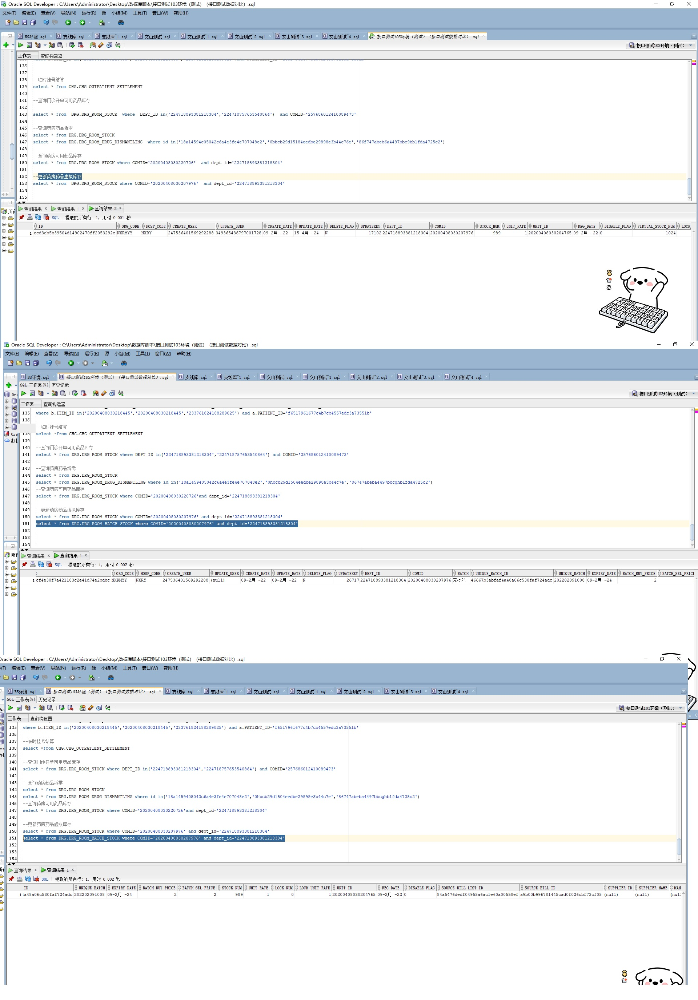

# 领域服务/药品领域 - 更新药房药品虚拟库存 - 更新药房药品虚拟库存 正向用例
## 请求参数：
``` json
{
  "hospCode": "NXRY",
  "orgCode": "NXRMYY",
  "list": [
    {
      "specDesc": "10g/支",
      "num": -2,
      "deptId": "224718893381218304",
      "drugName": "红霉素软膏",
      "unitRate": 1,
      "drugId": "20200408030207976",
      "factName": "福元药业有限公司"
    }
  ],
  "operateDate": "2024-10-21 17:27:18",
  "operatorId": "349365436797001728",
  "operatorName": "测试医生"
}
```
## 返回参数：
``` json
{
  "exception": null,
  "apiCode": null,
  "data": true,
  "Code": 200,
  "Message": "操作成功"
}
```
## 数据校验：



# 领域服务/药品领域 - 更新药房药品虚拟库存 - 必填校验-[orgCode]为空
## 请求参数：
``` json
{
  "hospCode": "NXRY",
  "orgCode": "",
  "list": [
    {
      "specDesc": "10g/支",
      "num": -2,
      "deptId": "224718893381218304",
      "drugName": "红霉素软膏",
      "unitRate": 1,
      "drugId": "20200408030207976",
      "factName": "福元药业有限公司"
    }
  ],
  "operateDate": "2024-10-21 17:27:18",
  "operatorId": "349365436797001728",
  "operatorName": "测试医生"
}
```
## 返回参数：
``` json
{
  "exception": null,
  "apiCode": null,
  "data": null,
  "Code": 1,
  "Message": "医院编码不能为空"
}
```
# 领域服务/药品领域 - 更新药房药品虚拟库存 - 必填校验-[hospCode]为空
## 请求参数：
``` json
{
  "hospCode": "",
  "orgCode": "NXRMYY",
  "list": [
    {
      "specDesc": "10g/支",
      "num": -2,
      "deptId": "224718893381218304",
      "drugName": "红霉素软膏",
      "unitRate": 1,
      "drugId": "20200408030207976",
      "factName": "福元药业有限公司"
    }
  ],
  "operateDate": "2024-10-21 17:27:18",
  "operatorId": "349365436797001728",
  "operatorName": "测试医生"
}
```
## 返回参数：
``` json
{
  "exception": null,
  "apiCode": null,
  "data": null,
  "Code": 1,
  "Message": "院区编码不能为空"
}
```
# 领域服务/药品领域 - 更新药房药品虚拟库存 - 必填校验-[operatorId]为空
## 请求参数：
``` json
{
  "hospCode": "NXRY",
  "orgCode": "NXRMYY",
  "list": [
    {
      "specDesc": "10g/支",
      "num": -2,
      "deptId": "224718893381218304",
      "drugName": "红霉素软膏",
      "unitRate": 1,
      "drugId": "20200408030207976",
      "factName": "福元药业有限公司"
    }
  ],
  "operateDate": "2024-10-21 17:27:18",
  "operatorId": "",
  "operatorName": "测试医生"
}
```
## 返回参数：
``` json
{
  "exception": null,
  "apiCode": null,
  "data": null,
  "Code": 1,
  "Message": "操作人id不能为空"
}
```
# 领域服务/药品领域 - 更新药房药品虚拟库存 - 必填校验-[operatorName]为空
## 请求参数：
``` json
{
  "hospCode": "NXRY",
  "orgCode": "NXRMYY",
  "list": [
    {
      "specDesc": "10g/支",
      "num": -2,
      "deptId": "224718893381218304",
      "drugName": "红霉素软膏",
      "unitRate": 1,
      "drugId": "20200408030207976",
      "factName": "福元药业有限公司"
    }
  ],
  "operateDate": "2024-10-21 17:27:18",
  "operatorId": "349365436797001728",
  "operatorName": ""
}
```
## 返回参数：
``` json
{
  "exception": null,
  "apiCode": null,
  "data": null,
  "Code": 1,
  "Message": "操作人姓名不能为空"
}
```
# 领域服务/药品领域 - 更新药房药品虚拟库存 - 必填校验-[operateDate]为空
## 请求参数：
``` json
{
  "hospCode": "NXRY",
  "orgCode": "NXRMYY",
  "list": [
    {
      "specDesc": "10g/支",
      "num": -2,
      "deptId": "224718893381218304",
      "drugName": "红霉素软膏",
      "unitRate": 1,
      "drugId": "20200408030207976",
      "factName": "福元药业有限公司"
    }
  ],
  "operateDate": "",
  "operatorId": "349365436797001728",
  "operatorName": "测试医生"
}
```
## 返回参数：
``` json
{
  "exception": null,
  "apiCode": null,
  "data": null,
  "Code": 1,
  "Message": "操作时间不能为空"
}
```
# 领域服务/药品领域 - 更新药房药品虚拟库存 - 必填校验-[list]为空
## 请求参数：
``` json
{
  "hospCode": "NXRY",
  "orgCode": "NXRMYY",
  "list": null,
  "operateDate": "2024-10-21 17:27:18",
  "operatorId": "349365436797001728",
  "operatorName": "测试医生"
}
```
## 返回参数：
``` json
{
  "exception": null,
  "apiCode": null,
  "data": null,
  "Code": 1,
  "Message": "药品集合不能为空"
}
```
# 领域服务/药品领域 - 更新药房药品虚拟库存 - 必填校验-[list.deptId]为空
## 请求参数：
``` json
{
  "hospCode": "NXRY",
  "orgCode": "NXRMYY",
  "list": [
    {
      "specDesc": "10g/支",
      "num": -2,
      "deptId": null,
      "drugName": "红霉素软膏",
      "unitRate": 1,
      "drugId": "20200408030207976",
      "factName": "福元药业有限公司"
    }
  ],
  "operateDate": "2024-10-21 17:27:18",
  "operatorId": "349365436797001728",
  "operatorName": "测试医生"
}
```
## 返回参数：
``` json
{
  "exception": null,
  "apiCode": null,
  "data": null,
  "Code": 1,
  "Message": "药房科室ID不能为空"
}
```
# 领域服务/药品领域 - 更新药房药品虚拟库存 - 必填校验-[list.drugId]为空
## 请求参数：
``` json
{
  "hospCode": "NXRY",
  "orgCode": "NXRMYY",
  "list": [
    {
      "specDesc": "10g/支",
      "num": -2,
      "deptId": "224718893381218304",
      "drugName": "红霉素软膏",
      "unitRate": 1,
      "drugId": null,
      "factName": "福元药业有限公司"
    }
  ],
  "operateDate": "2024-10-21 17:27:18",
  "operatorId": "349365436797001728",
  "operatorName": "测试医生"
}
```
## 返回参数：
``` json
{
  "exception": null,
  "apiCode": null,
  "data": null,
  "Code": 1,
  "Message": "药品ID不能为空"
}
```
# 领域服务/药品领域 - 更新药房药品虚拟库存 - 必填校验-[list.drugName]为空
## 请求参数：
``` json
{
  "hospCode": "NXRY",
  "orgCode": "NXRMYY",
  "list": [
    {
      "specDesc": "10g/支",
      "num": -2,
      "deptId": "224718893381218304",
      "drugName": null,
      "unitRate": 1,
      "drugId": "20200408030207976",
      "factName": "福元药业有限公司"
    }
  ],
  "operateDate": "2024-10-21 17:27:18",
  "operatorId": "349365436797001728",
  "operatorName": "测试医生"
}
```
## 返回参数：
``` json
{
  "exception": null,
  "apiCode": null,
  "data": null,
  "Code": 1,
  "Message": "药品名称不能为空"
}
```
# 领域服务/药品领域 - 更新药房药品虚拟库存 - 必填校验-[list.specDesc]为空
## 请求参数：
``` json
{
  "hospCode": "NXRY",
  "orgCode": "NXRMYY",
  "list": [
    {
      "specDesc": null,
      "num": -2,
      "deptId": "224718893381218304",
      "drugName": "红霉素软膏",
      "unitRate": 1,
      "drugId": "20200408030207976",
      "factName": "福元药业有限公司"
    }
  ],
  "operateDate": "2024-10-21 17:27:18",
  "operatorId": "349365436797001728",
  "operatorName": "测试医生"
}
```
## 返回参数：
``` json
{
  "exception": null,
  "apiCode": null,
  "data": null,
  "Code": 1,
  "Message": "药品规格不能为空"
}
```
# 领域服务/药品领域 - 更新药房药品虚拟库存 - 必填校验-[list.factName]为空
## 请求参数：
``` json
{
  "hospCode": "NXRY",
  "orgCode": "NXRMYY",
  "list": [
    {
      "specDesc": "10g/支",
      "num": -2,
      "deptId": "224718893381218304",
      "drugName": "红霉素软膏",
      "unitRate": 1,
      "drugId": "20200408030207976",
      "factName": null
    }
  ],
  "operateDate": "2024-10-21 17:27:18",
  "operatorId": "349365436797001728",
  "operatorName": "测试医生"
}
```
## 返回参数：
``` json
{
  "exception": null,
  "apiCode": null,
  "data": null,
  "Code": 1,
  "Message": "生产厂家名称不能为空"
}
```
# 领域服务/药品领域 - 更新药房药品虚拟库存 - 必填校验-[list.num]为空
## 请求参数：
``` json
{
  "hospCode": "NXRY",
  "orgCode": "NXRMYY",
  "list": [
    {
      "specDesc": "10g/支",
      "num": null,
      "deptId": "224718893381218304",
      "drugName": "红霉素软膏",
      "unitRate": 1,
      "drugId": "20200408030207976",
      "factName": "福元药业有限公司"
    }
  ],
  "operateDate": "2024-10-21 17:27:18",
  "operatorId": "349365436797001728",
  "operatorName": "测试医生"
}
```
## 返回参数：
``` json
{
  "exception": null,
  "apiCode": null,
  "data": null,
  "Code": 1,
  "Message": "药品数量不能为空"
}
```
# 领域服务/药品领域 - 更新药房药品虚拟库存 - 必填校验-[list.unitRate]为空
## 请求参数：
``` json
{
  "hospCode": "NXRY",
  "orgCode": "NXRMYY",
  "list": [
    {
      "specDesc": "10g/支",
      "num": -2,
      "deptId": "224718893381218304",
      "drugName": "红霉素软膏",
      "unitRate": null,
      "drugId": "20200408030207976",
      "factName": "福元药业有限公司"
    }
  ],
  "operateDate": "2024-10-21 17:27:18",
  "operatorId": "349365436797001728",
  "operatorName": "测试医生"
}
```
## 返回参数：
``` json
{
  "exception": null,
  "apiCode": null,
  "data": null,
  "Code": 1,
  "Message": "单位比例不能为空"
}
```
# 领域服务/药品领域 - 更新药房药品虚拟库存 - 类型校验-[list.num]类型错误
## 请求参数：
``` json
{
  "hospCode": "NXRY",
  "orgCode": "NXRMYY",
  "list": [
    {
      "specDesc": "10g/支",
      "num": "\"abc\"",
      "deptId": "224718893381218304",
      "drugName": "红霉素软膏",
      "unitRate": 1,
      "drugId": "20200408030207976",
      "factName": "福元药业有限公司"
    }
  ],
  "operateDate": "2024-10-21 17:27:18",
  "operatorId": "349365436797001728",
  "operatorName": "测试医生"
}
```
## 返回参数：
``` json
{
  "exception": null,
  "apiCode": null,
  "data": null,
  "Code": 1,
  "Message": "请求参数错误"
}
```
# 领域服务/药品领域 - 更新药房药品虚拟库存 - 类型校验-[list.unitRate]类型错误
## 请求参数：
``` json
{
  "hospCode": "NXRY",
  "orgCode": "NXRMYY",
  "list": [
    {
      "specDesc": "10g/支",
      "num": -2,
      "deptId": "224718893381218304",
      "drugName": "红霉素软膏",
      "unitRate": "\"abc\"",
      "drugId": "20200408030207976",
      "factName": "福元药业有限公司"
    }
  ],
  "operateDate": "2024-10-21 17:27:18",
  "operatorId": "349365436797001728",
  "operatorName": "测试医生"
}
```
## 返回参数：
``` json
{
  "exception": null,
  "apiCode": null,
  "data": null,
  "Code": 1,
  "Message": "请求参数错误"
}
```
# 领域服务/药品领域 - 更新药房药品虚拟库存 - 依赖用例-[operatorName]赋值为依赖用例测试值
## 请求参数：
``` json
{
  "hospCode": "NXRY",
  "orgCode": "NXRMYY",
  "list": [
    {
      "specDesc": "10g/支",
      "num": -2,
      "deptId": "224718893381218304",
      "drugName": "红霉素软膏",
      "unitRate": 1,
      "drugId": "20200408030207976",
      "factName": "福元药业有限公司"
    }
  ],
  "operateDate": "2024-10-21 17:27:18",
  "operatorId": "349365436797001728",
  "operatorName": "依赖用例测试值"
}
```
## 返回参数：
``` json
{
  "exception": null,
  "apiCode": null,
  "data": true,
  "Code": 200,
  "Message": "操作成功"
}
```
# 领域服务/药品领域 - 更新药房药品虚拟库存 - 依赖用例-[operatorId]赋值为依赖用例测试值
## 请求参数：
``` json
{
  "hospCode": "NXRY",
  "orgCode": "NXRMYY",
  "list": [
    {
      "specDesc": "10g/支",
      "num": -2,
      "deptId": "224718893381218304",
      "drugName": "红霉素软膏",
      "unitRate": 1,
      "drugId": "20200408030207976",
      "factName": "福元药业有限公司"
    }
  ],
  "operateDate": "2024-10-21 17:27:18",
  "operatorId": "依赖用例测试值",
  "operatorName": "测试医生"
}
```
## 返回参数：
``` json
{
  "exception": null,
  "apiCode": null,
  "data": true,
  "Code": 200,
  "Message": "操作成功"
}
```
# 领域服务/药品领域 - 更新药房药品虚拟库存 - 依赖用例-[list.specDesc]赋值为依赖用例测试值
## 请求参数：
``` json
{
  "hospCode": "NXRY",
  "orgCode": "NXRMYY",
  "list": [
    {
      "specDesc": "依赖用例测试值",
      "num": -2,
      "deptId": "224718893381218304",
      "drugName": "红霉素软膏",
      "unitRate": 1,
      "drugId": "20200408030207976",
      "factName": "福元药业有限公司"
    }
  ],
  "operateDate": "2024-10-21 17:27:18",
  "operatorId": "349365436797001728",
  "operatorName": "测试医生"
}
```
## 返回参数：
``` json
{
  "exception": null,
  "apiCode": null,
  "data": true,
  "Code": 200,
  "Message": "操作成功"
}
```
# 领域服务/药品领域 - 更新药房药品虚拟库存 - 依赖用例-[list.deptId]赋值为依赖用例测试值
## 请求参数：
``` json
{
  "hospCode": "NXRY",
  "orgCode": "NXRMYY",
  "list": [
    {
      "specDesc": "10g/支",
      "num": -2,
      "deptId": "依赖用例测试值",
      "drugName": "红霉素软膏",
      "unitRate": 1,
      "drugId": "20200408030207976",
      "factName": "福元药业有限公司"
    }
  ],
  "operateDate": "2024-10-21 17:27:18",
  "operatorId": "349365436797001728",
  "operatorName": "测试医生"
}
```
## 返回参数：
``` json
{
  "exception": null,
  "apiCode": null,
  "data": true,
  "Code": 200,
  "Message": "操作成功"
}
```
# 领域服务/药品领域 - 更新药房药品虚拟库存 - 依赖用例-[list.drugName]赋值为依赖用例测试值
## 请求参数：
``` json
{
  "hospCode": "NXRY",
  "orgCode": "NXRMYY",
  "list": [
    {
      "specDesc": "10g/支",
      "num": -2,
      "deptId": "224718893381218304",
      "drugName": "依赖用例测试值",
      "unitRate": 1,
      "drugId": "20200408030207976",
      "factName": "福元药业有限公司"
    }
  ],
  "operateDate": "2024-10-21 17:27:18",
  "operatorId": "349365436797001728",
  "operatorName": "测试医生"
}
```
## 返回参数：
``` json
{
  "exception": null,
  "apiCode": null,
  "data": true,
  "Code": 200,
  "Message": "操作成功"
}
```
# 领域服务/药品领域 - 更新药房药品虚拟库存 - 依赖用例-[list.drugId]赋值为依赖用例测试值
## 请求参数：
``` json
{
  "hospCode": "NXRY",
  "orgCode": "NXRMYY",
  "list": [
    {
      "specDesc": "10g/支",
      "num": -2,
      "deptId": "224718893381218304",
      "drugName": "红霉素软膏",
      "unitRate": 1,
      "drugId": "依赖用例测试值",
      "factName": "福元药业有限公司"
    }
  ],
  "operateDate": "2024-10-21 17:27:18",
  "operatorId": "349365436797001728",
  "operatorName": "测试医生"
}
```
## 返回参数：
``` json
{
  "exception": null,
  "apiCode": null,
  "data": true,
  "Code": 200,
  "Message": "操作成功"
}
```
# 领域服务/药品领域 - 更新药房药品虚拟库存 - 依赖用例-[orgCode]赋值为依赖用例测试值
## 请求参数：
``` json
{
  "hospCode": "NXRY",
  "orgCode": "依赖用例测试值",
  "list": [
    {
      "specDesc": "10g/支",
      "num": -2,
      "deptId": "224718893381218304",
      "drugName": "红霉素软膏",
      "unitRate": 1,
      "drugId": "20200408030207976",
      "factName": "福元药业有限公司"
    }
  ],
  "operateDate": "2024-10-21 17:27:18",
  "operatorId": "349365436797001728",
  "operatorName": "测试医生"
}
```
## 返回参数：
``` json
{
  "exception": null,
  "apiCode": null,
  "data": true,
  "Code": 200,
  "Message": "操作成功"
}
```
# 领域服务/药品领域 - 更新药房药品虚拟库存 - 依赖用例-[hospCode]赋值为依赖用例测试值
## 请求参数：
``` json
{
  "hospCode": "依赖用例测试值",
  "orgCode": "NXRMYY",
  "list": [
    {
      "specDesc": "10g/支",
      "num": -2,
      "deptId": "224718893381218304",
      "drugName": "红霉素软膏",
      "unitRate": 1,
      "drugId": "20200408030207976",
      "factName": "福元药业有限公司"
    }
  ],
  "operateDate": "2024-10-21 17:27:18",
  "operatorId": "349365436797001728",
  "operatorName": "测试医生"
}
```
## 返回参数：
``` json
{
  "exception": null,
  "apiCode": null,
  "data": true,
  "Code": 200,
  "Message": "操作成功"
}
```