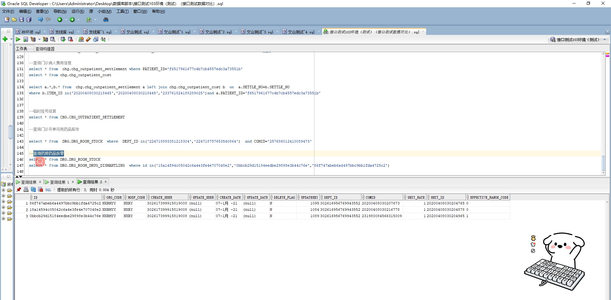

# 领域服务/药品领域 - 查询药房药品拆零 - 查询药房药品拆零 正向用例
## 请求参数：
``` json
{
  "hospCode": "NXRY",
  "orgCode": "NXRMYY",
  "pageSize": 3,
  "pageIndex": 1
}
```
## 返回参数：
``` json
{
  "exception": null,
  "apiCode": null,
  "data": {
    "list": [
      {
        "createDate": "2021-01-07 15:50:46",
        "createUserId": "302617399915819008",
        "deptId": "302616956769943552",
        "hospCode": "NXRY",
        "id": "18a14594c05042c6a4e3fe4e707048e2",
        "isDelete": "N",
        "orgCode": "NXRMYY",
        "unitId": "20200408030204878",
        "unitRate": 1,
        "updateDate": null,
        "updateUserId": null,
        "drugId": "20200408030216778"
      },
      {
        "createDate": "2021-01-07 16:03:54",
        "createUserId": "302617399915819008",
        "deptId": "302616956769943552",
        "hospCode": "NXRY",
        "id": "0bbcb29d15184eedbe29898e3b44c76e",
        "isDelete": "N",
        "orgCode": "NXRMYY",
        "unitId": "20200408030204965",
        "unitRate": 1,
        "updateDate": null,
        "updateUserId": null,
        "drugId": "231980084566315009"
      },
      {
        "createDate": "2021-01-07 16:35:21",
        "createUserId": "302617399915819008",
        "deptId": "302616956769943552",
        "hospCode": "NXRY",
        "id": "86f747abeb6a4497bbc9bb1fda4725c2",
        "isDelete": "N",
        "orgCode": "NXRMYY",
        "unitId": "20200408030204765",
        "unitRate": 1,
        "updateDate": null,
        "updateUserId": null,
        "drugId": "20200408030207673"
      }
    ],
    "totalCount": 83,
    "pageSize": 3,
    "pageNo": 1,
    "pageCount": 28
  },
  "Code": 200,
  "Message": "操作成功"
}
```
## 数据校验：



# 领域服务/药品领域 - 查询药房药品拆零 - 必填校验-[orgCode]为空
## 请求参数：
``` json
{
  "hospCode": "NXRY",
  "orgCode": "",
  "pageSize": 3,
  "pageIndex": 1
}
```
## 返回参数：
``` json
{
  "exception": null,
  "apiCode": null,
  "data": null,
  "Code": 1,
  "Message": "医院编码不能为空"
}
```
# 领域服务/药品领域 - 查询药房药品拆零 - 必填校验-[hospCode]为空
## 请求参数：
``` json
{
  "hospCode": "",
  "orgCode": "NXRMYY",
  "pageSize": 3,
  "pageIndex": 1
}
```
## 返回参数：
``` json
{
  "exception": null,
  "apiCode": null,
  "data": {
    "list": [
      {
        "createDate": "2021-01-07 15:50:46",
        "createUserId": "302617399915819008",
        "deptId": "302616956769943552",
        "hospCode": "NXRY",
        "id": "18a14594c05042c6a4e3fe4e707048e2",
        "isDelete": "N",
        "orgCode": "NXRMYY",
        "unitId": "20200408030204878",
        "unitRate": 1,
        "updateDate": null,
        "updateUserId": null,
        "drugId": "20200408030216778"
      },
      {
        "createDate": "2021-01-07 16:03:54",
        "createUserId": "302617399915819008",
        "deptId": "302616956769943552",
        "hospCode": "NXRY",
        "id": "0bbcb29d15184eedbe29898e3b44c76e",
        "isDelete": "N",
        "orgCode": "NXRMYY",
        "unitId": "20200408030204965",
        "unitRate": 1,
        "updateDate": null,
        "updateUserId": null,
        "drugId": "231980084566315009"
      },
      {
        "createDate": "2021-01-07 16:35:21",
        "createUserId": "302617399915819008",
        "deptId": "302616956769943552",
        "hospCode": "NXRY",
        "id": "86f747abeb6a4497bbc9bb1fda4725c2",
        "isDelete": "N",
        "orgCode": "NXRMYY",
        "unitId": "20200408030204765",
        "unitRate": 1,
        "updateDate": null,
        "updateUserId": null,
        "drugId": "20200408030207673"
      }
    ],
    "totalCount": 83,
    "pageSize": 3,
    "pageNo": 1,
    "pageCount": 28
  },
  "Code": 200,
  "Message": "操作成功"
}
```
# 领域服务/药品领域 - 查询药房药品拆零 - 必填校验-[pageIndex]为空
## 请求参数：
``` json
{
  "hospCode": "NXRY",
  "orgCode": "NXRMYY",
  "pageSize": 3,
  "pageIndex": null
}
```
## 返回参数：
``` json
{
  "exception": null,
  "apiCode": null,
  "data": null,
  "Code": 1,
  "Message": "系统内部异常"
}
```
# 领域服务/药品领域 - 查询药房药品拆零 - 必填校验-[pageSize]为空
## 请求参数：
``` json
{
  "hospCode": "NXRY",
  "orgCode": "NXRMYY",
  "pageSize": null,
  "pageIndex": 1
}
```
## 返回参数：
``` json
{
  "exception": null,
  "apiCode": null,
  "data": null,
  "Code": 1,
  "Message": "系统内部异常"
}
```
# 领域服务/药品领域 - 查询药房药品拆零 - 类型校验-[pageIndex]类型错误
## 请求参数：
``` json
{
  "hospCode": "NXRY",
  "orgCode": "NXRMYY",
  "pageSize": 3,
  "pageIndex": "abc"
}
```
## 返回参数：
``` json
{
  "exception": null,
  "apiCode": null,
  "data": null,
  "Code": 1,
  "Message": "请求参数错误"
}
```
# 领域服务/药品领域 - 查询药房药品拆零 - 类型校验-[pageSize]类型错误
## 请求参数：
``` json
{
  "hospCode": "NXRY",
  "orgCode": "NXRMYY",
  "pageSize": "abc",
  "pageIndex": 1
}
```
## 返回参数：
``` json
{
  "exception": null,
  "apiCode": null,
  "data": null,
  "Code": 1,
  "Message": "请求参数错误"
}
```
# 领域服务/药品领域 - 查询药房药品拆零 - 依赖用例-[orgCode]赋值为依赖用例测试值
## 请求参数：
``` json
{
  "hospCode": "NXRY",
  "orgCode": "依赖用例测试值",
  "pageSize": 3,
  "pageIndex": 1
}
```
## 返回参数：
``` json
{
  "exception": null,
  "apiCode": null,
  "data": {
    "list": [],
    "totalCount": 0,
    "pageSize": 3,
    "pageNo": 1,
    "pageCount": 0
  },
  "Code": 200,
  "Message": "操作成功"
}
```
# 领域服务/药品领域 - 查询药房药品拆零 - 依赖用例-[hospCode]赋值为依赖用例测试值
## 请求参数：
``` json
{
  "hospCode": "依赖用例测试值",
  "orgCode": "NXRMYY",
  "pageSize": 3,
  "pageIndex": 1
}
```
## 返回参数：
``` json
{
  "exception": null,
  "apiCode": null,
  "data": {
    "list": [],
    "totalCount": 0,
    "pageSize": 3,
    "pageNo": 1,
    "pageCount": 0
  },
  "Code": 200,
  "Message": "操作成功"
}
```