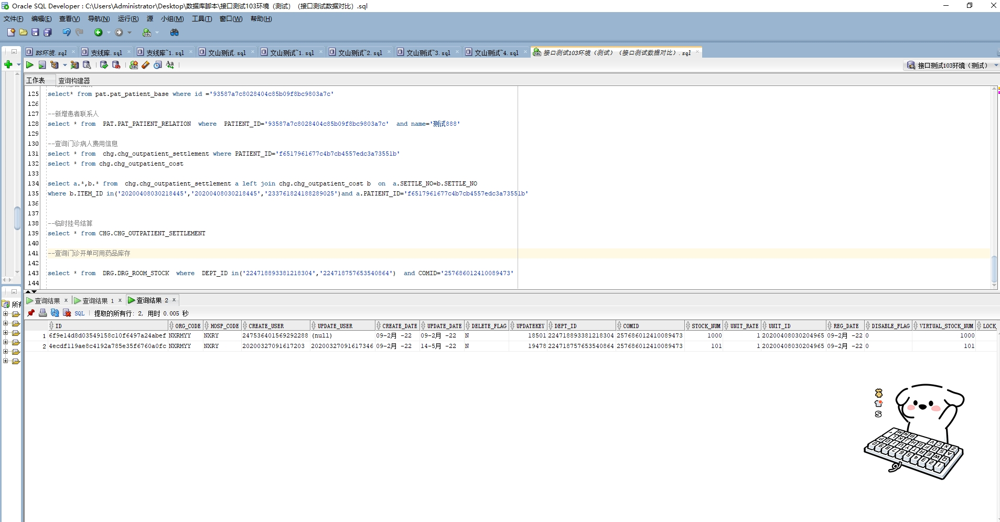

# 领域服务/药品领域 - 查询门诊开单可用药品库存 - 查询门诊开单可用药品库存 正向用例
## 请求参数：
``` json
{
  "drugIds": [
    "257686012410089473"
  ],
  "openDeptId": "224707726571106304",
  "pageIndex": 1,
  "orgCode": "NXRMYY",
  "pageSize": 3,
  "deptIds": []
}
```
## 返回参数：
``` json
{
  "exception": null,
  "apiCode": null,
  "data": {
    "list": [
      {
        "deptId": "224718893381218304",
        "drugId": "257686012410089473",
        "hospCode": "NXRY",
        "orgCode": "NXRMYY",
        "stockNum": 1000,
        "stockUnitId": "20200408030204965",
        "unitRate": 1,
        "virtualStockNum": 1000
      },
      {
        "deptId": "224718757653540864",
        "drugId": "257686012410089473",
        "hospCode": "NXRY",
        "orgCode": "NXRMYY",
        "stockNum": 101,
        "stockUnitId": "20200408030204965",
        "unitRate": 1,
        "virtualStockNum": 101
      }
    ],
    "totalCount": 2,
    "pageSize": 3,
    "pageNo": 1,
    "pageCount": 1
  },
  "Code": 200,
  "Message": "操作成功"
}
```
## 数据校验：



# 领域服务/药品领域 - 查询门诊开单可用药品库存 - 必填校验-[orgCode]为空
## 请求参数：
``` json
{
  "drugIds": [
    "257686012410089473"
  ],
  "openDeptId": "224707726571106304",
  "pageIndex": 1,
  "orgCode": "",
  "pageSize": 3,
  "deptIds": []
}
```
## 返回参数：
``` json
{
  "exception": null,
  "apiCode": null,
  "data": null,
  "Code": 1,
  "Message": "机构编码不能为空"
}
```
# 领域服务/药品领域 - 查询门诊开单可用药品库存 - 必填校验-[pageIndex]为空
## 请求参数：
``` json
{
  "drugIds": [
    "257686012410089473"
  ],
  "openDeptId": "224707726571106304",
  "pageIndex": null,
  "orgCode": "NXRMYY",
  "pageSize": 3,
  "deptIds": []
}
```
## 返回参数：
``` json
{
    "exception": null,
    "apiCode": null,
    "data": null,
    "Code": 1,
    "Message": "当前页不能为空"
}
```
# 领域服务/药品领域 - 查询门诊开单可用药品库存 - 必填校验-[pageSize]为空
## 请求参数：
``` json
{
  "drugIds": [
    "257686012410089473"
  ],
  "openDeptId": "224707726571106304",
  "pageIndex": 1,
  "orgCode": "NXRMYY",
  "pageSize": null,
  "deptIds": []
}
```
## 返回参数：
``` json
{
    "exception": null,
    "apiCode": null,
    "data": null,
    "Code": 1,
    "Message": "每页显示条数不能为空"
}
```
# 领域服务/药品领域 - 查询门诊开单可用药品库存 - 必填校验-[openDeptId]为空
## 请求参数：
``` json
{
  "drugIds": [
    "257686012410089473"
  ],
  "openDeptId": "",
  "pageIndex": 1,
  "orgCode": "NXRMYY",
  "pageSize": 3,
  "deptIds": []
}
```
## 返回参数：
``` json
{
  "exception": null,
  "apiCode": null,
  "data": null,
  "Code": 1,
  "Message": "开单科室id不能为空"
}
```
# 领域服务/药品领域 - 查询门诊开单可用药品库存 - 类型校验-[pageSize]类型错误
## 请求参数：
``` json
{
  "drugIds": [
    "257686012410089473"
  ],
  "openDeptId": "224707726571106304",
  "pageIndex": 1,
  "orgCode": "NXRMYY",
  "pageSize": "abc",
  "deptIds": []
}
```
## 返回参数：
``` json
{
  "exception": null,
  "apiCode": null,
  "data": null,
  "Code": 1,
  "Message": "请求参数错误"
}
```
# 领域服务/药品领域 - 查询门诊开单可用药品库存 - 类型校验-[pageIndex]类型错误
## 请求参数：
``` json
{
  "drugIds": [
    "257686012410089473"
  ],
  "openDeptId": "224707726571106304",
  "pageIndex": "abc",
  "orgCode": "NXRMYY",
  "pageSize": 3,
  "deptIds": []
}
```
## 返回参数：
``` json
{
  "exception": null,
  "apiCode": null,
  "data": null,
  "Code": 1,
  "Message": "请求参数错误"
}
```
# 领域服务/药品领域 - 查询门诊开单可用药品库存 - 依赖用例-[orgCode]赋值为依赖用例测试值
## 请求参数：
``` json
{
  "drugIds": [
    "257686012410089473"
  ],
  "openDeptId": "224707726571106304",
  "pageIndex": 1,
  "orgCode": "依赖用例测试值",
  "pageSize": 3,
  "deptIds": []
}
```
## 返回参数：
``` json
{
  "exception": null,
  "apiCode": null,
  "data": {
    "list": [],
    "totalCount": 0,
    "pageSize": 3,
    "pageNo": 1,
    "pageCount": 0
  },
  "Code": 200,
  "Message": "操作成功"
}
```
# 领域服务/药品领域 - 查询门诊开单可用药品库存 - 依赖用例-[openDeptId]赋值为依赖用例测试值
## 请求参数：
``` json
{
  "drugIds": [
    "257686012410089473"
  ],
  "openDeptId": "依赖用例测试值",
  "pageIndex": 1,
  "orgCode": "NXRMYY",
  "pageSize": 3,
  "deptIds": []
}
```
## 返回参数：
``` json
{
  "exception": null,
  "apiCode": null,
  "data": {
    "list": [
      {
        "deptId": "224718893381218304",
        "drugId": "257686012410089473",
        "hospCode": "NXRY",
        "orgCode": "NXRMYY",
        "stockNum": 1000,
        "stockUnitId": "20200408030204965",
        "unitRate": 1,
        "virtualStockNum": 1000
      },
      {
        "deptId": "224718757653540864",
        "drugId": "257686012410089473",
        "hospCode": "NXRY",
        "orgCode": "NXRMYY",
        "stockNum": 101,
        "stockUnitId": "20200408030204965",
        "unitRate": 1,
        "virtualStockNum": 101
      }
    ],
    "totalCount": 2,
    "pageSize": 3,
    "pageNo": 1,
    "pageCount": 1
  },
  "Code": 200,
  "Message": "操作成功"
}
```